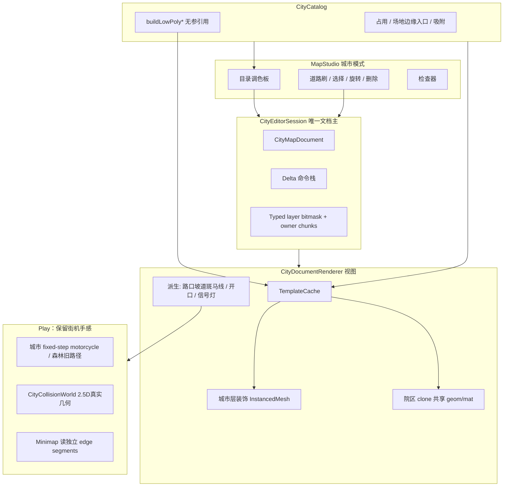
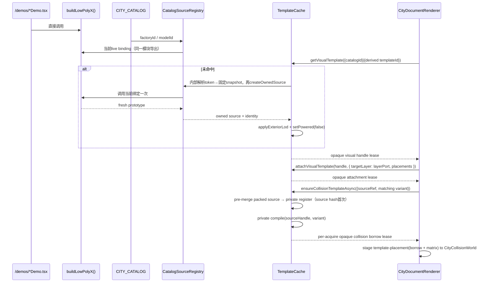
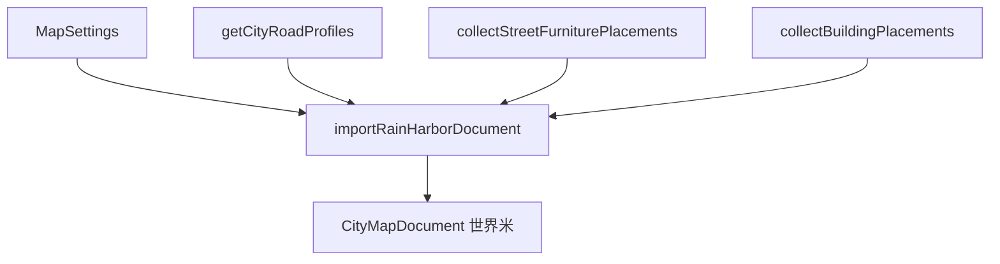

# 雨港新城：从程序化模拟器到格子 3D 城市地图编辑器

| 字段 | 值 |
|---|---|
| 文档标题 | Forest Courier · 雨港新城格子地图编辑器设计稿 |
| 作者 | Forest Courier · Map Workshop |
| 日期 | 2026-08-15 |
| 状态 | Draft — open questions resolved |
| 修订 | 2026-08-17 r13（角色默认器：去掉裸 `glass`→ignore；院区步道 token 收进 rideable，并加医院/商场夹具） |
| 产品 | Forest Courier · Map Workshop (`forest-courier-map-studio`) |
| 范围 | 城市地图（`mapType === "city"`，「雨港新城」/ Rain Harbor） |
| 非范围 | 森林地图程序化生成、展示区 `/demos` 视觉重做、车辆动力学参数重调或森林碰撞重写 |

---

## Overview

当前雨港新城由 `app/lib/map/city.ts` 的 `buildCityWorld()` **一次性程序化生成**：五条南北脊路 `ROAD_X = [-820, -360, 120, 500, 820]`、四条东西脊路 `ROAD_Z = [-640, -180, 280, 700]`，街区里塞的是按城区染色的盒子楼（`addBuildings`），不是展示区院区。工坊侧 `MapStudio.tsx` 只有 `cityDensity` / `roadWidth` / `seed` 滑条，导入导出只序列化 `MapSettings`（`format: "forest-courier-map", version: 2`）。

本设计把城市路径改成 **格子占用 + 世界米路网 + 展示区目录** 的 3D 地图编辑器：用户面对的最小编辑单元是 **1 m × 1 m** 地面方格（路灯 1×1、**行道树 1×1**、花坛 **4×1**、兔子电动车 **2×1**；其它圆形占地收成 n×n 正方形并补四角场地）。花坛、兔子、树是**游戏标尺**，不是当前 mesh AABB 的直接 `ceil`；树冠可越出占地格，但不占邻格、不挡路。现有院区 **不裁 mesh**，编辑保留区按实际 `siteSize`；保留区不可叠放其它建筑，但草地、广场、内路可骑。城市碰撞从 map LOD 可见的**实际源三角面**编译：能按完整连接组件证明等价的竖直连续挤出面生成2.5D墙段/闭合环；未被完整表示的组件保留实际源三角面并进入每模板一份fallback Triangle BVH。这样热路径不会再遍历已压成墙段的三角面，深恢复仍由闭合墙环或保持完整拓扑的fallback组件完成。v1 不再维护 Exact OBB/棱柱的第二套 contact 算法。城市骑行使用固定物理子步和明确的 collide-and-slide 循环，高程由 packed `SurfaceChunk` 中的真实可骑三角面求得。所有道路人行道都能从任意路缘直接骑上/骑下；0.24m 高差不阻挡，而是触发一次明显的视觉颠簸。道路节点与导入物件的位姿存在**世界米**里，再按统一的 world-AABB 半开区间规则栅格化。道路 UI 使用常见预设，文档存左右车道/自行车道/人行道等组合式剖面。渲染必须直接调用 `/demos` 同一套 `buildLowPoly*` 工厂，再派生真正的地图 LOD 或 InstancedMesh/BatchedMesh。森林地图、森林树圆/动态石头、动力学常量、追逐相机算法、小地图和破碎（仅森林）保持原路径；i18n **只加键、不重写框架**。

城市工坊**默认打开空白镜框**（地面、海、禁区/海堤，无路无楼），并使用固定安全出生点；不能再假定 `roadPoints[0]` 存在。`importRainHarborDocument(settings)` 仍把脊路、`CityRoadProfile` 米制、灯/树/体块的世界坐标原样写入文档，由面板「导入默认雨港」显式调用；该导入结果在布局、视觉和道路表面上与现城等价（允许 instance 矩阵浮点差），但静态障碍从旧手写圆升级为源三角面编译的精确墙段 / Triangle BVH，碰撞手感允许有意精化。`USE_CITY_DOCUMENT` 对照测试用导入器产出作夹具，不用空白默认档。新画道路由预设生成组合式规范剖面（标准机动车道 **3.0 m = 3 格**）；导入边仍冻结现城 2.9–3.8 m 与左右横断面，再按实际世界区间栅格化，禁止把 `ceil(corridorWidth)` 当作完整覆盖规则。森林路径不受影响。

---

## Background & Motivation

### 现状

| 层 | 现状 | 关键文件 |
|---|---|---|
| 工坊 UI | 参数滑条 + Play，不是格子编辑器 | `app/components/MapStudio.tsx` |
| 地图类型 | `MapType = "forest" \| "city"`，城市旋钮 `cityDensity` / `roadWidth` / `seed` / `deliveryStops` | `app/lib/map/types.ts` |
| 城市生成 | `buildCityWorld()` 全图一次建完，不走 `ChunkManager`（森林 `CHUNK_SIZE = 96`） | `app/lib/map/city.ts` |
| 道路 | `getCityRoadProfiles()` 按 seed 赋 1–3 车道/向 + 自行车道 + 隔离带 + 人行道；永远双向机动车。`laneWidth` clamp 2.9–3.8 m，人行道 lerp 6.5–9.2 m | `city.ts` `roadProfile()` |
| 建筑 | 五城区（harbor / waterfront / hills / oldtown / central）程序化盒子 | `city.ts` `addBuildings()` |
| 街道设施 | 已改为展示区源的 InstancedMesh（当前生成器约路灯 306、行道树 270、信号灯 72；测试只断言下界） | `addInstancedShowroomModel()` / `addStreetFurniture()` |
| 场景入口 | `ForestScene.buildCity()` 调 `buildCityWorld()`，骑行 / 碰撞 / 小地图仍工作 | `app/lib/map/ForestScene.ts` |
| 展示区 | 12 个 collection，全部 `buildLowPoly*`，几乎都是 TS 生成的 Three.js Group，不是 GLB | `app/demos/page.tsx` + `app/lib/map/*.ts` |
| 持久化 | `{ format, version: 2, settings }`，没有对象级文档 | `MapStudio.exportMap` / `importMap` |
| 世界尺度 | `CITY_MIN_X/MAX_X = ±1100`，`CITY_MIN_Z = -1080`，`CITY_MAX_Z = 860`（2200 × 1940 m） | `city.ts` |
| 路口骑行 | `addSidewalkNetwork` 铺人行道、转角垫、每活动交叉口 8 条坡道（`RAMP_LENGTH = 4.2`）、斑马线；`sampleCitySurface` 硬编码这些坡 | `city.ts` 219–229、368+ |

### 痛点

1. **不可编辑**：玩家不能把医院、学校、体育中心拖到路上，只能拧密度旋钮重生整座城。
2. **模型两套皮**：展示区有完整院区，城市里仍是盒子楼。路灯/信号灯已复用工厂，建筑没有。
3. **道路类型隐含**：现有剖面永远是「双向 + 非机动车 + 人行道」，没有单行道，也没有「这条路占几格」。
4. **入口与信号灯是写死的**：坡道/斑马线按脊路交点批量铺；信号灯无条件铺满活动交叉口。
5. **JSON 存不住一座城**：version 2 只有旋钮。

### 已有可复用资产（必须直接调用，禁止分叉几何）

展示区工厂是 TypeScript 现场建 Group。地图只要和 demo 引用**同一个函数**，工厂一改，下次 rebuild 就会变。

`city.ts` 已证明这条路：`addInstancedShowroomModel()` 对 `buildLowPolyStreetLight()` / `buildLowPolyTrafficLight()` 的原型 traverse，按 part 做 `InstancedMesh`，`userData.sourceModel` 记录工厂 `group.name`。编辑器要把这套机制推广到**城市层**装饰；院区内部再调一次工厂的嵌套家具**不**并入城市 InstancedMesh（见复用合同）。

---

## Goals & Non-Goals

### Goals

1. 用户最小编辑单元 = 一块 **1 m × 1 m** 地面方格。游戏标尺：路灯 1×1、**行道树 1×1**、花坛 4×1、兔子电动车 2×1；其余条目默认按地图 prototype 的地面包络向上取整，允许有审计过的语义 override。**圆形占地默认是 n×n 正方形**；树是例外，只占树干那 1 格。现有展示区建筑/院区 **不裁 mesh、不按入口宽裁内部路**，编辑保留区按实际 `siteSize` / AABB 修正。
2. 单一 `CityCatalog`：catalog id → 展示区工厂 + 占用 + 吸附 + 碰撞 + 分类。加模型 = 加一条注册，绝不复制几何。
3. 道路是轴对齐折线/图（v1 不做自由曲线）。**节点存世界米**；占用栅到格子。UI 提供单行 1 车道、双向 1/2/3 车道/向等预设；文档持久化组合式 `RoadCrossSection`（A→B/B→A 车道数、左右自行车道、人行道、隔离带、停车带）。导入边冻结当时的完整左右米制剖面。
4. 道路可自延伸；碰到院区**场地边缘路缘开口**时自动接路，不把沥青刷进草坪。
5. 红绿灯：用户选择「需要红绿灯」后，在合格交叉口按每个驶入approach的tangent/normal与左右剖面自动放置`traffic-light` derived template（descriptor绑定`buildLowPolyTrafficLight(-1)`）；旧`getCitySignalCornerOrientation`只作默认四向路口回归夹具，不生成任意T字/单行路口。
6. MapStudio 城市模式变成调色板 + 3D 拖放 + 道路刷 + 选择变换 + 撤销重做。
7. 新 JSON schema（version 3）与 `MapSettings` 分离存储城市文档；Play 骑编辑后的图。
8. 雨港尺度（~2 km）可编辑：院区使用真正的 `map-exterior` LOD（隐藏/合并地图不需要的细节，不把 cutaway 冒充 LOD），装饰 instance；性能验收通过后才开放几十个院区 + 数百装饰。
9. 现有可玩雨港不静默消失：保留 seed → document 导入器（世界米保真），由「导入默认雨港」一键恢复。**默认打开 = 空白镜框**，不是自动导入。
10. 遗留盒子楼只作为导入产物 `legacy-massing-block` 存在；v1 **不做**「一键换成展示区建筑」。

### Non-Goals（v1 明确不做）

- 森林地图格子化 / 森林物体拖放。
- 改写 `/demos` 展示区交互或视觉。
- 重调车辆加速、制动、转向、漂移、碰撞减速参数，或改写追逐相机/破碎形态。允许为城市路径重构 `motorcycle.ts` 的 fixed-step 接口、接触持久化和路缘颠簸 presentation；这些不得改变森林路径的动力学常量与旧圆/石头求解器。
- 真实 GIS / 经纬度 / 高德路网。
- 信号灯时序驱动（`setPhase` 只摆静态红/绿）。
- 自由角度旋转（新摆物件只 90°；导入树保留自由 yaw）、自由曲线道路、立交/隧道/高架。
- 运行时改工厂源码或把 Group 烘焙成 GLB。
- D1/R2 云端存档。
- v1「一键把遗留体块换成展示区建筑」（2026-08-15 已否决）。
- 城市 chunk 流式加载（后续；v1 全图构建 + 共享几何）。
- 机动车 AI、刚体/布娃娃、建筑破坏；v1 增加城市静态墙段/BVH查询和固定子步，不引入通用物理引擎，不改森林动态石头路径。
- 把院区内部的灯/坛/餐车提升成城市 InstancedMesh。

---

## Key Decisions

| # | 决策 | 理由 |
|---|---|---|
| D1 | 占用尺 `TILE_SIZE_METERS = 1`；路灯/树 1×1、花坛 4×1、兔子电动车 2×1 是游戏标尺 | 2026-08-16 用户拍板：1 格 = 1 m；树占 1 格；兔子占 2 格。标尺优先于 mesh AABB。树冠是无碰撞 visual overhang，不把邻格算进占用。其它条目默认按地图 prototype 地面 AABB `ceil`。新画车道规范 3.0 m = 3 格。 |
| D2 | 方案 A：格子占用 + 目录（不用 B/C） | 满足「最小单元是方格」和「直接复用工厂」。B 留不下道路类型；C 工期不匹配。 |
| D3 | 占用格永远是轴对齐矩形。圆形占地默认：直径 D → **n×n**。**行道树例外：1×1** | 格子没有圆形格。喷泉/圆塔仍走外接正方形。树按用户标尺只占树干格，树冠登记为 `nonCollidingOverhang`，可压人行道/路缘视觉，但不与 asphalt 冲突、不能阻止邻格再放灯。**禁止**用 override 缩小院区/楼。 |
| D4 | 单一 `CITY_CATALOG`，source 持稳定`factoryId`或既有model-pack id；live registry把factoryId绑定到/demos同一无参`buildLowPoly*`导出。非调色板派生信号灯另有一条checked-in `DerivedTemplateDescriptor`，仍走同一registry/cache | 加模型 = 加条目。程序化展品不得复制工厂；HMR可替换registry live binding而不让catalog闭包困在旧函数。GLB 树引用既有 model id。信号灯不进目录，但其视觉与碰撞都从descriptor解析到`buildLowPolyTrafficLight(-1)`同一snapshot；renderer只消费编译出的声明式phase part表，绝不复制或调用捕获旧工厂树的`setPhase`闭包。 |
| D5 | 模板缓存：每 catalogId 调一次工厂；地图 prototype 有独立资源所有者；invalidate 后强制重建 instance/batch | raw prototype/geometry/material不离开cache；renderer只持opaque handle并通过受控attachment API请求cache内部clone/instance。placement删除只释放attachment lease，不能遍历dispose借用资源。HMR 是**新工作**，不是现成钩子。 |
| D6 | 道路节点存世界米；占用再栅到 1 m 格 | TILE=1 时全部脊路相对 origin 落在**格边**（整数米）。新画吸附格心会偏 0.5 m，故仍存世界米：导入无损，延长已有边锁世界轴。`mergeSlop` 默认 0.9 m（> 半格 0.5 m），才能焊上导入脊路。 |
| D7 | UI 用道路预设；文档存组合式 `RoadCrossSection`；导入边持久化冻结的左右米制剖面 | 预设只负责创建剖面，不成为存档真相。导入若只冻道路名称，路缘/灯位/信号会漂数米。`sampleCitySurface`、占用和派生路口读边上的同一剖面。 |
| D8 | 红绿灯默认关；勾选后按交叉口自动摆。三态：`undefined` 继承文档，`true`/`false` 覆盖 | 用户 opt-in。导入城文档旗为 true。 |
| D9 | 入口锚点 = AABB 边路缘切口（城侧接路宽度）。`InternalRoad`绑定工厂实际rideable源表面；catalog模板在合批前把源面沿outward补到site边并暴露稳定`EntrancePort`，PR7只生成依赖城市道路的外侧driveway，再以跨owner `SurfaceStitch`原子接上 | 医院主通道停在 z∈[19,25]，AABB +z=31，必须由模板内真实三角连接带补到边；学校南环路仍保持158m，不裁成大门16m。外侧driveway按入口净宽生成并归入road chunks；共点不等于运行时连通，stitch还必须精确覆盖双方自动`blocked-step`边界。 |
| D10 | 导入器保留；**默认打开 = 空白镜框**；「导入默认雨港」是显式命令。盒子楼不自动换 | 用户 2026-08-15 拍板。空白可玩（地面/海/围栏，无路）。导入器仍是恢复今日可骑城的唯一一键路径；`legacy-massing-block` 仅出现在导入结果里，用户用手拖展示区院区替换。 |
| D11 | 森林继续程序化；城市文档与 `MapSettings` 并存 | version 3：`settings` 服务森林与骑行旋钮；`cityDocument` 仅城市。森林写出器**只写 v3 且无 `cityDocument`**（一种写出器）。读端收 v2 与 v3。 |
| D12 | 院区默认真正的 `map-exterior` LOD，烘焙在 **catalogId 模板** 上；v1 不做 per-placement LOD | `setInteriorCutaway(true)` 只隐藏部分外壳并保留大量内部 Mesh，不是 exterior LOD。工厂需标记 map layer，模板构建器隐藏/合并 detail，并以实测 draw calls 作为门槛。以后若要单座开内饰，缓存键改为 `(catalogId,lod)`。 |
| D13 | 占用使用 2200×1940 的 typed-array 位掩码，owner/派生数据按需分块 | 426.8 万格用 `Uint8Array` 存 5–8 个 layer 约 4.1 MiB，比大量字符串键 `Map` 更稳定。选择 owner 可单独用 chunked `Uint32Array`/稀疏表，视觉 GridHelper 与数据存储分离。 |
| D14 | v1 全图构建 + 共享几何；chunk 流式后续 | 今天城市已全图一次建完。 |
| D15 | 位姿使用判别联合：`grid` / `world` / `legacy-massing` 三选一 | 新摆物件用格最小角 + `Yaw90`；导入灯/树用世界米与自由 yaw/scale；体块用唯一 massing pose。禁止同一 placement 同时出现互相矛盾的 `i/j`、`x/z` 与 `massing.x/z`。 |
| D16 | `CityEditorSession` 拥有文档并提供 `subscribe/getSnapshot/revision`；`ForestScene` 只是视图 | 避免 React/editor/scene 三份权威。命令是 `{ apply, revert }` delta；每次 apply/revert 增 revision 并通知 React/renderer。旋转绕 footprint 中心改写 `(i,j)`。 |
| D17 | 院区保留区与骑行碰撞彻底分离；城市静态碰撞由map LOD可见源三角面编译成真实几何2.5D/BVH表示 | 整个`siteSize`只用于编辑reservation。Mesh/group解析为`solid/rideable-surface/ignore`；只有完整连接组件可由精确墙段/闭合环保持响应与containment时才从BVH移除其源面，否则该组件完整保留在模板级单一fallback Triangle BVH。2.5D运动体与平滑坡面的Y envelope是明确游戏物理语义，不声称通用3D刚体精确。v1没有Exact OBB/prism contact路径，且碰撞在渲染合批前编译。 |
| D18 | 导入器在每个 `roadsIntersect` 点插节点并打断两边；刷路撞上异向中心线同样打断 | 「一条脊路一条边」没有共享顶点，度数检测会得到 0 个路口。与 `addSidewalkNetwork` 同一拓扑。 |
| D19 | 现有展示区建筑/院区不裁 mesh；院区 reservation = `ceil(siteSize/TILE)`；语义标尺允许审计过的 `footprintOverride` | 院区保留区禁止缩小。路灯/公园灯/信号/树 1×1、花坛 4×1、兔子电动车 2×1 是明确的游戏标尺。花坛地图 prototype 必须落入 4×1；树只约束树干落在 1×1，树冠允许 overhang。 |
| D20 | 圆形占地默认外接正方形；**树不走这条**。物理形状不从占地反推 | 用户已定树占1格。喷泉/圆塔仍 n×n + sitePad；GLB树干与其它异形物都从实际源 triangles 编译，树叶忽略；不能因占地是1×1就反推一个碰撞圆。 |
| D21 | 交叉口由图节点派生；只持久化 `intersectionOverrides[nodeId]` | `Intersection{x,z}` 与 `RoadNode{x,z}` 双份坐标会漂。道路拆分/移动后，信号灯覆盖跟随 node id；不再序列化派生交叉口列表。 |
| D22 | 所有**编辑占用**统一走 world-AABB 半开区间栅格器 | `ceil(width/TILE)` 只算尺寸，不决定格索引。路中心可能在格边或格心，冻结宽度是小数；幽灵、冲突、道路层、solid 几何投影与导入测试共享 `rasterizeWorldAabb([min,max))`。骑行物理查询精确墙段 / Triangle BVH，不拿占用格当碰撞体。 |
| D23 | 默认空白镜框使用固定安全出生点；小地图接收独立线段而非单 polyline | 空文档无 `roadPoints[0]`。Play/相机/配送需有无路回退；小地图不得把不相邻 edges 连成假路。 |
| D24 | 城市静态碰撞采用两级管线：16m world owner hash → 每模板/道路chunk一份本地精确墙段索引与合并Triangle BVH | world hash登记`template-placement / legacy-massing / road-chunk / world-static`判别owner的AABB；查询去重后，catalog/derived placement变换到共享模板，legacy massing走共享box-part公式生成的自身墙段记录，另两类进入各自packed index。十座医院只有十组矩阵/AABB，墙段/BVH只存一份。v1不手搓cluster或用24m/4096/128魔数锁调色板；若真实性能spike不达标，后续才按profile数据引入TLAS。 |
| D25 | 城市 Play 使用固定 `1/120 s` 动力学步、水平行程不超过 `0.25m` 的碰撞 microstep 和最多4次 collide-and-slide；森林维持现路径 | 38m/s 时一个固定步位移约0.317m，必须再分成2个 microstep。current→target、TOI、剩余位移、凹角与初始穿透进入同一城市求解合同。每渲染帧最多追6个固定步，2ms预算统计其中全部 microstep；接触持久化避免贴墙时重复扣速。 |
| D26 | 所有道路人行道可从任意路缘骑上/骑下；普通路缘不是墙 | 用户2026-08-16拍板。`CURB_HEIGHT_METERS=0.24`小于`MAX_CROSSABLE_SURFACE_STEP_METERS=0.30`；直接跨越触发一次强烈但有界的presentation颠簸，不新增竖直速度/腾空态，也不对权威velocity/body状态施加额外改速或转向响应。花坛、矮墙等仍由`solid`阻挡，不能按“低于0.3m全部忽略”。 |

---

## Proposed Design

### 系统全景



### 与现有调用链的关系

今天：

```
MapStudio.generate(settings)
  → ForestScene.build(settings)
    → buildCity(settings)
      → buildCityWorld(settings, collision, modelPack)
```

目标：

```
MapStudio 持有 CityEditorSession
  首次进入城市且无已载入文档:
    session.replace(emptyCityDocument())   // 空白镜框，不自动导入
  「导入默认雨港」:
    session.replace(importRainHarborDocument(settings))
  session.document 变更
    → session.getRenderUpdate(sceneRevision)
    → ForestScene.applyCityDocument(doc, dirtyLayers)
    → 成功后推进 sceneRevision
  森林路径不变
```

`buildCityWorld()` **不删除**，直到导入器 + 文档渲染覆盖 `city-map.test.mjs`。`ROAD_X` / `ROAD_Z` 从 `city.ts` **导出**（今天是文件私有 `const`，`Minimap.ts` 已复制字面量）供导入器与对照测试使用。

### 格子系统

#### 推导

| 参照物 | 用户标尺 | 当前展示尺寸 | 地图规则 |
|---|---|---|---|
| 路灯 | **1×1** | 基座底半径 0.56 m；悬臂到约 x=2.73 m | 占用按杆位；基座规则竖直侧面可无损编译为墙段，灯杆等其余 `solid` 源三角面进入模板 fallback；灯臂可登记为无碰撞 visual overhang |
| 行道树 | **1×1** | 叶冠 D≈4.7 m，树干更窄 | 只占树干那一格；树冠 overhang，不挡邻格、不挡路。GLB 树干在 v1 使用 Triangle BVH；叶片忽略 |
| 路边花坛 | **4×1** | `roadside-planter-foundation` = 6.35 × 1.75 m | 地图 prototype 缩进 4×1 包络；测试 `Box3.x≤4 && Box3.z≤1` |
| 骑电动车的小兔子 | **2×1** | 展示参考长度仍 2.4 m | 编辑占用 = 2 m × 1 m。**不改**全局 `RABBIT_RIDER_REFERENCE_LENGTH_METERS`。不是 v1 可摆物件；骑行半径仍 0.55 m |

取 **`TILE_SIZE_METERS = 1`**。一格面积 1 m²。

```
originWorld = { x: CITY_MIN_X, z: CITY_MIN_Z } = { x: -1100, z: -1080 }
tile (i, j) 中心:
  x = origin.x + (i + 0.5) * TILE
  z = origin.z + (j + 0.5) * TILE
bounds（占用栅格，处处用这一对）:
  tilesX = 2200 / 1 = 2200
  tilesZ = 1940 / 1 = 1940
```

栅格与可玩矩形 `[CITY_MIN_X, CITY_MAX_X] × [CITY_MIN_Z, CITY_MAX_Z]` 对齐。海岸 mesh / 护栏仍钉在 `CITY_MAX_Z`。

坐标约定与 `ForestScene.getTextState()` 一致：`+x` 东，`+z` 南。

#### 为什么路网仍存世界米

相对 origin，**全部**现脊路落在格边（`相对 / 1` 都是整数）：

| 坐标 | 相对 origin | `/ 1` | 落点 |
|---|---|---|---|
| `ROAD_X` -820, -360, 120, 500, 820 | 280, 740, 1220, 1600, 1920 | 同左 | **格边** |
| `ROAD_Z` -640, -180, 280, 700 | 440, 900, 1360, 1780 | 同左 | **格边** |

新画吸附格心会偏 **0.5 m**。导入剖面 `laneWidth` 不是整数。因此节点仍存 `(x, z)` 米。占用/幽灵/新画吸附用 1 m 格；延长已有边锁该边世界轴。

#### 占用规则

```ts
export const TILE_SIZE_METERS = 1;
export const OCCUPANCY_TILES_X = 2200;
export const OCCUPANCY_TILES_Z = 1940;

export type Yaw90 = 0 | 90 | 180 | 270;

export function worldSizeToTiles(sizeMeters: number): number {
  return Math.max(1, Math.ceil(sizeMeters / TILE_SIZE_METERS - 1e-6));
}

export function footprintTiles(worldX: number, worldZ: number, yaw: Yaw90): { w: number; d: number } {
  const swap = yaw === 90 || yaw === 270;
  return {
    w: worldSizeToTiles(swap ? worldZ : worldX),
    d: worldSizeToTiles(swap ? worldX : worldZ),
  };
}

/** 唯一 world → tile 覆盖规则。max 是半开边；仅接触格边不算占用。 */
export function rasterizeWorldAabb(min: number, max: number, origin: number): { first: number; lastExclusive: number } {
  const first = Math.floor((min - origin) / TILE_SIZE_METERS + 1e-6);
  const lastExclusive = Math.ceil((max - origin) / TILE_SIZE_METERS - 1e-6);
  return { first, lastExclusive };
}
```

- **新摆锚点**：`(i, j)` = 占用 AABB **最小角**（西、北）。
- **旋转**：`yaw += 90` 后按 footprint 中心回写 `(i, j)`，禁止绕西北角扫过邻格。
- **覆盖**：`footprintOverride` 只用于明确的游戏标尺/点状家具（路灯/公园灯/信号 1×1、花坛 4×1）。override 条目必须有 `mapScale`/地图 prototype 包络测试；院区、楼、遗留体块禁止 override 缩小。
- **导入装饰**：走 `WorldPlacement`，只存 `x,z,yawRadians,scale,heightScale`；占用由旋转后的世界 AABB/override 经过 `rasterizeWorldAabb` 得到。它不再同时携带 `i,j`。
- **道路**：不能用 `ceil(corridorWidth)` 直接猜格数。先求世界走廊 `[center-halfWidth, center+halfWidth)`，再走同一栅格器；格边/格心、小数冻结剖面全部遵守这一规则。
- **占用内存**：每格一个 `Uint8` layer bitmask；reservation owner 另存分块 id 表。禁止以字符串 `"i,j"` 为每个道路格建 `Map`。

#### 圆形占地 → 正方形场地（D3 / D20）

格子上没有圆形格。除已明确为 1×1 游戏标尺的行道树外，圆喷泉、圆塔等圆形条目的**地图占用必须是外接正方形**：

```
n = worldSizeToTiles(diameterMeters)   // ceil(D / 1)，最小 1
occupancy = n × n                      // 永不相等轴
padWorld = n * TILE_SIZE_METERS        // 略大于 D 的方形场地
```

```ts
export function squareTilesFromCircle(diameterMeters: number): { n: number; padMeters: number } {
  const n = worldSizeToTiles(diameterMeters);
  return { n, padMeters: n * TILE_SIZE_METERS };
}
```

| 层 | 圆形本体 | 方 − 圆 的四角/环带 |
|---|---|---|
| 编辑占用 | 计入 n×n | **计入同一 n×n**（整块场地属于该物件） |
| 视觉 | 工厂 mesh **不裁** | `sitePad`：铺装 / 草地 / 方形树池。加在 **TemplateCache** 里，不改 `/demos` 工厂 |
| 骑行碰撞 | `solid` 源几何编译为精确墙段或 Triangle BVH fallback | `sitePad` 标为 `rideable-surface`，写入 packed surface chunks，可骑 |
| 再放其它 solid | 冲突 | 冲突 |

院区内部的旋转木马、体育场跑道、喷泉 **不** 升为城市层圆形条目：它们已经画在矩形 `siteSize` 里，院区占地仍按矩形 siteSize。

**行道树不走 n×n。** 用户 2026-08-16 拍板：树占地 **1×1**（树干所在格）。叶冠是 `nonCollidingOverhang`，可画出 1 m 格，但不写入占用层、不与 asphalt/bike 冲突、邻格仍可放路灯。骑行碰撞从树干 Mesh 源几何编译：GLB 树干在 v1 默认进入 Triangle BVH fallback；叶片 Mesh 标为 `ignore`。新摆树需断言树干 solid 包络落在1×1内；导入树无论统一 `scale` 多少，占用仍是1×1，中心落在世界位姿所在格，但若缩放后的 solid 包络越格，编辑器必须显示 `collision-overhang` 警告，不能谎称邻格完全无物理占用。

v1 其它圆形条目（喷泉、圆塔，若进城市层）仍用上表 n×n + `sitePad`。

#### 编辑保留区、视觉包络与骑行碰撞分离（D17 / D19）

- **不改** 展示区工厂 mesh、不另写 `buildCityHospital()`、不按格子去切楼板。
- 院区 `reservationFootprint` = `ceil(实际 siteSize / TILE)`，用于防止其它建筑/院区重叠；**它不是碰撞体**。
- 单体建筑 `reservationFootprint` 默认取地图 prototype 地面 AABB；游戏标尺 override 必须同时让地图 prototype 落在声明包络内。
- `visualEnvelope` 用于幽灵预览和开发断言：solid mesh 不得越出 reservation；只有显式 `nonCollidingOverhang`（如灯臂、屋檐）可以越界。
- 角色只决定**哪些源 Mesh/group 进入碰撞模板以及进入哪个通道**；表示由编译器在“可证明无损的墙段”和“实际 Triangle BVH fallback”之间选择。LOD可见性过滤后、渲染 merge/batch **之前**编译碰撞，以保留 geometry/group 来源；之后才合批渲染。禁止手填近似盒、圆或另造 collision mesh。
- 显式角色可写在 Mesh 或 geometry/material group 的 `userData.mapCollisionRole`。普通混合语义 Mesh 仍需拆 group/geometry；道路人行道整块 slab 是明确例外：整体可标 `rideable-surface`，顶面进 surface，路缘侧面按 D26 不阻挡。

角色解析按以下固定优先级执行。名称先转小写，再以非字母数字字符切成 token；`sidewalk-top` 等多词规则按连续 token 序列匹配，`road` 不得以子串误中 `broadway`。匹配来源包括对象名、祖先名、geometry group名与material名：

| 优先级 | 条件 | 结果 |
|---:|---|---|
| 1 | catalog `collisionMeshes` 精确 name/group override | override 指定角色 |
| 2 | Mesh/group 显式 `userData.mapCollisionRole` | 显式角色 |
| 3 | `mapLayer` 为 `interior` / `micro-detail` / `animated-detail` | `ignore` |
| 4 | token 含 `leaf/leaves/lens/bulb/glow/window-pane/pane/bolt`（**不含**裸 `glass`） | `ignore` |
| 5 | token 含 `road/asphalt/sidewalk/sidewalk-top/lawn/grass/plaza/path/ramp/ramp-top/walkway/promenade/crossing/pavement` | `rideable-surface` |
| 6 | 其它仍可见 Mesh | **auto-resolved `solid` + 写入 `roleAudit.autoSolid`** |

裸 `glass` 不得标 `ignore`。`shopping-mall-glass-curtain-panel`、`shopping-mall-storefront-glass` 及幕墙/橱窗走第 6 级 auto-solid（或 catalog 显式 `solid`）。只有 `pane` / `window-pane` / `lens` 等窄 token 才能因名字 ignore。若要把某块玻璃当窗格，必须用这些窄名字或 catalog override，禁止再加回裸 `glass`。

院区步道必须能被第 5 级命中：`walkway`（如 `hospital-campus-pedestrian-walkway`）、`promenade`（如 `amusement-park-main-promenade`）、`crossing`（如医院过街板）、`pavement`。`path` 继续覆盖 `school-campus-pedestrian-path`。这些默认 `site-surface`。catalog 测试必须断言：医院主通道 `(0,31)→(0,22)` 与 `hospital-campus-pedestrian-walkway` 为 rideable；`shopping-mall-glass-curtain-panel` **不是** ignore。

`auto-resolved solid`列出归一化token/祖先路径/meshCount/triangleCount，用于成本排序和黄色综合碰撞预览。它不锁成品调色板；CI比较catalog的`reviewedCollisionRoleHash`与本次`computedHash`，变化时要求人工审阅。开发者可用一条catalog override覆盖整组，不要求手标社区全部5218个Mesh。运行时只有碰撞数据仍在准备或真实编译失败时才暂缓对应条目进入Play。
- `InternalRoad` 宽度 = 工厂沥青/广场在 siteSize 框里的真实宽度；`stretchInternalRoadToKerb`只计算**模板内连接计划**，沿outward到AABB且垂直尺寸不变。计划必须绑定实际rideable源triangle/group；`buildTemplateArtifacts`在渲染合批前据此生成同一catalog模板拥有的可见/可编译真实三角带，并在每个`EntranceAnchor`净宽处切出稳定`EntrancePort`。不能把矩形元数据直接塞进SurfaceChunk，也不能等到placement/PR7才把这段做成第三种owner。
- 城侧自动接路仍用较窄的 `EntranceAnchor.widthMeters`（大门净宽）。内路可骑面 ≠ 大门：学校内路面158m宽，城侧接路16m宽。

遗留盒子楼是迁移专用参数化例外。导入器必须保存`width/depth/height/roofHeight`，renderer与collision共同调用一个纯`buildLegacyMassingBoxParts(placement)`，从现有body、`(width+1.4)×1.2×(depth+1.4)` plinth、偏移roof、两条trim、door、awning和ignore windows公式生成同一组BoxGeometry世界矩阵。reservation/visual envelope取这些parts的实际union AABB；collision从每个`solid` box的真实矩阵直接生成等价竖直墙段、Y范围与闭合footprint，至少不能漏掉比body四周各外扩0.7m的低plinth。屋顶不是rideable surface；这条参数盒路径不建每座一次性的BVH/IndexedDB variant，也不能只按`catalogId`共用错误尺寸。现城`r=min(width,depth)*0.47`近似圆被删除，因此“导入默认雨港等价”不包含旧圆手感，几何精化是有意变化。新摆院区仍从map LOD可见源节点编译墙段、Triangle BVH与packed surfaces，禁止对整个siteSize填近似圆盒。

#### 占用层矩阵

层：`road-reservation` | `asphalt` | `bike` | `sidewalk` | `driveway` | `site-reservation` | `solid`。一格可有多层；`reservation` 管编辑冲突，`solid` 仅标实际实体投影。

| 动作 | road-reservation | asphalt / bike | sidewalk | driveway | site-reservation | solid |
|---|---|---|---|---|---|---|
| 装饰 `snap: "cell"` | 冲突 | 冲突 | 否（应改用 road-verge） | 仅入口附属物 | 冲突 | 冲突 |
| 装饰 `snap: "road-verge"` | **必须位于其中** | 冲突 | **必须落在 sidewalk** | 允许 | 允许院区自带家具 | 冲突 |
| 装饰 `snap: "intersection-corner"` | **必须位于其中** | 冲突 | 必须落在交叉口人行垫 | 否 | 否 | 冲突 |
| 建筑 / 院区 | **冲突** | 冲突 | 冲突 | 否 | **冲突** | **冲突** |
| 道路刷 | 同剖面共线段规范化；异剖面拆分/替换 | 按剖面重建 | 按剖面重建 | 清掉再刷 | **拒绝** | **拒绝** |
| 派生 driveway | 只切开所属路缘段 | 覆盖到沥青边 | 换坡道 | 盖上 | 允许穿过所属院区 | **不得穿透 solid 墙段/BVH fallback** |

幽灵：违反上表 → 红，不可落。

#### 骑行碰撞：源三角面编译的真实几何2.5D/BVH路径

`motorcycle.ts`现有私有`BIKE_R=0.55`在PR6b-1改名并导出为唯一的`BIKE_COLLISION_RADIUS_METERS`，所有旧调用同步引用，禁止保留两份半径常量。兔车没有跳跃、竖直速度或空中态，城市v1把移动体定义为 **XZ半径0.55m的圆 + `[surfaceY,surfaceY+2.40m]`竖直占用带**，不是通用3D刚体胶囊。墙响应只修改`x/z/velocityX/velocityZ/motionSign/bodyHeading/drifting`并由它们派生现有signed speed/velHeading；物理高程只由表面系统决定。2.40m来自归一化模型最大尺寸的保守上界，独立于编辑占用2×1；后续改模型须更新同一Box3夹具。

v1 最终 contact 只有两条正确路径：从实际 solid triangles **可证明无损**编译出的竖直挤出墙段，以及无法证明该条件时保留的实际 Triangle BVH fallback。AABB、world spatial hash 和 BVH node 只剪枝，不能自己产生 contact。Exact OBB、圆、凸包、prism 和占用格都不产生城市静态接触。

以下代码块为跨文件的总体合同，不表示全部塞进一个模块。纯依赖边界固定为：PR2在`cityCollisionTypes.ts`建立`MapCollisionRole/CollisionContainmentPolicy`、7个内建profile、role code、sentinel、`TemplateEntrancePortSource`与稳定`localSurfaceKey`分配器；PR4在同文件加入transition、`RoadSurfaceHandleRecord/RoadBoundaryHandleRecord/PackedExplicitBoundarySource`；PR6b-1再加入runtime surface/boundary handle、sample/move/impact/recovery DTO与固定常量。PR6b-2新建`cityCollisionWire.ts`，消费PR2的template port DTO，只放`PackedTriangleSource`、road port source、template/road/world-static compile input、Worker command/result及serialized payload/version，并引用`CollisionContainmentPolicy`，绝不能反向引用`CatalogEntry`。含`THREE/MeshBVH`的墙段/BVH/template/owner/world类型留在`cityCollision.ts`，cache状态留在`cityTemplateCache.ts`。`cityRoadGraph.ts`、catalog、Worker与solver都从这些唯一来源导入；禁止PR4另造临时形状再在PR6b悄悄转换。

```ts
export type MapCollisionRole = "solid" | "rideable-surface" | "ignore";
export type CollisionContainmentPolicy = "closed-required" | "open-allowed";
export type CanonicalKeyPart = string | number;
/** number只接受有限safe integer；任意Float64先转canonicalFloat64Bits。 */
export declare function canonicalTupleKey(parts: readonly CanonicalKeyPart[]): string;
export declare function canonicalFloat64Bits(value: number): string;
export const CITY_SURFACE_CHUNK_COORD_MIN = -32768;
export const CITY_SURFACE_CHUNK_COORD_MAX = 32767;
/** (chunkX+32768)*65536+(chunkZ+32768)，结果为0..2^32-1的safe integer。 */
export declare function citySurfaceChunkKey(chunkX: number, chunkZ: number): number;
export declare function decodeCitySurfaceChunkKey(key: number): readonly [chunkX: number, chunkZ: number];
export type DeepReadonly<T> =
  T extends (...args: never[]) => unknown ? T
  : T extends readonly (infer U)[] ? readonly DeepReadonly<U>[]
  : T extends object ? { readonly [K in keyof T]: DeepReadonly<T[K]> }
  : T;

type RoleResolutionBase = {
  source: "catalog-override" | "user-data" | "map-layer" | "name-rule" | "fallback";
  autoResolved: boolean;
  auditPath?: string;
};

export type RoleResolution = RoleResolutionBase & (
  | { role: "rideable-surface"; surfaceProfileId: string }
  | { role: "solid" | "ignore"; surfaceProfileId?: never }
);

export type CollisionRoleAudit = {
  computedHash: string;
  autoSolid: Array<{
    normalizedToken: string;
    ancestorPath: string;
    meshCount: number;
    triangleCount: number;
  }>;
};

/** 一组源 triangles 已证明构成连续竖直挤出面后得到；不是人工代理线。 */
export type ExactWallSegment = {
  ax: number;
  az: number;
  bx: number;
  bz: number;
  minY: number;
  maxY: number;
  nx: number;
  nz: number;
  sourceTriangleStart: number;
  sourceTriangleCount: number;
};

export type PackedWallSegmentIndex = {
  /** ax,az,bx,bz,minY,maxY,nx,nz；运行时不得展开成大量 JS 对象。 */
  segmentData: Float32Array;
  /** 每段在sourceTriangleIds中的半开区间；长度=segmentCount+1。 */
  segmentSourceStart: Uint32Array;
  sourceTriangleIds: Uint32Array;
  nodeBounds: Float32Array;
  nodeChildren: Int32Array;
  /** 可证明闭合的2.5D墙环；只在Play/revision恢复时做winding。 */
  containmentLoopStart: Uint32Array;
  containmentLoopSegmentIds: Uint32Array;
  containmentLoopComponentIds: Uint32Array;
  /** 每环minX,minZ,maxX,maxZ,minY,maxY。 */
  containmentLoopBounds: Float32Array;
  /** +1 outer，-1 hole；不信任源mesh winding，由编译器从嵌套关系确定。 */
  containmentLoopWinding: Int8Array;
};

/** 每个template/variant最多一份fallback组件合并BVH，不为每个Mesh建一棵。 */
export type TriangleFallbackBvh = {
  sourceGeometryHash: string;
  /** 只含未被精确墙段/闭合环完整替代的连接组件；每个保留组件的源三角拓扑必须完整。 */
  geometry: THREE.BufferGeometry;
  sourceTriangleIds: Uint32Array;
  triangleComponentIds: Uint32Array;
  weldedSurfaceGroupIds: Uint32Array;
  canonicalVertexIds: Uint32Array;
  /** 每个triangle三个canonical edge id，顺序与原triangle顶点边一致。 */
  canonicalEdgeIds: Uint32Array;
  closedComponentIds: Uint32Array;
  closedComponentBounds: Float32Array;
  /** 必须以indirect:true构建；查询结果经resolveTriangleIndex映射回上述元数据。 */
  bvh: MeshBVH;
};

export type SurfaceProfile = {
  id: string;
  family: "ground" | "asphalt" | "bike-lane" | "driveway" | "ramp" | "sidewalk" | "site-surface";
  speedCap: number;
  maxSlopeDegrees: number;
  selectionPriority: number;
};
export declare const BUILTIN_SURFACE_PROFILES: readonly SurfaceProfile[];

export type RuntimeSurfaceHandle =
  | {
      kind: "owner-local";
      worldId: number;
      ownerId: string;
      ownerGeneration: number;
      localSurfaceKey: number;
    }
  | {
      /** 同一road surface跨64m chunk保持同一id；id不得包含chunk坐标。 */
      kind: "road";
      worldId: number;
      documentGeneration: number;
      roadSurfaceId: string;
    }
  | {
      kind: "implicit-ground";
      worldId: number;
      documentGeneration: number;
    };

export type SurfaceSampleQuery = {
  currentY: number;
  previousHandle: RuntimeSurfaceHandle | null;
  /** 普通连续移动传SURFACE_CONTINUITY_EPS_METERS；仅已命中的显式transition可放宽。 */
  maxStepUpMeters: number;
};

/** 热路径由调用方复用；隐式ground保证成功查询时handle始终存在。 */
export type SurfaceSampleOut = {
  handle: RuntimeSurfaceHandle;
  profileId: string;
  height: number;
  normalX: number;
  normalY: number;
  normalZ: number;
  gx: number;
  gz: number;
  speedCap: number;
};

export type CityMoveRequest = {
  startX: number;
  startZ: number;
  microDtSeconds: number;
  /** microstep内唯一权威平移状态；remaining初值严格为velocity*microDt。 */
  velocityX: number;
  velocityZ: number;
  motionSign: -1 | 0 | 1;
  bodyHeading: number;
  drifting: boolean;
  startSurface: Readonly<SurfaceSampleOut>;
};

export type CitySurfaceTransitionEventOut = {
  kind: "none" | "smooth" | "road-curb";
  boundaryHandle: RuntimeBoundaryHandle | null;
  fromSurface: RuntimeSurfaceHandle;
  toSurface: RuntimeSurfaceHandle;
  stepDeltaY: number;
  /** 只有已接受的road-curb可大于0；相机与rider消费同一个值。 */
  bumpStrength: number;
};

export type CityImpactEventOut = {
  kind: "none" | "contact-begin";
  contact: RuntimeContactHandle | null;
  normalX: number;
  normalZ: number;
  normalImpactSpeed: number;
};

/** request、out及out.surface均由controller预分配并逐microstep双缓冲复用。 */
export type CityMoveResult = {
  x: number;
  z: number;
  velocityX: number;
  velocityZ: number;
  motionSign: -1 | 0 | 1;
  bodyHeading: number;
  drifting: boolean;
  surface: SurfaceSampleOut;
  transitionCount: number;
  /** 固定两个可复用槽，与CITY_SURFACE_TRANSITIONS_MAX_PER_MICROSTEP一致。 */
  transitionEvents: [CitySurfaceTransitionEventOut, CitySurfaceTransitionEventOut];
  impactCount: number;
  /** 最多4次阻挡命中，其中只有solid dominant begin会占事件槽；持续contact不重复产生begin事件。 */
  impactEvents: [CityImpactEventOut, CityImpactEventOut, CityImpactEventOut, CityImpactEventOut];
  hitLimitReached: boolean;
};

export type CityPoseRecoveryRequest = {
  x: number;
  z: number;
  currentY: number;
  reason: "play-enter" | "teleport" | "owner-generation-commit" | "undo-redo";
  safeFrameX: number;
  safeFrameZ: number;
};

export type CityPoseRecoveryResult = {
  x: number;
  z: number;
  surface: SurfaceSampleOut;
  status: "unchanged" | "depenetrated" | "nearest-rideable" | "safe-frame";
  /** 非unchanged时controller必须清零权威velocity/motionSign并退出drift。 */
  resetMotion: boolean;
};

export type RuntimeContactHandle = {
  worldId: number;
  ownerId: string;
  ownerGeneration: number;
  primitiveKind: "wall" | "triangle";
  featureKind: "segment" | "face" | "edge" | "vertex";
  canonicalFeatureId: number;
};

export type CompiledBoundaryHandle =
  | {
      /** 模板placement及没有跨chunk语义的road/world自动边界。 */
      kind: "owner-local";
      worldId: number;
      ownerId: string;
      ownerGeneration: number;
      localBoundaryGroupKey: number;
    }
  | {
      kind: "road";
      worldId: number;
      documentGeneration: number;
      roadEdgeId: string;
      side: "left" | "right";
      curbRun: number;
    };

export type RuntimeBoundaryHandle =
  | CompiledBoundaryHandle
  | {
      /** stitch双向越边都返回同一规范handle；endpoint原边仅负责有效性校验。 */
      kind: "surface-stitch";
      worldId: number;
      documentGeneration: number;
      stitchId: string;
      groupId: string;
    };

/** pre-merge模板输入；Worker把片段切成强制blocked/NO_SURFACE端口边，等待world stitch覆盖。 */
export type TemplateEntrancePortSource = {
  entranceId: string;
  localSurfaceKey: number;
  localSegmentXZ: readonly [number, number, number, number];
  /** 指向site AABB外侧的模板局部单位方向；不能从无向segment临时猜。 */
  localOutwardXZ: readonly [number, number];
};

/** catalog模板在site边暴露的精确入口片段；局部key由pre-merge编译确定。 */
export type TemplateEntrancePortRecord = {
  entranceId: string;
  localSurfaceKey: number;
  localBoundaryGroupKey: number;
  /** x0,z0,x1,z1；只覆盖EntranceAnchor净宽，不代表整条InternalRoad宽度。 */
  localSegmentXZ: readonly [number, number, number, number];
  /** 与产出该record的同一snapshot绑定，PR7据此向site外生成driveway。 */
  localOutwardXZ: readonly [number, number];
  /** 与localSurfaceKey在整条segment上一致的模板局部平面nx,ny,nz,d。 */
  localPlane: readonly [number, number, number, number];
  surfaceProfileId: string;
};

/** road chunk输入；同样强制blocked/NO_SURFACE，不预知Worker最终group key。 */
export type RoadEntrancePortSource = {
  placementId: string;
  entranceId: string;
  localSurfaceKey: number;
  worldSegmentXZ: readonly [number, number, number, number];
  worldOutwardXZ: readonly [number, number];
};

/** road generator/Worker为外侧driveway在每个64m core裁出的site-edge端口片段。 */
export type RoadEntrancePortHandleRecord = {
  /** 显式字段供跨opaque borrow稳定排序；不得从ownerId字符串反拆。 */
  chunkX: number;
  chunkZ: number;
  placementId: string;
  entranceId: string;
  localSurfaceKey: number;
  /** 由同一chunk的surfaceHandleTable解析出的跨chunk稳定surface身份。 */
  roadSurfaceId: string;
  localBoundaryGroupKey: number;
  /** world x0,z0,x1,z1；长边跨core时每个record只含本core的非零片段。 */
  worldSegmentXZ: readonly [number, number, number, number];
  worldOutwardXZ: readonly [number, number];
  /** 与localSurfaceKey在整条segment上一致的世界平面nx,ny,nz,d。 */
  worldPlane: readonly [number, number, number, number];
  surfaceProfileId: string;
};

export type OrdinalAssignedEntranceSegment = DeepReadonly<{
  record: RoadEntrancePortHandleRecord;
  /** 已统一到template world A→B方向；不修改冻结的record。 */
  normalizedWorldSegmentXZ: readonly [number, number, number, number];
  segmentOrdinal: number;
}>;
/** PR6b-2落唯一实现，PR7 assembler直接import；输入必须已筛到同一placement+entrance。 */
export declare function assignEntranceSegmentOrdinals(
  templateWorldSegmentXZ: readonly [number, number, number, number],
  roadPorts: readonly DeepReadonly<RoadEntrancePortHandleRecord>[],
): readonly OrdinalAssignedEntranceSegment[];

export type SurfaceStitchEndpoint = DeepReadonly<{
  surface: RuntimeSurfaceHandle;
  boundary: CompiledBoundaryHandle;
}>;

/** 只存在于world快照；把两个已编译owner的精确边片段双向接成一个smooth transition。 */
export type SurfaceStitchRecord = DeepReadonly<{
  placementId: string;
  entranceId: string;
  segmentOrdinal: number;
  /** canonicalTupleKey(["entrance",placementId,entranceId,segmentOrdinal]) */
  id: string;
  /** canonicalTupleKey(["entrance",placementId,entranceId])；跨64m片段共享。 */
  groupId: string;
  worldId: number;
  documentGeneration: number;
  transitionProfileId: "smooth";
  worldSegmentXZ: readonly [number, number, number, number];
  a: SurfaceStitchEndpoint;
  b: SurfaceStitchEndpoint;
}>;

/** road Worker的每个boundary group必须恰有一条输出记录。 */
export type RoadBoundaryHandleRecord =
  | {
      kind: "road";
      localBoundaryGroupKey: number;
      roadEdgeId: string;
      side: "left" | "right";
      curbRun: number;
    }
  | {
      kind: "owner-local";
      localBoundaryGroupKey: number;
    };

export type RoadSurfaceHandleRecord = {
  localSurfaceKey: number;
  /** 规范来源为edge/node + band kind/side + run；禁止含64m chunk id。 */
  roadSurfaceId: string;
};

export type SurfaceTransitionProfile =
  | { id: string; kind: "smooth"; maxStepUpMeters?: never; maxStepDownMeters?: never; bumpProfile?: never }
  | {
      id: string;
      kind: "road-curb";
      maxStepUpMeters: number;
      maxStepDownMeters: number;
      bumpProfile: "curb-strong";
    }
  | { id: string; kind: "blocked-step"; maxStepUpMeters?: never; maxStepDownMeters?: never; bumpProfile?: never };

export type PackedSurfaceChunk = {
  chunkX: number;
  chunkZ: number;
  /** 64×64 cells 的 CSR；长度固定4097。 */
  cellStart: Uint32Array;
  cellTriangleRefs: Uint32Array;
  cellBoundaryStart: Uint32Array;
  cellBoundaryRefs: Uint32Array;
  /** 唯一三角表，分别为 xz顶点(6)、平面nx/ny/nz/d(4)、minY/maxY(2)。 */
  triangleXZ: Float32Array;
  trianglePlanes: Float32Array;
  triangleYRanges: Float32Array;
  triangleProfileIndices: Uint16Array;
  /** 跨帧选层与颠簸去重使用的稳定来源id。 */
  triangleSurfaceKeys: Uint32Array;
  /** x0,z0,x1,z1；路缘边由道路拓扑生成，不从高度差猜。 */
  boundaryXZ: Float32Array;
  boundaryTransitionProfileIndices: Uint16Array;
  /** 同一道路edge/side跨chunk保持相同的模板局部group key。 */
  boundaryGroupKeys: Uint32Array;
  /**
   * 第i条A→B有向边固定用[2*i]=left、[2*i+1]=right；cross(B-A,P-A)>0为left。
   * 反向必须交换pair，core裁片必须保留原方向；两个sentinel分别表示隐式ground与无surface。
   */
  boundarySurfaceKeyPairs: Uint32Array;
};

export type CollisionVariantSpec =
  | { kind: "catalog"; templateId: string; resolvedHeightScale: number }
  | { kind: "derived"; templateId: "traffic-light"; resolvedHeightScale: number };

/** cache/CityCollisionWorld内部记录；renderer与UI只能持per-acquire CollisionTemplateBorrow。 */
type CityCollisionTemplate = {
  templateId: string;
  variant: CollisionVariantSpec;
  scaleSignature: string;
  sourceGeometryHash: string;
  walls: PackedWallSegmentIndex;
  fallbackBvh: TriangleFallbackBvh | null;
  surfaceChunks: ReadonlyMap<number, PackedSurfaceChunk>;
  surfaceProfiles: readonly SurfaceProfile[];
  surfaceTransitionProfiles: readonly SurfaceTransitionProfile[];
  entrancePorts: readonly TemplateEntrancePortRecord[];
  localBounds: THREE.Box3;
};

export type CollisionWorldBounds = readonly [
  minX: number,
  minY: number,
  minZ: number,
  maxX: number,
  maxY: number,
  maxZ: number,
];
/** 布局严格等于THREE.Matrix4.toArray()/elements的column-major顺序。 */
export type Matrix4Snapshot = readonly [
  number, number, number, number,
  number, number, number, number,
  number, number, number, number,
  number, number, number, number,
];
declare const COLLISION_TEMPLATE_HANDLE_BRAND: unique symbol;
declare const COLLISION_TEMPLATE_BORROW_BRAND: unique symbol;
declare const COLLISION_PACKED_OWNER_BORROW_BRAND: unique symbol;
/** cache中可共享的模板身份；不含per-acquire借用状态。 */
export type CollisionTemplateHandle = Readonly<{
  generation: number;
  readonly [COLLISION_TEMPLATE_HANDLE_BRAND]: true;
}>;
/**
 * 每次acquire新签发且不写入CollisionRecord；把共享handle、纯标量入口元数据和
 * module-private借用状态封为一个不可拆换对象。template-placement只接收本对象。
 */
export type CollisionTemplateBorrow = Readonly<{
  handle: CollisionTemplateHandle;
  /** 深冻结纯标量元数据，供PR7构造world-space stitch；不暴露surface/BVH buffers。 */
  entrancePorts: readonly Readonly<TemplateEntrancePortRecord>[];
  readonly [COLLISION_TEMPLATE_BORROW_BRAND]: true;
}>;
/** road/legacy/world-static编译结果的per-acquire不透明借用；raw packed数据由registry解析。 */
export type CollisionPackedOwnerBorrow =
  | Readonly<{
      kind: "legacy-massing";
      readonly [COLLISION_PACKED_OWNER_BORROW_BRAND]: true;
    }>
  | Readonly<{
      kind: "world-static";
      readonly [COLLISION_PACKED_OWNER_BORROW_BRAND]: true;
    }>
  | Readonly<{
      kind: "road-chunk";
      /** 深冻结纯标量resolved metadata，供renderer构造stitch；不暴露surface/BVH buffers。 */
      entrancePorts: readonly Readonly<RoadEntrancePortHandleRecord>[];
      readonly [COLLISION_PACKED_OWNER_BORROW_BRAND]: true;
    }>;

/** 16m world hash只存这些owner；segment/triangle永不单独登记。 */
export type CollisionOwnerRef =
  | {
      readonly kind: "template-placement";
      readonly ownerId: string;
      readonly ownerGeneration: number;
      /** 单一不透明借用；只有CityCollisionWorld注入的registry可取raw template/BVH。 */
      readonly templateBorrow: CollisionTemplateBorrow;
      /** 唯一位姿真值；stage只接受translation+yaw+正统一scale。 */
      readonly worldFromLocal: Matrix4Snapshot;
    }
  | {
      readonly kind: "legacy-massing";
      readonly ownerId: string;
      readonly ownerGeneration: number;
      /** registry内部绑定worldBounds与buildLegacyMassingBoxParts的精确墙段/闭合环。 */
      readonly packedBorrow: Extract<CollisionPackedOwnerBorrow, { kind: "legacy-massing" }>;
    }
  | {
      readonly kind: "road-chunk";
      readonly ownerId: string;
      readonly ownerGeneration: number;
      readonly documentGeneration: number;
      /** registry内部绑定完整world-space road payload；没有placement逆矩阵。 */
      readonly packedBorrow: Extract<CollisionPackedOwnerBorrow, { kind: "road-chunk" }>;
    }
  | {
      readonly kind: "world-static";
      readonly ownerId: string;
      readonly ownerGeneration: number;
      readonly packedBorrow: Extract<CollisionPackedOwnerBorrow, { kind: "world-static" }>;
    };

export type CollisionOwnerDelta = DeepReadonly<{
  documentGeneration: number;
  upsert: readonly CollisionOwnerRef[];
  /** canonicalTupleKey(["owner-slot",kind,ownerId])，不带generation。 */
  removeOwnerKeys: readonly string[];
  upsertSurfaceStitches: readonly SurfaceStitchRecord[];
  removeSurfaceStitchIds: readonly string[];
}>;

/** ForestScene每个城市视图持有一份；module-private实现只能由cache factory创建。 */
export interface CityCollisionWorld {
  /** 进程内单调不复用；所有runtime handles都带该值。 */
  readonly worldId: number;
  /**
   * renderer在构造每个新/变更owner ref与取得新borrow lease前调用；进程级allocator发号，
   * world记录本world已签发号，
   * 首次stage时把它永久绑定到canonical owner key与immutable resource identity。
   */
  allocateOwnerGeneration(): number;
  /** 初载/整表替换；只stage，不在调用栈中改physics正在读的registry。 */
  replaceOwners(
    documentGeneration: number,
    owners: readonly CollisionOwnerRef[],
    surfaceStitches: readonly SurfaceStitchRecord[],
  ): void;
  /** 增量编辑；同一documentGeneration的dirty与未dirty road refs一起stage。 */
  applyOwnerDelta(delta: Readonly<CollisionOwnerDelta>): void;
  /** 每个城市render frame开始、任何sample/physics前原子交换owner hash/surface视图。 */
  /** 返回true表示registry/generation已切换，调用方须在本tick移动前做pose recovery。 */
  commitPendingAtCityFrameBoundary(): boolean;
  sampleCitySurface(
    x: number,
    z: number,
    query: Readonly<SurfaceSampleQuery>,
    out: SurfaceSampleOut,
  ): SurfaceSampleOut;
  resolveCityMove(request: Readonly<CityMoveRequest>, out: CityMoveResult): CityMoveResult;
  /** 深inside检测、水平推出、最近可骑点与安全镜框回退的唯一入口。 */
  recoverRiderPose(
    request: Readonly<CityPoseRecoveryRequest>,
    out: CityPoseRecoveryResult,
  ): CityPoseRecoveryResult;
  /** Play进入/退出、teleport、document/collision generation切换时清空持久contact/rearm缓存。 */
  resetRiderContacts(): void;
  dispose(): void;
}

export const BIKE_COLLISION_RADIUS_METERS = 0.55;
export const BIKE_COLLISION_HEIGHT_METERS = 2.40;
export const CITY_PHYSICS_FIXED_DT_SECONDS = 1 / 120;
export const CITY_PHYSICS_MAX_CATCH_UP_STEPS = 6;
export const CITY_COLLISION_MAX_TRANSLATION_PER_MICROSTEP_METERS = 0.25;
export const CITY_COLLIDE_AND_SLIDE_MAX_HITS = 4;
export const CITY_DEPENETRATION_MAX_ITERS = 4;
export const CITY_SURFACE_TRANSITIONS_MAX_PER_MICROSTEP = 2;
export const COLLISION_WIRE_VERSION = 1;
export const COLLISION_COMPILER_VERSION = 1;
export const VERTICAL_PLANE_EPSILON = 1e-5;
export const COLLISION_SKIN_METERS = 0.002;
export const TOI_DISTANCE_EPS_METERS = 0.001;
export const CONTACT_NORMAL_MERGE_COS = 0.99862953475; // cos(3°)
export const CURB_HEIGHT_METERS = 0.24;
export const MAX_CROSSABLE_SURFACE_STEP_METERS = 0.30;
export const SURFACE_CONTINUITY_EPS_METERS = 0.01;
export const SURFACE_BOUNDARY_PROBE_EPS_METERS = 0.002;
export const IMPLICIT_GROUND_SURFACE_KEY = 0xfffffffe;
export const NO_SURFACE_KEY = 0xffffffff;
export const CURB_BUMP_MIN_STEP_METERS = 0.08;
export const CURB_BUMP_REFERENCE_STEP_METERS = 0.24;
export const CURB_BUMP_REARM_DISTANCE_METERS = 0.10;
export const CURB_BUMP_PRESENTATION_Y_METERS = 0.12;
export const CURB_BUMP_PRESENTATION_PITCH_RADIANS = 0.10;
export const CURB_BUMP_DURATION_SECONDS = 0.22;
export const COLLISION_FRAME_P95_BUDGET_MS = 2;
```

所有`*_METERS`容差均以世界米定义；placement逆变换到统一scale模板时同步除以scale。solid与boundary的同TOI窗口都复用`TOI_DISTANCE_EPS_METERS`，不得另藏一套epsilon；法线合并只用`CONTACT_NORMAL_MERGE_COS`，越边probe只用`SURFACE_BOUNDARY_PROBE_EPS_METERS`。

`CityMoveRequest.velocityX/Z`是microstep内唯一权威平移速度；`remaining`只能由它乘`microDtSeconds`产生，不能再同时相信一份可冲突的speed/velHeading。controller与result按以下不变量同步现有状态：`signedSpeed=motionSign*hypot(velocityX,velocityZ)`；`motionSign=0`时速度向量必须为0，碰撞只能把`+1/-1`减到0，不能翻转前后方向；正向/漂移的物理行进角为`atan2(velocityX,velocityZ)`，非漂移正向时bodyHeading与其重新对齐，漂移时bodyHeading可保持侧滑夹角；倒车恒不漂移，bodyHeading与物理速度方向相差π。现有油门/刹车状态机只能在下一fixed tick改变motionSign。这样墙面投影后的velocity、车鼻heading、signed speed和下一microstep不会各自漂移。

热路径使用两个完整`SurfaceSampleOut`/`CityMoveResult`槽A/B交替：`request.startSurface !== out.surface`，`query.previousHandle !== out.handle`，transition event中的handle也复制到自己预分配的槽，不能引用随后会覆写的surface handle。开发构建断言no-alias；测试覆盖A→B→A连续复用。禁止一边写out一边破坏仍在读取的起点surface。

`ForestScene`为每份活动城市文档创建独立`CityCollisionWorld`，renderer只向它stage owner与`SurfaceStitch`的同一份逻辑快照/delta。碰撞资源统一由module-private `CollisionBorrowRegistry`管理；cache中的`CollisionRecord`只保存可共享的`CollisionTemplateHandle`与raw template，**绝不保存per-acquire borrow**。每次`ensureCollisionTemplateAsync`命中ready record都新建一份`CollisionTemplateBorrow`，把共享handle、深冻结入口标量元数据与借用状态封成一个不可拆对象；road/legacy/world-static编译结果则各自返回一份`CollisionPackedOwnerBorrow`。owner只接收对应的单一borrow对象，raw packed arrays、release能力和resource identity均留在registry内部，调用方不能再组合“资源A + 释放B”。

registry的内部状态机固定为`caller-owned → world-owned → released`，并向cache/compiler提供`issueTemplate/issuePacked`、向world提供`resolveAndValidate/transferToWorld/releaseByWorld`能力。`issue*`返回的`ResourceLease.release`只在`caller-owned`时释放；stage成功原子转为`world-owned`后，旧caller closure在开发构建抛合同错误、生产构建安全no-op，绝不能提前减引用，只有world持有的私有能力可最终release。stage失败保持`caller-owned`，调用方仍可正常release。ready `CollisionRecord`自己持一份独立cache pin；最后一份template borrow释放只把borrowerCount降到0，record仍可命中，不能dispose。LRU/invalidate先把record标retired并撤cache pin，等所有caller/world borrow也released后才恰好一次dispose owner。非缓存的road/legacy/world-static packed owner则在最后borrow released时dispose一次。packed compiler在签发时把规范`expectedOwnerId`私存进resource identity：road取input/header ownerId，legacy取placement id的规范owner key，world-static取输入name/key；stage必须与`CollisionOwnerRef.ownerId`逐字相等，禁止把chunk/placement A的borrow首次挂到槽B。`CityTemplateCache.createCollisionWorld()`把同一registry的私有resolver/transfer/releaser注入world；预验证必须确认borrow尚有效、kind正确、由该registry签发且精确绑定其内部完整resource identity，template还须由borrow内的handle解析到同一record。共享资源给两个placement时必须issue两份独立borrow，不能复用一个对象。

连续stage的基底固定为“已有pending逻辑快照，否则active快照”：同一city frame内A、B两个delta依次合成，不得让B从active重算而丢A。未变化owner槽位只有在`kind+ownerId+ownerGeneration+borrow object identity+底层resource identity`全部相同、确为同一borrow时，才把其`world-owned`状态原样保留到下一pending快照，不增加引用也不释放；同槽任一项不同就是replace。被后续delta替换/删除的pending-only borrow由world立即release，`replaceOwners`全量覆盖pending owner/stitch表并释放被覆盖的pending-only borrows；commit只释放active中没有按完整身份保留到新view的退休borrow，stage取消和world dispose也各自恰好释放一次，在publish前绝不能释放当前view仍在读的资源。

stitch不单独拥有buffer/borrow，但两端必须在同一pending快照内精确解析到即将active的一条template `TemplateEntrancePortRecord`与一条road `RoadEntrancePortHandleRecord`：显式`placementId/entranceId/segmentOrdinal`须匹配两表及规范segment，`id/groupId`只能由这些结构字段经`canonicalTupleKey`重算验证，绝不能反向split字符串；endpoint surface恰是port声明的local key所映射handle，endpoint boundary恰是resolved port group，worldId/generation一致、片段共线重合，且两张声明平面沿整个重合片段的高度差不超过`SURFACE_CONTINUITY_EPS_METERS`。v1的profile兼容规则不是id相等，而是两端`surfaceProfileId`都能在各自owner解析为合法`rideable-surface` profile；中心越边后`SurfaceSampleOut`立即切换目标profile并返回其speedCap，但动力学只在下一fixed tick读取该上限生效。这里只要求`stitch.transitionProfileId==="smooth"`；两端原compiled port boundary按设计必须是`blocked-step+NO_SURFACE`。缺端、错port/错surface/无法解析profile、错plane、高差或旧handle都在stage时拒绝，绝不能带着悬空引用发布。

同一入口跨64m产生多个road port片段时，`segmentOrdinal`不得按Worker完成/Map遍历顺序分配：先把每段方向统一到template port变换后的world A→B方向（反向段同时交换端点），按片段起点在A→B单位向量上的投影升序，再用`chunkX,chunkZ,segment四个Float64位模式`作稳定tie-break，最后编号`0..n-1`。因此乱序Worker回包、缓存命中与冷编译得到相同stitch id/group/re-arm身份。

`replaceOwners/applyOwnerDelta`都执行“完整预验证→一次性接管”的两阶段事务：预验证先拒绝同批重复canonical owner key、重复stitch id、同key同时upsert/remove，以及同一borrow对象被两个不同owner槽复用，并把borrow分类为三种：同一world已持有且完整身份未变的`retained`（no-op）、仍为`caller-owned`的新borrow（待转移）、来自其它world或已released/换槽复用的非法borrow。只有全部owner/stitch通过才修改pending，并只对newly-owned集合原子`transferToWorld`；retained集合既不重复转移也不释放。任一项失败则pending零变化、零borrow转移，调用方仍拥有并释放本批全部新lease；成功后新borrow所有权归world，调用方不得再释放。禁止遍历到一半后留下所有权不明状态。

`CityCollisionWorld.worldId`与`ownerGeneration`都由模块级进程内单调计数器分配并在本页生命周期内绝不复用；每个world另保存自己实际签发的owner generations。renderer在构造每个新/变更owner ref并取得其新borrow前调用该world公开的`allocateOwnerGeneration()`，允许全局跳号，禁止调用方自填计数。一个generation首次stage时永久绑定到`worldId + canonicalTupleKey(["owner-slot",kind,ownerId]) + immutable resource/borrow identity`，之后只允许完全相同owner重stage；非本world签发、已绑定给别的key/resource或企图复用旧号的ref在stage预验证中拒绝。新buffer/template、placement matrix/worldBounds变化、height variant变化、删除后同id重加、import/clear/replace都必须取新`ownerGeneration`；未重建road chunk只原子重绑`documentGeneration`是唯一可保留ownerGeneration/borrow的例外。所有`RuntimeSurfaceHandle/RuntimeBoundaryHandle/RuntimeContactHandle`构造时写当前worldId；`sampleCitySurface`收到异world的`previousHandle`按`null`处理并清相应迟滞，`resolveCityMove`或stitch stage收到异world handle则拒绝并要求controller reset contact，不能把两份world的相同documentGeneration混用。owner/stitch输入在类型上深只读，但world仍必须在stage入口把每个判别字段、id/generation、matrix tuple、stitch segment、a/b handles及其嵌套标量复制成自己拥有的pending snapshot；外部随后修改原对象/数组不得影响pending或active。placement移动必须生成新的16标量`Matrix4Snapshot`，不得原地改active `THREE.Matrix4`。共享template/road typed arrays由资源owner在编译后封存为只读内容，dirty更新必须产生新generation/新buffer，发布后任何外部写都是合同错误。world在每个城市render frame开始、任何surface sample或physics tick之前一次性交换16m hash、surface视图与generation，交换完成后才通过registry逐个release退休owner borrow；非Play编辑/HMR也经过这个frame boundary，因此不会等待一个不存在的fixed tick。`replaceOwners`与`dispose`同理释放不再可查询的全部borrower。旧view要么完整可见、要么完整消失。两份world不得共享可变registry/contact cache。

`template-placement` stage输入只接受一份`worldFromLocal`真值；16个数的布局严格等于`THREE.Matrix4.elements/toArray()`的column-major顺序，translation固定在indices 12/13/14，仿射底行要求indices 3/7/11为0且15为1。world预验证全部有限、basis只能表示translation+yaw-about-+Y+正统一scale且无shear/非均匀scale，再自行计算`localFromWorld/uniformScale`及变换template内部`localBounds`得到的保守world AABB。PR6a写入与PR6b-2读取都必须用同一helper并做translation+yaw+scale round-trip；禁止手写行主序数组。其它owner的world-space `worldBounds`由packed borrow内部payload提供，必须有限并包住其packed数据。任一失败按上面的零borrow转移原子拒绝。每批顶层`documentGeneration`还必须等于所有road owner、SurfaceStitch及其road/implicit/stitch handles的documentGeneration；未重建road也先构造同generation的新ref再一起stage，禁止一批混入D−1数据。

所有运行时身份都从`cityCollisionTypes.ts`导入唯一公共`canonicalTupleKey(parts)`实现：每个part先写类型tag，再写UTF-8字节长度和原始字节；整数用规范十进制，任意Float64先调用`canonicalFloat64Bits`取得位模式part。禁止用`:`、`|`、字符串拼接、可截断hash或反向`split`编码结构tuple。`ownerId`分别取`["placement",documentPlacementId]`、`["legacy",documentPlacementId]`、`["road-chunk",chunkX,chunkZ]`、`["derived","traffic-light",nodeId,approachEdgeId]`、`["world-static",name]`的规范键；人类日志可展示同名“前缀”，用户id本身不能直接充当ownerId。派生信号灯仍是`kind:"template-placement"`，同一node+approach且位姿/height variant未变时身份稳定；拓扑、approach、位姿或variant变化时取新ownerGeneration，纯灯相位若不改几何则不换。owner slot、去重、contact、surface、boundary、stitch group和cache key都对结构字段调用同一编码器，且把`worldId/kind/generation`作为独立part；包含冒号、竖线、空串、代理对或组合Unicode的不同tuple仍不得碰撞。隐式ground不是`CollisionOwnerRef`，使用自己的surface-handle variant。

**角色过滤先于几何编译：**

- `solid`：墙、楼体、围栏、柱、花坛、树干。
- `rideable-surface`：草地、广场、道路、人行道、坡道；每个命中必须同时解析出`surfaceProfileId`。Worker仅接受`normal.y >= cos(profile.maxSlopeDegrees)`的可骑triangle写表面索引；不达坡度门槛的triangle被审计并忽略，不自动改成`solid`。
- `ignore`：树叶、灯罩、窗格（仅 `pane` / `window-pane`）、螺栓、光晕、LOD 已隐藏内饰及不可骑室内桌椅，完全不进入运行时碰撞。幕墙、橱窗、结构玻璃**不是** ignore。
- 角色是语义，不能只靠法线猜 `solid/rideable/ignore`；法线只在角色确定后选择可骑面、验证竖直挤出面或把 fallback contact 投影到 xz。普通混合语义 Mesh 仍需 group/override。道路生成器的整块人行道 slab 可显式标为 `rideable-surface`：顶面写 surface，侧面按 D26 非阻挡，无需为了碰撞强拆 Mesh。
- rideable profile按`catalog byName override → userData.mapSurfaceProfile → 名称固定表 → catalog defaultRideableProfileId`解析。道路生成器直接写`ground/asphalt/bike-lane/driveway/ramp/sidewalk`；院区`grass/lawn/plaza/path/walkway/promenade/crossing/pavement`默认`site-surface`；`sitePad`显式带profile。显式profile id非法是编译错误，不能静默猜。解析后的完整profile内容进入source hash。
- 其它仍可见Mesh以auto-resolved `solid`参与安全预览并写`roleAudit.autoSolid`，但不锁成品调色板。`computedHash`覆盖规范化节点路径、最终role、最终surface profile id/内容和解析规则版本；CI比较`CatalogEntry.reviewedCollisionRoleHash`与本次hash，变化要求审阅，并在开发可视化中以黄色显示。红=实际wall/triangle response、绿=rideable、灰=ignore；运行时只在数据pending或真实编译失败时暂缓进入Play。

**从源 triangles 编译，不另造近似形状：**

- map LOD 可见性过滤后、渲染 merge/batch 前，先应用工厂内部 `matrixWorld` 与 `mapScale`，再收集角色明确的源 triangles。
- 只有组内每个 triangle 都满足 `abs(normal.y) <= VERTICAL_PLANE_EPSILON`，且投影并集可证明为单一 XZ 线段、**沿线每一点**对同一 `[minY,maxY]` 都连续完整覆盖且无洞时，才编译为 `ExactWallSegment`。单个竖直三角形沿线的Y覆盖会变化，不能冒充 `segment + yRange`；它仍进 fallback。Box 的成对侧面和规则矩形墙通常满足，斜墙、锥形树干、船体、雕塑及任何证明失败的三角组必须进入 fallback。
- `ExactWallSegment` 保存全部 `sourceTriangleIds` 与 geometry hash；任一来源顶点/LOD/角色变化都会令缓存失效。它是源三角面的无损2.5D编译结果，不是设计师手填碰撞线。
- Worker先按焊接拓扑划分`solid`连接组件。只有一个组件所有水平阻挡边界都由`ExactWallSegment`完整覆盖，且若组件闭合还能形成等价`containmentLoop`时，才把该组件从BVH移除；证明失败、混合或不规则组件的**全部源triangles**应用局部变换后合成一份无材质indexed geometry，构建模板级唯一fallback Triangle BVH。不得只删掉组件内“看起来像墙”的部分而破坏ray-parity。低矮水平盖面也必须随fallback组件保留，不能按`normal.y`单独丢弃。
- fallback BVH固定用`new MeshBVH(geometry,{indirect:true})`（或当前钉死版本的等价API）构建，禁止重排原geometry index；所有triangle query先经`bvh.resolveTriangleIndex()`映射，再读取source/component/welded face/canonical edge/vertex元数据。序列化必须连同库返回的indirect buffer保存。`three-mesh-bvh`只负责候选遍历，不提供本设计的swept-circle TOI。
- 允许删除退化/重复三角形、焊接同坐标顶点、转 indexed geometry、合并完全共面邻面；不得移动边界顶点。v1 不做有误差 decimation、凸包分解、代理盒/圆或视觉 scale 与碰撞 scale 分离。

**城市 fixed-step 与 collide-and-slide 硬合同：**

1. `ForestScene`城市Play令`acceptedDelta=min(rawDelta,0.05)`并放入accumulator，以`1/120s`运行；`rawDelta-acceptedDelta`立即计入`physicsDroppedTimeMsTotal`。单渲染帧最多追6个fixed ticks，历史accumulator仍超限时丢弃超额并同样计数，不能静默丢时间。按下/松开等**全部held-state变化**与`hardBrakeEdge`等边沿都以同一单调渲染时间戳进入输入队列；每个实际fixed tick只消费`eventTime<=tickEndTime`的事件并把held状态保持到下一变化，无physics tick的高刷新帧不得清空。发生丢时后physics/input clock同步跳过被丢区间：区间内held变化合并为末状态，edge仍按序rebase到下一个实际tick且各消费一次，不能让时间戳事件永久滞留。相机、音频、skid和渲染只消费最终pose；森林仍走旧调用链。
2. 每个fixed tick只执行一次现有油门/转向/阻力积分，得到预测物理速度、motionSign、bodyHeading与drifting；`predictedTranslation=length(predictedVelocityXZ)*fixedDt`，`microCount=max(1,ceil(predictedTranslation/0.25))`，`microDt=fixedDt/microCount`。每个microstep把**上一段碰撞后的权威velocityXZ**与同一microDt传入，求解器令`microDelta=velocityXZ*microDt`；不得继续使用碰撞前预切好的旧delta，也不得再次积分油门/阻力。38m/s时稳定产生2个约0.158m段。调用合同为`resolveCityMove(request,out)`：request带start/microDt/velocity/motionSign/bodyHeading/drifting/startSurface，result与两个固定transition event槽均由controller双缓冲复用；每段结束后按上文不变量由实际接受的velocity/body状态派生signed speed和行进角，再更新下一段。已接受的`road-curb`只通过result中的同一event把handle/stepDeltaY/bumpStrength交给rider与camera，禁止两边各自重新推断并叠加颠簸。
3. 每个microstep先做独立浅穿透恢复：墙段用圆—线段overlap；fallback把当前Y带内的实际triangle裁剪并投影XZ，对点/线段/凸多边形求最短水平推出，最多4轮。进入Play、collision generation/HMR、undo/redo后再做深恢复，而且**只求世界XZ最短退出向量**：闭合墙环用winding并找最近膨胀墙段；watertight fallback component用BVH ray-parity确认inside，再把当前Y带内的完整组件边界投影XZ求圆的最短退出。不得拿3D closest-point返回的屋顶/地板Y法线作推出；水平MTV不稳定、推出不收敛或世界深度>0.30m时停速并找最近可骑格，最终才回镜框安全点。不可证明闭合的open component不声称inside。`collisionContainment="closed-required"`按**组件**验收：每个含`triangleContainmentRequired=1`的焊接连接组件必须自身形成等价闭合墙环，或作为watertight fallback保留；任一required组件失败即编译错误，不能由另一颗闭合螺栓/小配件代偿。条目还必须至少有一个required组件；未标记的开放围栏等可只做浅恢复。`open-allowed`才允许完全没有required组件。初始穿透不能伪装成负TOI。
4. `remaining = microDelta`，`activeConstraints`在整个microstep内累积。每轮**同时**求`earliestSolidDistance`与`earliestBoundaryDistance`：两者相差大于`TOI_DISTANCE_EPS_METERS`时严格处理距离更小者；boundary更早必须先换surface/Y带，solid更早必须先挡住，只有epsilon tie才由solid优先。处理任一事件及其剩余位移后重新查询两类候选，禁止先固定整段solid列表。选中solid时，收集命中距离与最早值相差≤epsilon的全部contact；按`ownerId → ownerGeneration → primitiveKind → featureKind → canonicalFeatureId`字典序稳定排序，以`dot(nA,nB)>=CONTACT_NORMAL_MERGE_COS`合并同向法线，再并入active set。这里的`ownerId`与任何持久键都来自`canonicalTupleKey`，排序比较规范编码字节而非临时拼接串。tie set中所有contact都进入持久约束，但每次hit iteration至多输出一个`contact-begin`音效/反馈事件：先选`normalImpactSpeed`最大者，仍相同再按上述handle序；因此4个预分配impact槽足够，其余新contact不另播一次。dominant begin还必须在resolver内、返回及下一microstep前复用现有街机反馈：把`TREE_SPEED_LOSS=0.75`与强撞阈值`impact>0.6m/s`抽成森林/城市共用纯函数和唯一常量（森林旧solver只改为调用它，不改行为）。先用投影前velocity计算`normalImpactSpeed`与`targetMagnitude=max(0,|v|-0.75*normalImpactSpeed)`，再把residual和velocity投影到完整active manifold；若仍有可行切向，把投影方向归一后赋`targetMagnitude`，否则置0。强撞按现规则把bodyHeading转向所选稳定切向；持续contact和同iteration其余tie不再扣一次。`impactEvents`只报告这次已应用的dominant begin，不能让controller事后再扣速。已有约束只有在分离距离>`2*COLLISION_SKIN_METERS`或剩余运动明确向外时才移除；后续撞墙B必须对`A∪B`一起投影，blocked-step法线也进入同一集合。`hitDistance=toi*length(remaining)`，`safeDistance=max(0,hitDistance-COLLISION_SKIN_METERS)`，位置只走safeDistance；`residual=remaining*(1-toi)`，skin区间有意丢弃。两个非平行法线形成凹角且无可行切向时停止。每microstep最多4次**阻挡命中**（solid或blocked/rejected boundary）；处理第4次后无条件丢弃尚余位移、保留manifold约束后的velocity并累加`collisionHitLimitDropsTotal`，不得无上限继续或偷偷接受残余。最后只允许一次轻量浅穿透清理。
5. SurfaceChunk的稳定boundary按第4步参加全局最早事件查询；移动圆swept AABB覆盖的全部cells/chunks只用于取候选边，真正transition TOI是**兔车中心路径与有向boundary segment的穿越点**，不是swept-circle-vs-edge，不能提前0.55m换层。每段运动在当前surface高度开始；边界命中收集距离差≤`TOI_DISTANCE_EPS_METERS`的tie set；同一目标surface内`smooth`优先于`road-curb`，同一transition group只换层/触发一次，剩余冲突目标按`kind及RuntimeBoundaryHandle各字段`字典序排序后仍不唯一则保守当`blocked-step`。选定边后把中心走到boundary，再沿有向边目标侧法线前进`SURFACE_BOUNDARY_PROBE_EPS_METERS`采目标surface并验证transition。普通查询的`SurfaceSampleQuery.maxStepUpMeters`只能是`SURFACE_CONTINUITY_EPS_METERS`；命中`road-curb`后才可为这次目标采样传该profile的`maxStepUpMeters`。`road-curb`仅在目标handle等于边界声明的另一侧surface、目标确为rideable且世界高差分别不超过该profile的`maxStepUpMeters/maxStepDownMeters`时接受；`smooth`要求两面在连续性epsilon内或由道路坡道拓扑显式相连。接受后立即更新surfaceY/profile，并以**新Y带**重新验证旧active constraints、移除不再相交者；随后在越边点对新Y带做一次局部solid overlap/depenetration查询，把刚被新高度激活的浅接触MTV加入active set并推出后再继续。若该恢复深度>0.30m、不稳定或4轮不收敛，则回滚这次surface切换并按blocked boundary处理，不能把初始overlap伪成TOI。成功后记录一次transition并对剩余位移重新查询；新surface的`speedCap`从**下一个fixed tick**动力学积分开始生效，bump永不改速。`blocked-step`或验证失败（含第3次transition/换层后恢复失败）时不换层，把边界XZ法线加入active constraints，在skin前停下并只保留沿边切向位移；该次计入4次阻挡命中，但不产生solid impact减速/音效，且其group进入本microstep的`activeBlockedBoundaryGroups`后不再作为TOI候选，直到明确分离。普通路缘由此在换层点真正分段，不使用start/target高度并集冒充精确查询。每microstep最多2次成功surface transition；将要发生第3次时按上述阻挡边处理并累加`surfaceTransitionLimitHitsTotal`。连续坡面在一个piece内允许用端点高度的保守Y envelope；v1无高架/隧道/桥下穿行，因此这是明确的2.5D保守语义，不宣称通用3D精确。

   上述“接受”在实现上必须先写入scratch trial，而不是原地改权威pose：trial包含越边前XZ、候选surface/profile、active constraints、临时contact/re-arm状态、transition event/count与remaining。只有目标采样及新Y带depenetration全部成功才一次性提交；深度超限或4轮失败时恢复越边前XZ/surface/manifold/contact/event计数，再把同一边按blocked处理。失败trial产生的MTV、临时contact或位移不得泄漏到权威结果。
6. 每个surface-homogeneous piece中，墙段在候选TOI处检查其Y范围，再走解析式swept-circle-vs-segment。fallback以piece的swept AABB做BVH `shapecast`；每个实际triangle先裁到该piece Y envelope，再把凸结果投影XZ，移动圆对点/线段/凸多边形求最早TOI（边走偏移直线，顶点解二次方程）。`solid`一律双面，不依赖材质side或winding；法线从障碍指向圆心，退化重合时用`-normalize(remaining)`，零位移才用稳定编译法线。掠射判别式在容差内钳0；平行且未向内运动忽略；`TOI=0`向外允许离开、向内进入约束。中心raycast不能替代移动圆。
7. 墙段contact key=`canonicalTupleKey([worldId,"wall",ownerId,ownerGeneration,segmentId,feature])`；fallback同理编码`worldId/owner/generation/weldedSurfaceGroupId/canonical feature`，不能直接用会跨三角变化的triangle id或字符串相加。分离距离>`2*COLLISION_SKIN_METERS`才contact end；未分离时只有法向入射速度先降到现有impact阈值以下、再重新超过**同一既有阈值**才re-arm。持续贴墙只维持约束，不重复扣速/播音效。

**每帧剪枝与实例复用：**

1. 16m world spatial hash登记判别联合`CollisionOwnerRef = template-placement | legacy-massing | road-chunk | world-static`及world AABB，不登记triangle/segment。大型院区/道路chunk可跨多个桶，查询以结构tuple`[worldId,ownerId,ownerGeneration]`的规范键去重；catalog/derived placement进入共享模板，legacy massing placement进入自己的精确box-part墙段记录，road chunk/world static进入各自packed index。道路护栏/边界因此不会成为无查询入口的数据。
2. 移动圆与Y带的swept AABB查到placement后，按平移/yaw/统一scale逆变换到模板。schema要求`scale`有限且`>0`；局部位移、半径、skin、TOI epsilon、baseY和2.40m高度都除以统一scale，法线再正确变回world。heightScale已经烘焙进variant；0.30m深度和surface step在world空间判定。禁止混用局部/世界米常量。
3. 同一`templateId + scaleSignature`只编译一份`CityCollisionTemplate`。十座医院是十组矩阵/AABB，不是十份墙段、geometry或BVH；traffic-light使用derived templateId，不能冒充catalogId。
4. `WorldPlacement.scale`是统一scale，不产生模板变体。非均匀Y `resolvedHeightScale`由结构化`CollisionVariantSpec`传入，cache用规范Float64位模式生成`scaleSignature`，不得让调用方手拼/量化字符串。路灯常见值1.32、信号灯默认值1.25分别共享精确variant；文档若使用另一合法值就得到另一精确variant，视觉与碰撞不得各取不同来源。schema禁止任意非均匀XZ scale和shear。`LegacyMassingPlacement`不进入模板cache；其`width/depth/height/roofHeight`都必须有限且为正，并由共享`buildLegacyMassingBoxParts`逐part生成世界墙段/闭合footprint，不能退化成单个body四边形。
5. 道路/路口按64m world chunk维护packed surfaces、transition boundaries与必要的solid fallback；改路的dirty集合取“变更几何/boundary AABB外扩1m后与chunk core相交”的全部chunks，等价于重建所有`core+topologyHalo`会读到该变更的owner；普通core内部编辑仍只脏本chunk，贴seam编辑会把相邻chunk一起纳入同一原子publish。随后只更新这些chunk与16m owner登记，不能让邻chunk保留旧halo结论。
6. 兔车未跨 world bucket 时复用上一子步候选 ids；上一接触 segment/triangle 优先。placement 移动/删除、道路 dirty、模板 generation 或 scaleSignature 改变时立即失效。
7. v1 不另设手工 collision cluster。若居民社区 spike 证明“world owner hash + 单模板内部索引”仍不达标，后续以真实 node visits/query ms 引入 TLAS，不得先用24m/4096/128硬编码锁条目。

**packed rideable 表面与路缘颠簸：**

- 基础地面高度0为隐式surface，不为426.8万格创建对象。院区/道路把实际rideable triangles栅进稀疏64m`PackedSurfaceChunk`；每chunk以两套CSR保存triangle refs和boundary refs，三角、平面、profile、稳定local key与边界group key全用typed arrays，不使用“每格一个Map value + 每ref一个THREE.Plane”。
- `CityCollisionWorld.sampleCitySurface(x,z,query,out)`先从该world自己的owner hash取placement/road-chunk候选。placement查询把XZ逆变换到共享模板chunk/cell，局部height与normal按实例矩阵精确变回world；再与world-space road chunks和隐式ground合并。若上一`RuntimeSurfaceHandle`的同一连续surface group仍覆盖目标XZ，直接按该group的真实平面/相邻共面triangle采样并优先保持，**不**用step-up阈值拒绝合法连续坡面；只有切换到不同handle时才排除`height > query.currentY + query.maxStepUpMeters`的候选。道路用`RoadSurfaceHandleRecord`把每chunk local key还原为`{kind:"road",worldId,documentGeneration,roadSurfaceId}`，同一坡/路面跨64m seam仍是同一handle；模板surface用`{kind:"owner-local",worldId,ownerId,ownerGeneration,localSurfaceKey}`，隐式地面用自己的判别variant。其余依次按`height降序 → SurfaceProfile.selectionPriority降序 → RuntimeSurfaceHandle规范序列字典序`选择，所有runtime handle的规范序列固定为`worldId → kind → 该variant其余字段`，不能依赖owner/hash遍历顺序。初始priority固定为`ramp/driveway=60、sidewalk/bike-lane=50、asphalt=40、site-surface=30、显式ground=10、隐式ground=0`。普通查询不得把`maxStepUpMeters`放宽到路缘阈值；只有求解器已命中的显式transition可临时授权。模板local key只有和placement owner组成handle后才可跨帧使用，不能把两个相同院区实例混为一面。
- `gx/gz`直接由命中三角平面求：朝上单位法线满足`gx=-nx/ny`、`gz=-nz/ny`。Worker已按profile的`maxSlopeDegrees`过滤，禁止保留当前±x/±z有限差分。返回值包含`RuntimeSurfaceHandle/profileId/height/normal/gx/gz/speedCap`，并复用`out`避免每子步分配对象。
- v1 surface profile只允许引用`BUILTIN_SURFACE_PROFILES`里的以下id，Worker输入的`SurfaceProfile[]`是本次source实际引用到的内建条目子集；未知id是编译错误。v1不开放catalog自定义profile，后续若需要必须升级catalog/compiler schema并把完整定义纳入hash。限速不能再从`height>0.04`推导：

  | id / family | speedCap (m/s) | maxSlopeDegrees | selectionPriority |
  |---|---:|---:|---:|
  | `ground` | `Infinity` | 30 | 10 |
  | `asphalt` | `Infinity` | 30 | 40 |
  | `bike-lane` | `Infinity` | 30 | 50 |
  | `driveway` | `Infinity` | 30 | 60 |
  | `ramp` | 12 | 30 | 60 |
  | `sidewalk` | 12 | 30 | 50 |
  | `site-surface` | 12 | 30 | 30 |

  隐式地面使用虚拟`RuntimeSurfaceHandle{kind:"implicit-ground",worldId,documentGeneration}`、`profileId="implicit-ground"`、`normal=(0,1,0)`、`gx=gz=0`、`speedCap=Infinity`、priority 0，不占profile typed array槽位。v1唯一`road-curb` profile必须令up/down均等于`MAX_CROSSABLE_SURFACE_STEP_METERS`且带`curb-strong`；`smooth/blocked-step`不允许携带step或bump字段。
- Worker在坡度过滤与共面焊接后，为每个暴露rideable轮廓边、与隐式ground的高度断差，以及surface选择结果发生不连续的位置生成boundary；同一surface group内共面连续三角的内部边不得生成。道路64m chunk编译必须带`coreBoundsXZ + topologyHaloMeters=1`：输入triangles含与core外扩1m相交的邻面，Worker用halo完成焊接/暴露性判断，但只为半开core cells发布surface refs，halo本身不成为运行时owner数据。所有显式和自动boundary在发布前都按64m core边界裁成非零子段；每个半开core只发布自己的片段，恰落max边的点/段归相邻core，全部片段保留同一`boundaryGroupKey`及road handle。裁片必须保持源A→B方向；若规范化过程反向，就同时交换`boundarySurfaceKeyPairs[0/1]`。运行时对probe `P`固定用`cross((B-A),(P-A))>0`选择left(pair[0])、`<0`选择right(pair[1])，等于epsilon时沿运动方向的下一probe判侧，禁止各模块自定手性。禁止用原长边中点决定唯一owner，否则跨core长路缘会漏查。跨chunk连续坡/路面因halo内能看到同`roadSurfaceId`邻面，不得在seam生成`blocked-step`；跨core的surface triangle可在相邻chunk唯一表中重复，但cell refs只归各自core，运行时映射为同一road handle。道路输入的显式`road-curb/smooth`覆盖自动默认。暴露边另一侧能解析到rideable surface（含隐式ground）且两侧平面在`SURFACE_CONTINUITY_EPS_METERS`内连续时，自动生成为带明确两侧key的`smooth`，所以同高院区草地驶入隐式ground不会被误挡、也不触发bump；其余高台/空洞/不可达断差生成为`blocked-step`，不得让`boundaryTransitionProfileIndices`悬空。`IMPLICIT_GROUND_SURFACE_KEY`运行时映射为`{kind:"implicit-ground",worldId,documentGeneration}`，road local key通过`surfaceHandleTable`映射，`NO_SURFACE_KEY`才表示没有可达面。因此显式路缘只能授权声明的另一侧面，不能误跳到同位置重叠的第三方院区surface。
- 编译期boundary pair只允许引用**同一owner**的local surface或隐式ground；不得把别的placement/road chunk的local key硬塞进本chunk ABI。`TemplateEntrancePortSource/RoadEntrancePortSource`覆盖的精确片段是保守例外：Worker必须先把它从任意自动边中拆出，强制产出owner-local `blocked-step + NO_SURFACE`端口边；即使高度恰与隐式ground相同，也禁止自动改成`smooth`，否则会绕过声明目标。入口跨owner连续面只能由world层`SurfaceStitchRecord`授权：catalog模板内连接带在site边把`EntranceAnchor`净宽解析成`TemplateEntrancePortRecord`，外侧driveway归入所穿过的64m road chunks并产出裁剪后的`RoadEntrancePortHandleRecord`；renderer把两边的完整runtime surface/boundary handles与重合world segment解析成一个或多个stitch，并与owners同代stage。中心越过该segment时，若stitch两端仍是active且目标probe命中声明的另一侧surface，求解器以`smooth`无条件覆盖双方该**片段**上的端口边；未覆盖的同group边、第三方重叠surface、悬空/旧generation stitch仍保持blocked。一个跨chunk入口的stitch片段共享`groupId`但各有稳定`id`，去重只按group+一次实际越边，不能因chunk裁剪重复事件。该transition的event/tie key一律是规范`RuntimeBoundaryHandle{kind:"surface-stitch",worldId,documentGeneration,stitchId,groupId}`，不因行驶方向任选a/b原边；同TOI与其它boundary仍按`worldId→kind→variant fields`排序，re-arm按groupId与离开全部同组片段的0.10m迟滞处理。
- 可跨台阶由**显式边界**授权，不从两个surface profile或高度差猜。道路生成器把每段普通人行道所有暴露路缘写为`SurfaceTransitionProfile{id:"road-curb",kind:"road-curb",maxStepUpMeters:0.30,maxStepDownMeters:0.30,bumpProfile:"curb-strong"}`；跨chunk沿用由`roadEdgeId+side+curbRun`生成的local group key。坡道连接边为`smooth`，其它有高度断差且未显式授权的边默认`blocked-step`。因此所有道路人行道路缘都双向可跨，坡道只是更平滑；花坛、矮墙和护栏没有rideable boundary，仍由`solid`阻挡。
- 只有实际越过`road-curb`边且最终接受新surface，`stepDeltaY=新表面高度−旧表面平面在新XZ的预测高度`满足`abs(stepDeltaY)>=0.08m`时触发bump。模板placement与Worker自动边使用`RuntimeBoundaryHandle{kind:"owner-local",worldId,ownerId,ownerGeneration,localBoundaryGroupKey}`；只有道路生成器显式curb/ramp边使用`{kind:"road",worldId,documentGeneration,roadEdgeId,side,curbRun}`，不得把64m chunk id混入，因此跨chunk仍是同一边。`boundaryGroupKeys`是按规范源tuple排序后分配的无碰撞局部整数id，不得直接截断字符串hash；road Worker输出的`boundaryHandleTable`必须为每个最终group恰好给一条判别记录，显式组保留road tuple，自动组生成owner-local记录。placement移动/模板variant切换递增ownerGeneration；任一道路dirty publish/undo/redo或document替换递增所有road chunks共享的documentGeneration，修改chunk还递增自身ownerGeneration，使旧handle自然失效且同一publish的跨chunktuple仍相等。该publish在同一个city-frame boundary原子替换dirty chunk数据，并只重绑未重建chunk owner上的documentGeneration；禁止让新旧generation在world中同时可查询。兔车中心到该边的有符号距离绝对值超过`CURB_BUMP_REARM_DISTANCE_METERS=0.10`后才re-arm，三角/分块边界变化不重复触发。强度=`clamp(abs(stepDeltaY)/0.24,0,1)`，0.24m路缘满强度；0.22s阻尼偏移围绕**新的物理surfaceY**最终归零，rider/camera共用同一impulse（不得各叠一次0.12m），最大Y 0.12m、pitch 0.10rad。它不施加额外改速/转向响应、不产生airborne；现有人行道12m/s限速保持。
- `MAX_CROSSABLE_SURFACE_STEP_METERS`只存在于`road-curb`transition，绝不能据此忽略所有低墙。`SurfaceProfile`初始统一`maxSlopeDegrees=30`（后续可按profile收紧），但坡度门槛只决定是否可骑，不自动决定是否为墙。
- 编辑道路/院区只重建脏chunks；新索引在Worker中完成并先stage双缓冲，在下一city render-frame开头、任何sample/tick前按generation原子commit，过期Worker结果丢弃，Play与编辑预览都不读取半成品。

**真实异步构建与缓存：**

- 角色解析后的triangle merge、墙段证明/索引、Triangle BVH和SurfaceChunk栅格都在浏览器module Web Worker中执行；Promise包装主线程同步构建不算异步。主线程遍历与碰撞专用position/index副本的打包必须分时间片，Worker同一时刻只编译一个重院区；不能transfer渲染geometry后让prototype Buffer被detach。
- `sourceGeometryHash`覆盖position/index、source group/surface key、`triangleContainmentRequired`与规范化`containmentRequiredNames`、显式boundary及两侧surface pair字节、模板`entrancePortSources`规范tuple（入口id/local surface key/segment/**localOutwardXZ**的Float64位模式），road `chunkX/chunkZ/chunkKey/coreBoundsXZ/topologyHaloMeters`、halo邻面拓扑、`surfaceHandleTable`规范UTF-8 tuple（`localSurfaceKey/roadSurfaceId`）、`explicitBoundaryHandleTable`规范tuple（`roadEdgeId/side/curbRun`）与`entrancePortSources`规范tuple（placement/entrance/local surface key/world segment/**worldOutwardXZ**位模式），节点`matrixWorld`、mapScale、LOD可见集、`collisionContainment`、解析后角色及完整surface/transition profile内容；同一source identity还覆盖声明式`visualStateBindings`的规范part key与red/green状态。Worker自动group id、owner-local记录、resolved plane/profile/roadSurfaceId与port table必须由这些已哈希输入确定性导出。完整缓存键使用上一节规范variant key，并包含`COLLISION_WIRE_VERSION/COLLISION_COMPILER_VERSION/meshBvhVersion`；版本值写入wire header且精确钉在代码与lockfile，任一变化即失效。IndexedDB序列化命名typed-array views与`MeshBVH.serialize`的version/index/roots/indirectBuffer，不得把大二进制放localStorage或用户地图JSON。发生quota错误时LRU驱逐后重编译。

  `world-static`的hash还必须覆盖规范`name`/派生owner key，并在hash前验证其triangle角色约束；同一几何换了逻辑静态体身份不能沿用带旧`expectedOwnerId`的registry resource。
- 完成前只给对应catalog条目显示“准备碰撞数据”；auto-solid审计本身不锁成品调色板。pointermove/落放当帧不得同步编译重院区。
- placement 变化只更新 matrix/worldBounds/world buckets；模板未变不重编译。HMR按两阶段事务：标旧generation stale并stage detach → 等下一city-frame commit退休world owners/释放leases → dispose old owned data → rebuild → reattach；非Play也有render-frame安全点，不得在旧view仍可查询时提前dispose。
- 每 catalog 的 triangles、wall segments、BVH bytes、surface bytes、build ms 和 query fixture 写入 checked-in 审计基线；超过基线报警并令 CI 要求审阅，但不因通用魔数让合法条目消失。真实 Worker/内存分配失败只禁用该条目并显示明确错误，不能静默换近似圆盒。

入口和内部道路不靠“挖洞”实现，因为 site reservation 本来就不是碰撞体。入口 sweep 不得命中围墙/门柱的墙段或 BVH fallback；工厂实际rideable源triangles与模板构建阶段生成的local connector triangles共同进入同一`CityCollisionTemplate`的packed surfaces，服务于入口连通、表面采样与测试。`InternalRoad`矩形本身只做拓扑/宽度计划，不产生物理高度；PR7生成的城侧driveway属于road chunks，通过world `SurfaceStitch`接到模板端口。

`tests/city-collision.test.mjs` 的真值层次：

- **解析 ground truth**：无限薄墙、有限墙段端点、平行、掠射、45°墙、零位移、初始接触且远离的预期TOI/法线手算固定；实际triangle裁Y带后的点/线/凸多边形各有真值，高于Y带的triangle不命中；38m/s不得穿墙。
- **编译正确性**：Box侧面/规则围墙证明为 exact wall segments 并保留 source triangle ids；斜墙、锥形树干、修改一个顶点后的墙自动进入 Triangle BVH fallback。任何编译表示都与源模型同轴，不以另一条实现互相对照冒充真值。
- **完整 solver**：初始浅/深穿透、一次 fixed tick 连撞两墙、凹角停止、贴墙滑行、最多4次命中、contact persistence、不重复扣速；38m/s触发≤0.25m microstep；同一输入回放在30/60/120/144Hz渲染序列经过相同物理时间后XZ误差≤2mm，边沿输入只消费一次。
- **表面/路缘**：医院草坪/广场/`hospital-campus-pedestrian-walkway`/主通道`(0,31)→(0,22)`、学校操场、公园路径、游乐园 promenade 可骑；`shopping-mall-glass-curtain-panel` 产生 solid 响应、不得 ignore；64m CSR cell 在坡道边界、同格多triangle上返回真实 height/normal/profile/speedCap；直接从沥青跨任意普通路缘成功、0.24m只触发一次强 bump且不扣额外速度，坡道不触发台阶 bump，花坛矮边仍阻挡。
- **实例与缩放**：0/90/180/270°变换同轴；统一scale共享模板，默认1.32/1.25与一个非默认合法signal heightScale都命中各自精确variant。视觉实例的Y缩放必须等于variant的`resolvedHeightScale`，碰撞variant已把该非均匀Y缩放烘焙进顶点，故其placement `worldFromLocal`只保留相同的统一scale/yaw/translation；两条路径最终world AABB、轴线与命中位置一致，但两份矩阵本身不得被误判为逐元素相等。同`templateId+scaleSignature`只编译一次，legacy参数盒走直接墙段特例。
- **剪枝/更新**：远处10000 placements 不进入候选；跨 bucket placement只查一次；移动/undo 后旧 bucket、接触和时间相干缓存无残留；collision revision 把 solid 覆盖车身时推出或回退最近可骑点。
- **缓存/Worker**：IndexedDB命中可反序列化；LOD/角色/compiler/scaleSignature 变化失效；主线程 pointermove/落放帧不执行重编译；脏 surface 双缓冲切换前继续读取旧完整版本。

### 目录 / Prefab 注册表

新文件：`app/lib/map/cityCatalog.ts`。

**硬约束**：程序化展品必须绑定展示区正在 import 的同一个**无参**函数；GLB 展品必须引用展示区/`ForestModelPack` 正在使用的同一个 model id。禁止在 catalog 里复制几何、把 Group 序列进 JSON、为地图另写 `buildCityHospital()` 或人工 collision mesh。

```ts
export type CatalogCategory = "decoration" | "building" | "scene";
export type Cardinal = "+z" | "-z" | "+x" | "-x";

export type EntranceAnchor = {
  id: string;
  /**
   * siteSize 坐标系（工厂 Group 应用根 scale 之后，与 userData.siteSize 同一框架）。
   * 商场必须用 184×138，禁止写预缩放 160×120 或把 69 再乘 1.15。
   * 必须落在 siteSize AABB 边缘（容差 1.0 m）。
   */
  localX: number;
  localZ: number;
  widthMeters: number;
  outward: Cardinal;
  /** 对应 internalRoads[].name；有值则该洞必须与本切口线段相交 */
  connectsInternalRoad?: string;
};

export type LocalSurfaceRect = {
  localX: number;
  localZ: number;
  width: number;
  depth: number;
};

export type InternalRoadSourceSurface =
  | {
      kind: "mesh-group";
      /** map LOD可见rideable group精确名；编译时必须命中实际triangle。 */
      exactName: string;
    }
  | {
      kind: "rideable-at-point";
      /** 无专用沥青时，从该点命中的实际site surface继承plane/profile/material。 */
      sampleLocalX: number;
      sampleLocalZ: number;
      expectedProfileId: "site-surface";
    };

export type InternalRoad = {
  name: string;
  sourceSurface: InternalRoadSourceSurface;
  /** 工厂实际surface的局部包络，用于定位内侧连接边，不是碰撞代理。 */
  sourceRect: LocalSurfaceRect;
  outward: Cardinal;
  /** connector plan矩形，siteSize坐标；本身不是可骑surface。 */
  localX: number;
  localZ: number;
  width: number;
  depth: number;
};

/** 只计算connector plan，不改工厂mesh、不产生SurfaceCell；模板构建器按source实际triangle生成连接带。 */
export declare function stretchInternalRoadToKerb(
  seed: { name: string; sourceSurface: InternalRoadSourceSurface; sourceRect: LocalSurfaceRect },
  site: { x: number; z: number },
  outward: Cardinal,
): InternalRoad;

export type FootprintKind = "rect" | "circle";
export type SitePadMaterial = "paving" | "grass" | "soil-grate";
export type MapLodPolicy =
  | { mode: "instanced-parts" }
  | { mode: "tagged-exterior"; hideLayers: Array<"interior" | "micro-detail" | "animated-detail">; mergeStaticByMaterial: true };

export type CatalogSource =
  | { kind: "factory"; factoryId: string }
  | { kind: "model-pack"; modelId: string };

export type CollisionMeshSelection =
  | { source: "mesh-userData" }
  | {
      source: "catalog-mesh-names";
      solidNames: string[];
      rideableSurfaceNames?: string[];
      ignoreNames?: string[];
    };

export type SurfaceProfileSelection = {
  /** catalog精确name/group override；与collisionMeshes一致，优先于userData.mapSurfaceProfile。 */
  byName?: Record<string, string>;
  /** rideable但未命中更具体规则时使用；院区通常为site-surface。 */
  defaultRideableProfileId: string;
};

export declare function resolveMapCollisionRole(
  meshOrGroup: THREE.Object3D,
  collisionSelection: DeepReadonly<CollisionMeshSelection>,
  surfaceProfileSelection: DeepReadonly<SurfaceProfileSelection>,
  audit: CollisionRoleAudit,
): RoleResolution;

export type CatalogEntry = {
  id: string;
  collection: 1 | 2 | 3 | 4 | 5 | 6 | 7 | 8 | 9 | 10 | 11 | 12;
  category: CatalogCategory;
  titleZh: string;
  titleEn: string;
  source: CatalogSource;
  /** 地图 prototype 的根缩放；默认 1。语义 override 必须靠它或专用 map variant 真正落进声明包络 */
  mapScale: number;
  footprintKind: FootprintKind;
  /** factory 源坐标系的 siteSize；先乘 mapScale。rect 取为 reservation，circle 再按直径收成 n×n */
  siteSizeMeters: { x: number; z: number };
  circleDiameterMeters?: number;
  /** 圆形占地的方形补白；加在 TemplateCache，不进工厂源码 */
  sitePad?: { material: SitePadMaterial; surfaceProfileId: string };
  footprintOverride?: { w: number; d: number };
  /** 允许越出 reservation 但不参与碰撞的视觉件，如路灯灯臂；必须列名，不接受任意 Box3 越界 */
  nonCollidingOverhangNames?: string[];
  /** 只选择源 Mesh/group 角色，不手填 primitive 尺寸。v1 编译器自动选择精确墙段或 Triangle BVH fallback。 */
  collisionMeshes: CollisionMeshSelection;
  /** 建筑/院区为closed-required；围栏、灯杆等允许open shell。 */
  collisionContainment: CollisionContainmentPolicy;
  /** closed-required必填且非空；这些源Mesh/group所在的每个连接组件都必须可判inside。 */
  containmentRequiredNames?: string[];
  surfaceProfiles: SurfaceProfileSelection;
  /** checked-in审阅值；CI与CollisionRoleAudit.computedHash比较。 */
  reviewedCollisionRoleHash?: string;
  snap: "cell" | "road-verge" | "intersection-corner";
  reservation: "none" | "object" | "site";
  entrances?: EntranceAnchor[];
  internalRoads?: InternalRoad[];
  frontDirection?: Cardinal;
  mapLod: MapLodPolicy;
  maxRecommendedCount: number;
  /** 城市 instance 时乘在 Y；灯 1.32，信号由派生层写 1.25，其余 1 */
  defaultHeightScale: number;
};

/** visual/collision模板构建器真正消费的公共子集；catalog与非调色板派生物都先解析成它。 */
export type TemplateBuildDescriptor = {
  templateId: string;
  source: CatalogSource;
  mapScale: number;
  siteSizeMeters?: { x: number; z: number };
  /** toTemplateBuildDescriptor已把circle/override解析成最终局部米尺寸，builder不再回读CatalogEntry。 */
  sitePad?: { material: SitePadMaterial; surfaceProfileId: string; sizeMeters: { x: number; z: number } };
  nonCollidingOverhangNames?: readonly string[];
  mapLod: MapLodPolicy;
  collisionMeshes: CollisionMeshSelection;
  collisionContainment: CollisionContainmentPolicy;
  containmentRequiredNames?: string[];
  surfaceProfiles: SurfaceProfileSelection;
  reviewedCollisionRoleHash?: string;
  entrances?: EntranceAnchor[];
  internalRoads?: InternalRoad[];
};

export type DerivedTemplateDescriptor = TemplateBuildDescriptor & {
  templateId: "traffic-light";
  source: { kind: "factory"; factoryId: "traffic-light" };
  paletteVisible: false;
};
export type CatalogEntrySnapshot = DeepReadonly<CatalogEntry>;
export type TemplateBuildDescriptorSnapshot = DeepReadonly<TemplateBuildDescriptor>;
export type DerivedTemplateDescriptorSnapshot = DeepReadonly<DerivedTemplateDescriptor>;

export declare const DERIVED_TEMPLATE_DESCRIPTORS: readonly DerivedTemplateDescriptorSnapshot[];
export declare function toTemplateBuildDescriptor(
  entry: CatalogEntrySnapshot,
): TemplateBuildDescriptorSnapshot;

export const CITY_CATALOG_SCHEMA_VERSION = 1;
export declare const CITY_CATALOG: readonly CatalogEntrySnapshot[];
export declare function getCatalogEntry(id: string): CatalogEntrySnapshot | undefined;
```

`getCatalogEntry` **不是**全函数：未知 id 返回 `undefined`，渲染器跳过并记入 `catalogMisses`。稳定态实现短借`CatalogSourceRegistry.captureSnapshot()`返回的lease、读取冻结`CatalogEntrySnapshot`并在finally调用稳定`lease.release`；refresh build只把不透明`RefreshEpochToken`交给cache，由cache内部把当前epoch解析到协调器固定的snapshot view，renderer既看不到view/factory/`THREE.Group`，也不得混入后来一代entry。

`DERIVED_TEMPLATE_DESCRIPTORS` v1恰有`traffic-light`一条：`factoryId="traffic-light"`绑定展示区同一`buildLowPolyTrafficLight(-1)`包装，`mapScale=1`、`mapLod={mode:"instanced-parts"}`、`collisionMeshes={source:"mesh-userData"}`、`collisionContainment="open-allowed"`，无rideable面/入口，默认surface profile仅作解析兜底。factory registry保存的是每个id的**零参adapter**而非任意原始导出；traffic-light无论冷启动还是HMR都必须安装`() => buildLowPolyTrafficLight(-1)`，不能因热替换退回函数默认`armSide=+1`。它不出现在调色板和地图JSON，却必须由`CatalogSourceSnapshotView.getDerivedTemplateDescriptor()`解析；visual instance与collision pack共用同一snapshot generation/source identity，不能由`citySignals.ts`另持一个旧factory闭包。

`collisionContainment="closed-required"`时`containmentRequiredNames`必须非空且每个名字精确命中可见solid Mesh/group；打包器把命中组的triangle标为`triangleContainmentRequired=1`。`open-allowed`不得携带该列表。它标的是需要inside/deep-recovery保证的主楼/主封闭体，不是让任意闭合螺栓替整座建筑通过验收。

catalog 变换顺序固定：先从 `source` 构建/取得展示 prototype，应用工厂内部 `matrixWorld`、`mapScale` 和 map LOD **可见性过滤**；在渲染 merge/batch 之前，从仍保留 geometry 来源/分组的可见节点打包碰撞专用 position/index 副本交给 Worker，编译精确墙段、模板级 Triangle BVH fallback 与 packed surface chunks；渲染路径可并行生成合并 `mapPrototype`，最后计算 reservation override 与 placement yaw。这样碰撞与最终可见源模型同源，又不会因材质合批丢失 provenance。任何碰撞尺寸都来自源顶点与精确 placement scale，禁止另存一套手填 primitive。

调色板分组跟随 `app/demos/page.tsx` 的 12 个 collection。**例外**：`buildLowPolyParkStreetLight` 不是 COLLECTION 01 展品（`CityFurnitureDemo.tsx` 是树+路灯+信号+餐车+两亭+电话亭+花坛 = 8，与首页「8 组模型」一致）。公园灯挂在 COLLECTION 09，标「园内共享家具」。

#### v1 目录占用表

**COLLECTION 01 街道装饰** — `cityFurniture.ts`

| id | 工厂 | 世界 xz (m) | 占用 | 备注 |
|---|---|---|---|---|
| `street-light` | `buildLowPolyStreetLight` | 杆位 | **1×1** | `defaultHeightScale: 1.32`（instance 时乘，不进工厂） |
| `traffic-light` | `DerivedTemplateDescriptor` → registry/cache | 杆 + 臂 | **1×1** | 不进调色板。`citySignals.ts`只产derived placements并按phase bucket实例化已借用view；factory只由registry snapshot调用。现 `getCitySignalCornerOrientation` **恒** `armSide: -1` |
| `roadside-planter` | `buildLowPolyRoadsidePlanter` | 原型 6.35 × 1.75；地图 prototype 缩到 ≤4×1 | **4×1** | 用户标尺；solid 源几何的 Box3 必须落格内 |
| `food-truck` | `buildLowPolyFoodTruck` | 5.85 × 2.28 | **6×3** | `ceil` 实际 |
| `hot-dog-kiosk` | `buildLowPolyHotDogKiosk` | 3.5 × 2.5 | **4×3** | |
| `newsstand` | `buildLowPolyNewsstand` | 3.5 × 2.5 | **4×3** | |
| `phone-booth` | `buildLowPolyPhoneBooth` | 缩放后 1.84 × 1.69 | **2×2** | |
| `street-tree` | `tree_normal_medium_redwood_a` showroom wood | 树干格 | **1×1** | 用户标尺。树冠 overhang，不占邻格；wood 在 v1 使用 Triangle BVH fallback；leaves 忽略。唯一非 `buildLowPoly*` |

**COLLECTION 09 共享（公园灯）**

| id | 工厂 | 占用 | 备注 |
|---|---|---|---|
| `park-street-light` | `buildLowPolyParkStreetLight` | 1×1 | 公园 demo 使用；调色板放 09，不冒充 COLLECTION 01 |

**COLLECTION 02 居民建筑**

| id | 工厂 | 基础 / siteSize (m) | reservation | mapLod |
|---|---|---|---|---|
| `residential-building` | `buildLowPolyResidentialBuilding` | 7.4 × 5.25 | **8×6** | tagged-exterior |
| `high-rise-residential` | `buildLowPolyHighRiseResidential` | 13 × 9 | **13×9** | tagged-exterior |
| `small-villa` | `buildLowPolySmallVilla` | 8.3 × 6.65 | **9×7** | tagged-exterior |
| `office-campus` | `buildLowPolyOfficeCampus` | **30 × 17** | **30×17** | tagged-exterior |

**COLLECTION 03–12 院区**

所有坐标 = **`userData.siteSize` 框架**（根 `group.scale` 已乘完）。商场 `SHOPPING_MALL_SCALE = 1.15`：siteSize 已是 184 × 138，切口写 `(0, 69)`，**不要**再 `* 1.15`。

`InternalRoad` 是入口连接计划，不再是从整院区碰撞中挖出的“洞”，也不是凭矩形生成的隐形高度面。每条必须用`sourceSurface`精确绑定map LOD中实际rideable Mesh/group，或在无专用沥青时指定一个命中实际site-surface triangle的采样点；`sourceRect`定位工厂表面的内侧连接边。计划沿`outward`到AABB，垂直方向保持工厂宽度；catalog模板构建器在合批前生成一条匹配实际源plane/profile/material的local connector mesh并纳入视觉/碰撞同一模板，工厂原视觉mesh不改。到site边后只在对应`EntranceAnchor.widthMeters`净宽上切出`EntrancePort`，未把158m源路本身裁成16m。`connectsInternalRoad`有值时，connector plan必须与切口线段相交。

城侧接路宽度仍写在 `EntranceAnchor.widthMeters`（下表「入口」列）。

| id | siteSize | reservation | mapLod | maxN | EntranceAnchor（siteSize 米，城侧接路宽） | InternalRoad connector plan `{name, x, z, w, d}`（另带实际source selector/sourceRect；工厂真宽 + 只拉边） |
|---|---|---|---|---|---|---|
| `hospital-campus` | 80 × 62 | **80×62** | tagged-exterior | 4 | `main` (0, **31**, w=12, `+z`) → main-access；`emergency` (**40**, 5, w=8, `+x`) → emergency；`ward` (0, **−31**, w=10, `−z`) → ward | `main-access` (0, **25**, 76, **12**) 工厂 (0,22,76,6) 拉到 z=31；`emergency` (**36.5**, 5, **7**, 36) 工厂 (35.5,5,5,36) 拉到 x=40；`ward` (0, **−29.1**, 28, **3.8**) 工厂 (0,−29,28,3.6) 拉到 z=−31 |
| `amusement-park` | 180 × 130 | **180×130** | tagged-exterior | 2 | `gate` (0, **65**, w=16, `+z`) 大门净宽即工厂宽度，不是裁切 | `gate-approach` (0, **60**, 16, **10**) 工厂大门 ~16 m 从 z=55 拉到边 65 |
| `school-campus` | 170 × 130 | **170×130** | tagged-exterior | 2 | `main` (0, **65**, w=16, `+z`) 只决定城侧 driveway | `main-approach` (0, **62.4**, **158**, **5.2**) 工厂 `school-campus-service-road` (0,61.8,158,4) **整宽**拉到 z=65，不裁成 16 |
| `shopping-mall` | **184 × 138** | **184×138** | tagged-exterior | 2 | `south` (0, **69**, w=**62.1**, `+z`) 入口广场 54×1.15 | `south-perimeter` (0, **64.11**, 172.5, **9.78**) 工厂南环路 (0,55,150,7)×1.15 拉到 z=69 |
| `residential-community` | 190 × 145 | **190×145** | tagged-exterior | 2 | `public-south` (0, **72.5**, w=16, `+z`)（临街商铺外路，**不是**内门 (−43, 35)） | `public-road` (0, **69.05**, 181, **6.9**) 工厂 (0,68.7,181,6.2) 拉到 z=72.5 |
| `fire-station` | 155 × 110 | **155×110** | tagged-exterior | 2 | `response` (0, **55**, w=80, `+z`) 六车库净宽；连通面仍用整条出警路 | `public-response` (0, **50.5**, **151**, **9**) 工厂已贴 z=55，无需再拉，**不裁成 80** |
| `city-park` | 185 × 140 | **185×140** | tagged-exterior | 2 | `south` (0, **70**, w=20, **`+z`**)；`north` (0, **−70**, w=18, `−z`)；`west` (**−92.5**, 0, w=18, `−x`)；`east` (**92.5**, 0, w=18, `+x`)。工厂 `inwardDirection` 与 outward 相反，勿抄 | `south-plaza` (0, **58.75**, **48**, **22.5**) 广场 (0,57,48,19) **整宽**拉到 z=70，不裁成 20；北东西口工厂无更宽沥青 → 按入口净宽 18 m 拉边 |
| `sports-center` | 280 × 190 | **280×190** | tagged-exterior | **1** | `public` (0, **95**, w=24, `+z`) | `public-road` (0, **89.75**, 274, **10.5**) 工厂 (0,89,274,9) 拉到 z=95（跑道在矩形场地内，reservation 仍是矩形） |
| `city-center` | 210 × 165 | **210×165** | tagged-exterior | **1** | `map` (0, **82.5**, w=16, `+z`)；`transit-west` (**−105**, −39, w=20, `−x`) | `south-boulevard` (0, **75.25**, **204**, **14.5**) 工厂南大道 (0,74,204,12) **整宽**拉到 z=82.5；`hub-apron-west` 按工厂 apron 真宽拉到 x=−105 |
| `town-center` | 175 × 135 | **175×135** | tagged-exterior | 2 | `south` (0, **67.5**, w=17, `+z`) 人行接口净宽 | `south-street` (0, **61.75**, **169**, **11.5**) 工厂南环 (0,61,169,10) **整宽**拉到 z=67.5 |

`tests/city-catalog.test.mjs`：

- 每条 `entrances[]` 距 `siteSize` AABB 边 ≤ 1 m。
- 每条带`connectsInternalRoad`的切口线段与对应connector plan相交；每条InternalRoad的`sourceSurface`精确命中实际rideable triangle/group，`sourceRect`内侧边确实覆盖这些triangles。
- `stretchInternalRoadToKerb`：只扩connector plan的outward轴，垂直轴等于工厂宽度（学校158、公园南广场48、市镇南环169、城市中心南大道204）；输出矩形不能被直接编译成surface。
- 院区占用 `w,d` ≥ `ceil(siteSize / TILE)`，禁止更小裁切框。
- `street-tree`：占用 **1×1**；树冠可越出 Box3，但不写入占用；与 asphalt 相邻的人行道格仍可落树。
- factory 条目断言`CatalogSourceRegistry`当前`factoryId`绑定与展示区导出的函数严格相同，HMR替换后也相同；catalog本身不得闭包保存旧函数。GLB 树断言 `source.modelId === "tree_normal_medium_redwood_a"`；`siteSize` 对齐 `userData.siteSize`（商场断言 `x===184`、`z===138`）。
- 商场南切口 `(0, 69)` 在缩放后 AABB 上，**不**在 `69*1.15`。
- 花坛地图 prototype 的 solid `Box3` ≤ 4×1。兔子编辑占用 2×1；展示区参考长度仍为 2.4 m，不改全局展厅尺。
- 每个 `reservation:"site"` 的 map LOD 可见源节点必须能在合批前编译出非空 wall/fallback 数据与 packed surfaces；不得存在手填近似 circle/OBB、凸包或另造 collision mesh。solid union 不得等于整个 siteSize；草地/广场/内路的 rideable surface 必须存在。
- traverse 同时记录 `showcaseMeshCount` 与 `mapVisibleMeshCount`；后者在加 `sitePad` 前统计，进入checked-in的map-LOD基线与告警线，不在PR2先验硬卡150/80。

**迁移专用（不进默认调色板）**

| id | 渲染 | 用途 |
|---|---|---|
| `legacy-massing-block` | 与今天相同的 **7** 个 InstancedMesh（bodies, plinths, roofs, trims, doors, awnings, windows） | 导入器写入世界位姿。禁止新图手摆。 |

兔子骑手不是 v1 可摆物件。

### 复用合同与实时同步



#### 规则

1. **模块身份**：`cityCatalog.ts` 与 demo 从同一相对路径 import。
2. **禁止烘焙**：JSON 不存几何。
3. **模板缓存**：

```ts
export type PackedTriangleSource = {
  positions: Float32Array;
  indices: Uint32Array;
  triangleRoles: Uint8Array;
  triangleSurfaceProfileIndices: Uint16Array;
  triangleSourceGroupIds: Uint32Array;
  /** rideable triangle的稳定owner-local surface key；非rideable用0xffffffff。 */
  triangleSourceSurfaceKeys: Uint32Array;
  /** 1表示该triangle所在连接组件必须有闭合墙环或watertight fallback。 */
  triangleContainmentRequired: Uint8Array;
  sourceTriangleIds: Uint32Array;
  sourceVertexIds: Uint32Array;
};

export const enum PackedCollisionRoleCode {
  Ignore = 0,
  Solid = 1,
  RideableSurface = 2,
}
export const SURFACE_PROFILE_INDEX_NONE = 0xffff;

export type PackedExplicitBoundarySource = {
  boundaryXZ: Float32Array;
  boundaryTransitionProfileIndices: Uint16Array;
  boundaryGroupKeys: Uint32Array;
  boundarySurfaceKeyPairs: Uint32Array;
};

export type PackedTemplateCompileInput = {
  kind: "template";
  templateId: string;
  sourceGeometryHash: string;
  collisionContainment: CollisionContainmentPolicy;
  triangles: PackedTriangleSource;
  explicitBoundaries: PackedExplicitBoundarySource;
  /** template-local connector已生成；Worker据片段拆/生成最终边并回填boundary group。 */
  entrancePortSources: TemplateEntrancePortSource[];
  surfaceProfiles: SurfaceProfile[];
  surfaceTransitionProfiles: SurfaceTransitionProfile[];
};

export type PackedRoadChunkCompileInput = {
  kind: "road-chunk";
  collisionContainment: "open-allowed";
  chunkX: number;
  chunkZ: number;
  /** 必须等于canonicalTupleKey(["road-chunk",chunkX,chunkZ])，Worker重算交叉验证。 */
  ownerId: string;
  documentGeneration: number;
  /** 必须等于citySurfaceChunkKey(chunkX,chunkZ)，不得复用96m森林字符串key。 */
  chunkKey: number;
  /** 该owner发布查询数据的64m半开core；halo只供拓扑判断，不发布cell/boundary。 */
  coreBoundsXZ: readonly [minX: number, minZ: number, maxX: number, maxZ: number];
  /** v1固定1m；triangles同时携带与core外扩该距离相交的拓扑邻面。 */
  topologyHaloMeters: 1;
  sourceGeometryHash: string;
  triangles: PackedTriangleSource;
  explicitBoundaries: PackedExplicitBoundarySource;
  /** 每个rideable local key恰一条；同一连续road surface跨chunk复用roadSurfaceId。 */
  surfaceHandleTable: RoadSurfaceHandleRecord[];
  /** 仅对应道路生成器显式提供的curb/ramp边；Worker自动边不在输入表。 */
  explicitBoundaryHandleTable: Array<Extract<RoadBoundaryHandleRecord, { kind: "road" }>>;
  /** 外侧driveway的site-edge端口；跨core时已裁片，Worker解析最终boundary group。 */
  entrancePortSources: RoadEntrancePortSource[];
  surfaceProfiles: SurfaceProfile[];
  surfaceTransitionProfiles: SurfaceTransitionProfile[];
};

/**
 * v1少量非placement程序化静态体；只接受真实source triangles，不接受手填代理圆/盒。
 * 该路径只编译墙/封闭体：triangleRoles只能是Ignore/Solid，profile必须为NONE，surface key必须为NO_SURFACE。
 */
export type PackedWorldStaticCompileInput = {
  kind: "world-static";
  /** compiler据此生成canonicalTupleKey(["world-static",name])；调用方不传ownerId真值。 */
  name: string;
  sourceGeometryHash: string;
  collisionContainment: CollisionContainmentPolicy;
  triangles: PackedTriangleSource;
};

export type CollisionSourceHandle = {
  templateId: string;
  sourceGeometryHash: string;
  /** Worker每次成功register分配的单调不复用token；release只作用于精确token。 */
  registrationToken: number;
};
export type CollisionWorkerCommand =
  | { kind: "register-template-source"; jobId: number; generation: number; source: PackedTemplateCompileInput }
  | { kind: "compile-template-variant"; jobId: number; generation: number; source: CollisionSourceHandle; variant: CollisionVariantSpec }
  | { kind: "compile-road-chunk"; jobId: number; generation: number; source: PackedRoadChunkCompileInput }
  | { kind: "compile-world-static"; jobId: number; generation: number; source: PackedWorldStaticCompileInput }
  | { kind: "release-template-source"; source: CollisionSourceHandle };

export type SerializedBvhBuffers = {
  version: number;
  roots: ArrayBuffer[];
  index: Uint16Array | Uint32Array | null;
  indirectBuffer: Uint16Array | Uint32Array | null;
};

export type SerializedElementType = "f32" | "u32" | "i32" | "u16" | "u8" | "i8";
export type SerializedArrayView<E extends SerializedElementType = SerializedElementType> = {
  bufferIndex: number;
  byteOffset: number;
  length: number;
  elementType: E;
};

export type SerializedWallViews = {
  segmentData: SerializedArrayView<"f32">;
  segmentSourceStart: SerializedArrayView<"u32">;
  sourceTriangleIds: SerializedArrayView<"u32">;
  nodeBounds: SerializedArrayView<"f32">;
  nodeChildren: SerializedArrayView<"i32">;
  containmentLoopStart: SerializedArrayView<"u32">;
  containmentLoopSegmentIds: SerializedArrayView<"u32">;
  containmentLoopComponentIds: SerializedArrayView<"u32">;
  containmentLoopBounds: SerializedArrayView<"f32">;
  containmentLoopWinding: SerializedArrayView<"i8">;
};

export type SerializedFallbackViews = {
  positions: SerializedArrayView<"f32">;
  indices: SerializedArrayView<"u16" | "u32">;
  sourceTriangleIds: SerializedArrayView<"u32">;
  triangleComponentIds: SerializedArrayView<"u32">;
  weldedSurfaceGroupIds: SerializedArrayView<"u32">;
  canonicalVertexIds: SerializedArrayView<"u32">;
  canonicalEdgeIds: SerializedArrayView<"u32">;
  closedComponentIds: SerializedArrayView<"u32">;
  closedComponentBounds: SerializedArrayView<"f32">;
};

export type SerializedSurfaceViews = {
  cellStart: SerializedArrayView<"u32">;
  cellTriangleRefs: SerializedArrayView<"u32">;
  cellBoundaryStart: SerializedArrayView<"u32">;
  cellBoundaryRefs: SerializedArrayView<"u32">;
  triangleXZ: SerializedArrayView<"f32">;
  trianglePlanes: SerializedArrayView<"f32">;
  triangleYRanges: SerializedArrayView<"f32">;
  triangleProfileIndices: SerializedArrayView<"u16">;
  triangleSurfaceKeys: SerializedArrayView<"u32">;
  boundaryXZ: SerializedArrayView<"f32">;
  boundaryTransitionProfileIndices: SerializedArrayView<"u16">;
  boundaryGroupKeys: SerializedArrayView<"u32">;
  boundarySurfaceKeyPairs: SerializedArrayView<"u32">;
};

export type SerializedSurfaceChunkManifest = {
  chunkKey: number;
  chunkX: number;
  chunkZ: number;
  views: SerializedSurfaceViews;
};

export type SerializedCollisionManifest = {
  collisionContainment: "closed-required" | "open-allowed";
  wallViews: SerializedWallViews;
  /** null只表示整棵fallback不存在；非null时所有必填view都必须存在。 */
  fallbackViews: SerializedFallbackViews | null;
  surfaceChunks: SerializedSurfaceChunkManifest[];
  surfaceProfiles: SurfaceProfile[];
  surfaceTransitionProfiles: SurfaceTransitionProfile[];
};

/** 可落IndexedDB；不含一次性job/generation envelope。 */
export type SerializedCollisionTemplatePayload = {
  kind: "template-payload";
  header: {
    wireVersion: number;
    templateId: string;
    sourceGeometryHash: string;
    scaleSignature: string;
    compilerVersion: number;
    meshBvhVersion: string;
  };
  manifest: SerializedCollisionManifest & {
    /** template-local坐标；placement stage后再变换成world AABB。 */
    localBounds: [number, number, number, number, number, number];
    variant: CollisionVariantSpec;
    entrancePorts: TemplateEntrancePortRecord[];
  };
  buffers: ArrayBuffer[];
  serializedBvh: SerializedBvhBuffers | null;
};

/** road dirty pipeline的可转移payload；v1不落IndexedDB。 */
export type SerializedRoadCollisionChunkPayload = {
  kind: "road-chunk-payload";
  header: {
    wireVersion: number;
    ownerId: string;
    documentGeneration: number;
    chunkKey: number;
    sourceGeometryHash: string;
    compilerVersion: number;
    meshBvhVersion: string;
  };
  manifest: SerializedCollisionManifest & {
    /** road payload已经是world-space，禁止写template local bounds。 */
    worldBounds: [number, number, number, number, number, number];
    surfaceHandleTable: RoadSurfaceHandleRecord[];
    /** 包含显式road记录与Worker为自动边生成的owner-local记录。 */
    boundaryHandleTable: RoadBoundaryHandleRecord[];
    entrancePortHandleTable: RoadEntrancePortHandleRecord[];
  };
  buffers: ArrayBuffer[];
  serializedBvh: SerializedBvhBuffers | null;
};

/** 少量程序化world static的一次性world-space payload；无surface/boundary数据。 */
export type SerializedWorldStaticCollisionPayload = {
  kind: "world-static-payload";
  header: {
    wireVersion: number;
    ownerId: string;
    sourceGeometryHash: string;
    compilerVersion: number;
    meshBvhVersion: string;
  };
  manifest: {
    collisionContainment: CollisionContainmentPolicy;
    wallViews: SerializedWallViews;
    fallbackViews: SerializedFallbackViews | null;
    worldBounds: [number, number, number, number, number, number];
  };
  buffers: ArrayBuffer[];
  serializedBvh: SerializedBvhBuffers | null;
};

export type CollisionWorkerResult =
  | { kind: "source-registered"; jobId: number; generation: number; source: CollisionSourceHandle }
  | { kind: "template-compiled"; jobId: number; generation: number; payload: SerializedCollisionTemplatePayload }
  | { kind: "road-chunk-compiled"; jobId: number; generation: number; payload: SerializedRoadCollisionChunkPayload }
  | { kind: "world-static-compiled"; jobId: number; generation: number; payload: SerializedWorldStaticCollisionPayload }
  | { kind: "compile-error"; jobId: number; generation: number; message: string };

type ResourceOwner = { dispose(): void };
export type ResourceLease<T> = {
  readonly value: T;
  /** 稳定、幂等、this-free闭包；碰撞stage成功后由registry状态机阻止caller提前释放。 */
  readonly release: () => void;
};
type MapPrototypeParts = Readonly<Record<string, THREE.Object3D | THREE.BufferGeometry | THREE.Material>>;
type TemplateVisualPartState = Readonly<{
  /** canonicalTupleKey(["visual-part",nodePathWithSiblingOrdinals,materialSlot])；全模板唯一。 */
  partKey: string;
  visible: boolean;
  color?: number;
  emissive?: number;
  emissiveIntensity?: number;
  opacity?: number;
}>;
type TemplateVisualStateBindings = Readonly<{
  /** canonical builder在原hook仍有效时采样完整状态；不保存工厂闭包或PointLight。 */
  signalPhase?: Readonly<{
    red: readonly TemplateVisualPartState[];
    green: readonly TemplateVisualPartState[];
  }>;
}>;
type InternalTemplateView = Readonly<{
  generation: number;
  sourceIdentity: string;
  sourceRegistryGeneration: number;
  mapPrototype: THREE.Group;
  parts: MapPrototypeParts;
  visualStateBindings: TemplateVisualStateBindings;
}>;
declare const VISUAL_TEMPLATE_HANDLE_BRAND: unique symbol;
export type VisualTemplateHandle = Readonly<{
  generation: number;
  sourceIdentity: string;
  sourceRegistryGeneration: number;
  readonly [VISUAL_TEMPLATE_HANDLE_BRAND]: true;
}>;
declare const VISUAL_ATTACHMENT_HANDLE_BRAND: unique symbol;
export type VisualAttachmentHandle = Readonly<{
  attachmentId: string;
  readonly [VISUAL_ATTACHMENT_HANDLE_BRAND]: true;
}>;
declare const VISUAL_LAYER_PORT_BRAND: unique symbol;
/** 由renderer/cache共享的layer manager创建；普通renderer代码拿不到底层THREE.Group。 */
export type VisualLayerPort = Readonly<{
  layerId: string;
  readonly [VISUAL_LAYER_PORT_BRAND]: true;
}>;
export type VisualPickResult = Readonly<{
  placementId: string;
  distance: number;
}>;
export type CityVisualLayerManager = Readonly<{
  /**
   * ForestScene内部把带skip-generic-dispose标记的私有子层挂到scene；renderer只取得opaque
   * port lease。release前必须先释放该port全部attachments，随后manager移除并销毁私有子层。
   */
  createPort: (parentOwnedLayer: THREE.Group) => ResourceLease<VisualLayerPort>;
  /** attachment内部维护instanceId/object→placementId；viewport不遍历raw child。 */
  raycast: (port: VisualLayerPort, raycaster: THREE.Raycaster) => readonly VisualPickResult[];
}>;
/** ForestScene初始化时创建一次并注入CityTemplateCache/CityDocumentRenderer。 */
export declare function createCityVisualLayerManager(): CityVisualLayerManager;
export type VisualAttachRequest = Readonly<{
  targetLayer: VisualLayerPort;
  /** renderer给出的placement矩阵/phase bucket数据；cache内部读取raw prototype并attach。 */
  placements: readonly Readonly<{
    placementId: string;
    worldFromLocal: Matrix4Snapshot;
    signalPhase?: "red" | "green";
  }>[];
}>;
type TemplateRecord = {
  handle: VisualTemplateHandle;
  internalView: InternalTemplateView;
  /** cache内部CollisionSourceState键；public view不暴露。 */
  collisionSourceKey: string;
  owner: ResourceOwner;
};
type VisualCacheState = { record: TemplateRecord; borrowerCount: number };
type CollisionRecord = {
  /** 共享record只缓存无借用状态的handle；每次ready acquire另签CollisionTemplateBorrow。 */
  handle: CollisionTemplateHandle;
  template: Readonly<CityCollisionTemplate>;
  cacheKey: string;
  owner: ResourceOwner;
};

type InternalPackedOwnerPayload =
  | Readonly<{
      kind: "legacy-massing";
      expectedOwnerId: string;
      worldBounds: CollisionWorldBounds;
      walls: PackedWallSegmentIndex;
    }>
  | Readonly<{
      kind: "road-chunk";
      /** 发布代不进入可复用payload identity；以CollisionOwnerRef.documentGeneration为准。 */
      expectedOwnerId: string;
      worldBounds: CollisionWorldBounds;
      walls: PackedWallSegmentIndex;
      fallbackBvh: TriangleFallbackBvh | null;
      surfaceChunks: ReadonlyMap<number, PackedSurfaceChunk>;
      surfaceProfiles: readonly SurfaceProfile[];
      surfaceTransitionProfiles: readonly SurfaceTransitionProfile[];
      surfaceHandleTable: readonly RoadSurfaceHandleRecord[];
      boundaryHandleTable: readonly RoadBoundaryHandleRecord[];
      entrancePortHandleTable: readonly RoadEntrancePortHandleRecord[];
    }>
  | Readonly<{
      kind: "world-static";
      expectedOwnerId: string;
      worldBounds: CollisionWorldBounds;
      walls: PackedWallSegmentIndex;
      fallbackBvh: TriangleFallbackBvh | null;
    }>;

/** module-private；public owner只能携opaque borrow，不能取得或拼接raw resource/release。 */
type CollisionBorrowRegistry = Readonly<{
  issueTemplate: (record: CollisionRecord) => ResourceLease<CollisionTemplateBorrow>;
  issuePacked: (payload: InternalPackedOwnerPayload, owner: ResourceOwner) => ResourceLease<CollisionPackedOwnerBorrow>;
  /** createCollisionWorld只把这些能力放入world闭包，不导出给renderer。 */
  resolveAndValidate: (
    borrow: CollisionTemplateBorrow | CollisionPackedOwnerBorrow,
  ) => Readonly<CityCollisionTemplate> | InternalPackedOwnerPayload | undefined;
  transferToWorld: (
    worldId: number,
    borrows: readonly (CollisionTemplateBorrow | CollisionPackedOwnerBorrow)[],
  ) => void;
  releaseByWorld: (
    worldId: number,
    borrow: CollisionTemplateBorrow | CollisionPackedOwnerBorrow,
  ) => void;
  /** LRU/invalidate统一撤cache pin；最后borrow释放后dispose并删handle→record映射。 */
  retireCollisionRecord: (record: CollisionRecord) => void;
}>;

/** renderer只提交源DTO并取得opaque borrow；编译后的raw payload从不返回。 */
export type CityPackedOwnerCompiler = Readonly<{
  compileLegacyMassing: (
    placement: DeepReadonly<LegacyMassingPlacement>,
    refreshToken?: RefreshEpochToken,
  ) => ResourceLease<Extract<CollisionPackedOwnerBorrow, { kind: "legacy-massing" }>>;
  compileRoadChunk: (
    input: PackedRoadChunkCompileInput,
    refreshToken?: RefreshEpochToken,
  ) => Promise<ResourceLease<Extract<CollisionPackedOwnerBorrow, { kind: "road-chunk" }>>>;
  compileWorldStatic: (
    input: PackedWorldStaticCompileInput,
    refreshToken?: RefreshEpochToken,
  ) => Promise<ResourceLease<Extract<CollisionPackedOwnerBorrow, { kind: "world-static" }>>>;
}>;
type CollisionCacheState =
  | { state: "pending"; generation: number; jobId: number; promise: Promise<CollisionRecord>; borrowerCount: number }
  | { state: "ready"; generation: number; record: CollisionRecord; borrowerCount: number }
  | { state: "error"; generation: number; message: string; borrowerCount: 0 };
type CollisionPackJob = {
  generation: number;
  /** 主线程scheduler每slice有时间预算；完成后才得到可transfer副本。 */
  promise: Promise<PackedTemplateCompileInput>;
  /** 幂等；只置取消标记，调用方仍须await settled后才能dispose pre-merge source。 */
  cancel(): void;
  settled: Promise<void>;
};
type CollisionSourceState = {
  generation: number;
  packJob: CollisionPackJob | null;
  handle: CollisionSourceHandle | null;
  registration: Promise<CollisionSourceHandle> | null;
  borrowerCount: number;
  dependentVariantCount: number;
  pendingVariantCount: number;
  stale: boolean;
};

export type CollisionStatus =
  | { state: "missing" }
  | { state: "pending" | "ready"; generation: number }
  | { state: "error"; generation: number; message: string };

export type CollisionTemplateSourceRef =
  | { kind: "catalog"; catalogId: string }
  | { kind: "derived"; templateId: "traffic-light" };

export type CollisionTemplateRequest =
  | {
      source: Extract<CollisionTemplateSourceRef, { kind: "catalog" }>;
      variant: Extract<CollisionVariantSpec, { kind: "catalog" }>;
    }
  | {
      source: Extract<CollisionTemplateSourceRef, { kind: "derived" }>;
      variant: Extract<CollisionVariantSpec, { kind: "derived" }>;
    };

export type TemplateRefreshResult = {
  errors: readonly { sourceKey: string; message: string }[];
};

export type TemplateBorrowerCallbacks = Readonly<{
  /** 取消尚未attach的build lease；幂等且不得等待下一帧。 */
  cancelInflightAcquisitions: () => void;
  /** 在下一city render-frame开头、任何sample/tick前detach并commit；无查询栈时可立即完成。 */
  stageDetachAndCommit: () => Promise<void>;
  /** 只用本轮token重建并reattach；逐条失败收进结果，不能让整轮barrier死锁。 */
  rebuildAndReattach: (refreshToken: RefreshEpochToken) => Promise<TemplateRefreshResult>;
}>;
declare const TEMPLATE_BORROWER_REGISTRATION_BRAND: unique symbol;
export type TemplateBorrowerRegistration = Readonly<{
  readonly [TEMPLATE_BORROWER_REGISTRATION_BRAND]: true;
}>;
export type TemplateBorrowerRegistrationLease = Readonly<{
  value: TemplateBorrowerRegistration;
  /** 稳定、幂等；完成安全detach及本epoch callback settle后才resolve，调用方随后才可dispose renderer。 */
  retire: () => Promise<void>;
}>;

/** 仅runtime内部持有；公开门面只暴露registerBorrower。 */
type TemplateBorrowerCoordinatorControl = {
  registerBorrower(
    callbacks: TemplateBorrowerCallbacks,
  ): TemplateBorrowerRegistrationLease;
  /**
   * 向全部活动的CityDocumentRenderer stage detach，并取消/释放已acquire但尚未attach的
   * in-flight build leases；只有它们都在下一city render-frame开头commit并退休world
   * owners后才resolve。无borrower/build时立即resolve。
  */
  stageDetachAllBorrowers(): Promise<void>;
  /** 只接受协调器当前epoch token；按最新catalog/factory重建并在安全点reattach。 */
  rebuildAllBorrowers(refreshToken: RefreshEpochToken): Promise<TemplateRefreshResult>;
};

type OwnedCatalogSource = {
  group: THREE.Group;
  /** 含kind/id及该source绑定代际，进入visual record identity。 */
  sourceIdentity: string;
};

/** ForestModelPack满足该只读结构；registry只拿all按id建地图source。 */
export type CatalogModelPackView = Readonly<{
  all: readonly Readonly<{
    id: string;
    wood: THREE.BufferGeometry;
    leaves: THREE.BufferGeometry;
    showroomWood?: THREE.BufferGeometry;
  }>[];
}>;

/** 每次loadForestModelPack产生一位owner；ForestScene/registry只持borrow lease。 */
export type ModelPackOwner<TPack extends CatalogModelPackView> = {
  /** ForestScene取得完整TPack；registry只按其CatalogModelPackView结构读取all。 */
  borrow(): ResourceLease<TPack>;
  /**
   * 禁止新borrow；等待最后lease释放后恰好一次调用底层disposeForestModelPack。
   * reload refresh只后台登记该Promise，绝不能等待仍被现存ForestScene持有的旧lease。
   */
  retire(): Promise<void>;
};
export declare function createModelPackOwner<TPack extends CatalogModelPackView>(
  pack: TPack,
  disposeUnderlying: (pack: TPack) => void,
): ModelPackOwner<TPack>;
export type BackgroundRetirementTracker = Readonly<{
  /** 捕获并上报reject但不阻塞当前refresh；应用最终teardown调用drain。 */
  track: (retirement: Promise<void>) => void;
  drain: () => Promise<void>;
}>;
export declare function createBackgroundRetirementTracker(): BackgroundRetirementTracker;

export type CatalogSourceSnapshotView = Readonly<{
  /** factory或model-pack任一live source替换都递增；snapshot本身不可变。 */
  generation: number;
  catalogEntries: readonly CatalogEntrySnapshot[];
  getCatalogEntry: (id: string) => CatalogEntrySnapshot | undefined;
  getDerivedTemplateDescriptor: (
    id: "traffic-light",
  ) => DerivedTemplateDescriptorSnapshot | undefined;
  /**
   * factory调用当前snapshot绑定的/demos同一build导出；model-pack返回cache-owned深克隆。
   * 两者的geometry/material/texture owner均与其它scene/pack隔离，可改LOD并最终dispose。
   */
  createOwnedSource: (source: DeepReadonly<CatalogSource>) => OwnedCatalogSource | undefined;
}>;
export type CatalogSourceSnapshotLease = ResourceLease<CatalogSourceSnapshotView>;

export type CatalogSourceRegistry = {
  captureSnapshot(): CatalogSourceSnapshotLease;
  /** self-accept必须把catalog与derived descriptors作为同一代原子替换。 */
  replaceCatalog(
    entries: readonly CatalogEntrySnapshot[],
    derivedTemplates: readonly DerivedTemplateDescriptorSnapshot[],
  ): void;
  /** accept回调必须传newModule导出，不得继续引用旧闭包；替换即递增generation。 */
  replaceFactory(factoryId: string, build: () => THREE.Group): void;
  /** 接管一份来自唯一ModelPackOwner的borrow lease；替换即递增generation。 */
  replaceModelPack(pack: ResourceLease<CatalogModelPackView>): void;
  /** 封锁capture/replace，等所有snapshot归零后释放当前model-pack lease；幂等。 */
  retire(): Promise<void>;
};
export type CatalogFactoryAdapter = Readonly<{
  factoryId: string;
  build: () => THREE.Group;
}>;
export declare function createCatalogSourceRegistry(init: Readonly<{
  catalogEntries: readonly CatalogEntrySnapshot[];
  derivedTemplates: readonly DerivedTemplateDescriptorSnapshot[];
  factoryAdapters: readonly CatalogFactoryAdapter[];
  modelPack: ResourceLease<CatalogModelPackView>;
}>): CatalogSourceRegistry;

declare const REFRESH_EPOCH_TOKEN_BRAND: unique symbol;
export type RefreshEpochToken = Readonly<{
  readonly epoch: number;
  /** 纯授权能力；不暴露snapshot、factory、THREE.Group或release。 */
  readonly [REFRESH_EPOCH_TOKEN_BRAND]: true;
}>;

/** module-private；coordinator固定epoch snapshot lease，cache只能凭当前token解析只读view。 */
type RefreshSnapshotResolver = Readonly<{
  resolve: (refreshToken: RefreshEpochToken) => CatalogSourceSnapshotView | undefined;
}>;

export type TemplateAcquisitionBarrier = {
  /** 正常态允许无token；刷新态只允许当前协调器持有的不可伪造token。 */
  canAcquire(refreshToken?: RefreshEpochToken): boolean;
  /** 只有完整refresh reattach且没有dirty重跑待办时才resolve。 */
  whenRefreshStable(): Promise<void>;
};

/** HMR/“刷新模型”唯一入口；合并完整detach→dispose→rebuild→reattach事务。 */
export type TemplateRefreshCoordinator = TemplateAcquisitionBarrier & {
  requestRefresh(): Promise<TemplateRefreshResult>;
};

export declare class CacheInvalidatingError extends Error {
  readonly code: "CACHE_INVALIDATING";
}
declare const CACHE_INVALIDATION_CAPABILITY_BRAND: unique symbol;
/** 只由TemplateRefreshCoordinator闭包持有，不从cityTemplateCache模块导出。 */
type CacheInvalidationCapability = { readonly [CACHE_INVALIDATION_CAPABILITY_BRAND]: true };

class CityTemplateCache {
  private generation = 0;
  private visualRecords = new Map<string, VisualCacheState>();
  private collisionStates = new Map<string, CollisionCacheState>();
  private collisionSources = new Map<string, CollisionSourceState>();
  private invalidation: Promise<void> | null = null;

  constructor(
    private readonly borrowers: TemplateBorrowerCoordinatorControl,
    private readonly sources: CatalogSourceRegistry,
    private readonly acquisitionBarrier: TemplateAcquisitionBarrier,
    private readonly refreshSnapshots: RefreshSnapshotResolver,
    private readonly layers: CityVisualLayerManager,
    private readonly collisionBorrows: CollisionBorrowRegistry,
  ) {}

  /** 注入module-private raw-template resolver；ForestScene不得自己从handle取BVH/typed arrays。 */
  declare createCollisionWorld: () => CityCollisionWorld;
  /** 与world/cache共用同一borrow registry和refresh barrier。 */
  declare createPackedOwnerCompiler: () => CityPackedOwnerCompiler;

  invalidateAll(
    capability: CacheInvalidationCapability,
    refreshToken: RefreshEpochToken,
  ): Promise<void> {
    /* 先验证capability、token正是当前barrier epoch；失败不得改变generation。 */
    void capability;
    void refreshToken;
    /* HMR连发/重复点击合并到同一事务；完成后的rebuild读取最新工厂源码。 */
    if (this.invalidation) return this.invalidation;
    this.invalidation = this.runInvalidation().finally(() => { this.invalidation = null; });
    return this.invalidation;
  }

  /** 完整refresh（含最终reattach及可能的dirty重跑）稳定后才resolve。 */
  whenStable(): Promise<void> {
    return this.acquisitionBarrier.whenRefreshStable();
  }

  private async runInvalidation(): Promise<void> {
    /* 阶段1：先让后续Worker回包stale，再stage renderer/world detach。 */
    this.generation += 1;
    for (const source of this.collisionSources.values()) {
      source.stale = true;
      source.packJob?.cancel();
    }
    /* Promise只在下一city render-frame开头原子commit退休旧owners并由registry releaseByWorld后resolve；非Play也执行。 */
    await this.borrowers.stageDetachAllBorrowers();
    /** slice可能正在读pre-merge Group；全部退出后才允许visual owner dispose。 */
    await Promise.allSettled(
      [...this.collisionSources.values()].flatMap((source) => source.packJob ? [source.packJob.settled] : []),
    );
    /* 阶段2：此时physics已不读旧buffer；assert全部borrowerCount===0再dispose。 */
    for (const rec of this.visualRecords.values()) rec.record.owner.dispose();
    for (const rec of this.collisionStates.values()) {
      if (rec.state === "ready") this.collisionBorrows.retireCollisionRecord(rec.record);
    }
    /* pending标stale；每个source待pendingVariantCount归零后发送release-template-source。 */
    this.visualRecords.clear();
    this.collisionStates.clear();
  }

  getVisualTemplate(
    sourceRef: CollisionTemplateSourceRef,
    refreshToken?: RefreshEpochToken,
  ): ResourceLease<VisualTemplateHandle> {
    if (!this.acquisitionBarrier.canAcquire(refreshToken)) throw new CacheInvalidatingError();
    const snapshotLease = refreshToken ? null : this.sources.captureSnapshot();
    const sourceSnapshot = refreshToken
      ? this.refreshSnapshots.resolve(refreshToken)
      : snapshotLease!.value;
    if (!sourceSnapshot) throw new CacheInvalidatingError();
    try {
      const descriptor = sourceRef.kind === "catalog"
        ? (() => {
            const entry = sourceSnapshot.getCatalogEntry(sourceRef.catalogId);
            return entry ? toTemplateBuildDescriptor(entry) : undefined;
          })()
        : sourceSnapshot.getDerivedTemplateDescriptor(sourceRef.templateId);
      if (!descriptor) throw new Error(`unknown template source: ${JSON.stringify(sourceRef)}`);
      /* 视觉键 = templateId + sourceSnapshot generation/sourceIdentity。factory从snapshot同步build；
         model-pack从snapshot同步取得owned clone。bootstrap未完成或id未知均不得伪造占位模型。
         sourceSnapshot与this.generation写入内部view及opaque handle；这里只同步产出visual；collision pack另起
         cache-owned分时间片job，不得同步复制全量position/index。 */
      void descriptor;
      throw new Error("design contract stub");
    } finally {
      /** 未知id/build error/成功返回都释放normal lease；epoch snapshot lease只由coordinator/resolver退休。 */
      snapshotLease?.release();
    }
  }

  /**
   * 唯一视觉实例化入口：先验证handle仍属于当前live record与target port；成功时原子取得一份
   * 独立attachment pin并返回lease，调用方随后可释放最初的visual acquire lease。失败增加零pin。
   * attachment release恰好detach私有子层中的对象/instances、删除pick映射并减pin一次。
   */
  declare attachVisualTemplate: (
    handle: VisualTemplateHandle,
    request: VisualAttachRequest,
    refreshToken?: RefreshEpochToken,
  ) => ResourceLease<VisualAttachmentHandle>;

  /** cache内部完成pre-merge pack→source register→variant compile；调用方拿不到raw source/handle。 */
  declare ensureCollisionTemplateAsync: (
    request: CollisionTemplateRequest,
    refreshToken?: RefreshEpochToken,
  ) => Promise<ResourceLease<CollisionTemplateBorrow>>;
  /** collision模块内部唯一raw payload→borrow入口；不导出给renderer。 */
  private declare issuePackedOwner: (
    payload: InternalPackedOwnerPayload,
    refreshToken?: RefreshEpochToken,
  ) => ResourceLease<CollisionPackedOwnerBorrow>;
  declare getCollisionStatus: (
    request: CollisionTemplateRequest,
    refreshToken?: RefreshEpochToken,
  ) => CollisionStatus;
}

/** bootstrap/ForestScene唯一可见门面；内部私有创建cache、borrow registry与refresh capability。 */
export type CityTemplateRuntime = Readonly<{
  /** runtime创建后renderer再登记，消除“先有renderer还是先有cache”的装配环。 */
  registerBorrower: (
    callbacks: TemplateBorrowerCallbacks,
  ) => TemplateBorrowerRegistrationLease;
  getVisualTemplate: (
    sourceRef: CollisionTemplateSourceRef,
    refreshToken?: RefreshEpochToken,
  ) => ResourceLease<VisualTemplateHandle>;
  attachVisualTemplate: (
    handle: VisualTemplateHandle,
    request: VisualAttachRequest,
    refreshToken?: RefreshEpochToken,
  ) => ResourceLease<VisualAttachmentHandle>;
  ensureCollisionTemplateAsync: (
    request: CollisionTemplateRequest,
    refreshToken?: RefreshEpochToken,
  ) => Promise<ResourceLease<CollisionTemplateBorrow>>;
  getCollisionStatus: (
    request: CollisionTemplateRequest,
    refreshToken?: RefreshEpochToken,
  ) => CollisionStatus;
  createCollisionWorld: () => CityCollisionWorld;
  packedOwners: CityPackedOwnerCompiler;
  refresh: TemplateRefreshCoordinator;
  whenStable: () => Promise<void>;
  /** 封锁新acquire/register，退休全部registration/world/cache；不替调用方退休外部source registry。 */
  dispose: () => Promise<void>;
}>;

export declare function createCityTemplateRuntime(deps: Readonly<{
  sources: CatalogSourceRegistry;
  layers: CityVisualLayerManager;
}>): CityTemplateRuntime;

type TemplateBuildArtifacts = {
  visual: TemplateRecord;
  /** 读取保留的immutable pre-merge source，分时间片打包；只交cache内部source registry一次。 */
  collisionPackJob: CollisionPackJob;
};

/**
 * 克隆Object3D与会被renderer改写的material状态；不复制userData函数；BufferGeometry保持冻结共享，
 * 由TemplateRecord联合owner统一托管，visual dispose不得遍历释放pack仍在读的source buffer。
 */
declare function cloneTemplateVisualStructure(source: THREE.Group): THREE.Group;
type CanonicalPreMergeSource = Readonly<{
  group: THREE.Group;
  visualStateBindings: TemplateVisualStateBindings;
  /** PR2产出的显式公共DTO；PR6b-2 pack job直接消费，不借临时userData。 */
  entrancePortSources: readonly TemplateEntrancePortSource[];
}>;
/**
 * 在cache-owned canonical树仍完整且hook闭包仍指向本树时，先调用
 * setPowered(false)/setWaterMotionEnabled(false)完成静态归一化；信号灯还在同一owned树上依次
 * setPhase(red/green)，按“每级sibling ordinal的规范节点路径 + material slot”捕获
 * color/emissive/intensity/opacity/visible完整快照（同名lens不得合并为同key），
 * 再恢复确定性静态态。随后产出声明式visualStateBindings，丢弃城市map LOD中的PointLight，再应用一次
 * LOD/角色/profile/local connector+port选择并冻结。发布前删除所有捕获原树资源的userData函数。
 */
declare function prepareCanonicalPreMergeSource(
  source: THREE.Group,
  descriptor: TemplateBuildDescriptorSnapshot,
): CanonicalPreMergeSource;

function buildTemplateArtifacts(
  descriptor: TemplateBuildDescriptorSnapshot,
  ownedSource: OwnedCatalogSource,
  cacheGeneration: number,
  sourceRegistryGeneration: number,
): TemplateBuildArtifacts {
  const canonical = prepareCanonicalPreMergeSource(ownedSource.group, descriptor);
  const preMergeSource = canonical.group;
  const source = cloneTemplateVisualStructure(preMergeSource);
  /* descriptor来自catalog entry或checked-in derived descriptor；工厂给Object3D标mapLayer。
     1) canonical helper先归一静态状态，再完成tagged-exterior、角色/profile和local connector/port；
     2) preMergeSource随后不可变，由scheduler分slice遍历并复制collision buffers；
     3) visual只在资源深克隆上把静态、同材质、同阴影策略的mesh合并，无需等待pack；
     重复家具提升为 prototype 内的 InstancedMesh/BatchedMesh；
     返回visual record时必须写cacheGeneration、
     ownedSource.sourceIdentity、sourceRegistryGeneration与collisionSourceKey。
     内部view写入canonical.visualStateBindings；clone后不得继续调用从原factory复制来的closure；
     phase等动态状态只由renderer-owned part/material表设置，城市map LOD不保留原PointLight。
     绝不调用 cutaway 充当 LOD。 */
  void canonical.visualStateBindings;
  void descriptor;
  throw new Error("design contract stub");
}
```

Packed ABI硬不变量：`triangleCount=indices.length/3`且indices长度为3的倍数；`triangleRoles/triangleSurfaceProfileIndices/triangleSourceGroupIds/triangleSourceSurfaceKeys/triangleContainmentRequired/sourceTriangleIds`长度都等于triangleCount，`sourceVertexIds.length=positions.length/3`。`triangleContainmentRequired`只能为0/1；closed-required至少有一个1，且每个`containmentRequiredNames`命中组至少贡献一个1。非rideable triangle的profile index必须是`SURFACE_PROFILE_INDEX_NONE`、surface key必须是`NO_SURFACE_KEY`。`boundaryCount=boundaryXZ.length/4`，`boundaryTransitionProfileIndices/boundaryGroupKeys`长度都等于boundaryCount，`boundarySurfaceKeyPairs.length=2*boundaryCount`；所有索引与profile范围在transfer前和Worker入口各验证一次。road输入的`chunkX/chunkZ`必须是`[-32768,32767]`内整数，`chunkKey===citySurfaceChunkKey(chunkX,chunkZ)`且decode round-trip相同，`coreBoundsXZ`必须正好等于`[64*chunkX,64*chunkZ,64*(chunkX+1),64*(chunkZ+1)]`半开方块，`topologyHaloMeters===1`；严禁复用森林96m字符串key。template与road的每条`SerializedSurfaceChunkManifest`都执行同一coords/key/decode校验，单个payload内`chunkKey`必须唯一；Worker输出和主线程/IndexedDB反序列化各验证一次，重复或错key直接判损坏，不能让`Map.set`静默覆盖。每个rideable local surface key必须在`surfaceHandleTable`恰有一条记录，同一`roadSurfaceId`允许在相邻chunks重复但必须代表同一拓扑连续面；每个显式boundary group必须在`explicitBoundaryHandleTable`恰有一条road记录。Worker输出的每条`boundarySurfaceKeyPairs`中，除`IMPLICIT_GROUND_SURFACE_KEY/NO_SURFACE_KEY`外的两侧key都必须在该chunk `surfaceHandleTable`唯一可解析；补完自动边后，每个最终group必须在输出`boundaryHandleTable`恰有一条road或owner-local记录，反向也不得有孤儿记录。几何、变换、坡度、priority与step字段必须有限；`SurfaceProfile.speedCap`唯一允许的非有限值是正`Infinity`（表示不限速），禁止`NaN/-Infinity`。规范hash与wire使用显式IEEE-754位编码/typed array，不能用会把`Infinity`转成`null`的裸`JSON.stringify`。

`PackedWorldStaticCompileInput`是纯阻挡路径：主线程transfer前、Worker入口及结果反序列化都必须断言每个`triangleRoles`仅为`Ignore/Solid`，全部`triangleSurfaceProfileIndices===SURFACE_PROFILE_INDEX_NONE`且`triangleSourceSurfaceKeys===NO_SURFACE_KEY`。任一rideable/profile/surface key直接编译错误；不得丢掉这些字段后把本来合法的surface静默编成墙，也不得给world-static payload补一条未声明的surface ABI。

`getVisualTemplate`只返回不透明`VisualTemplateHandle`的幂等`ResourceLease`，`ensureCollisionTemplateAsync`则在每次acquire返回一份新的不透明`CollisionTemplateBorrow` lease；共享`CollisionTemplateHandle`只存在于borrow内部，不能直接stage。raw template `THREE.Group/BufferGeometry/Material/CityCollisionTemplate/MeshBVH/typed arrays`、内部owner、cache key、promise和borrower count永不出cache/world模块，浅`Readonly`或`Object.freeze`不能代替这个边界。road/legacy/world-static的raw packed payload同样不交给renderer，只能由对应编译器经registry签发`CollisionPackedOwnerBorrow`再移交world。

ForestScene初始化唯一`CityVisualLayerManager`并注入cache/renderer；manager为每个owned scene layer创建带跳过通用dispose标志的私有子层，外部只持`VisualLayerPort` lease。renderer只能把live visual handle与port交给`attachVisualTemplate(handle, request)`；cache先校验handle generation/record和port均未退休，再原子新增独立attachment pin。成功后调用方可立即释放原visual-acquire lease，attachment仍独立存活；失败增加零pin。attachment lease释放时恰好detach对象/instances、清理`object/instanceId→placementId`映射并减pin一次。port释放前必须先释放全部attachments，随后manager移除私有子层；refresh coordinator把未attach acquisition、live attachment和port都纳入borrower清单，按attachment→port顺序退休。viewport只能调用manager的`raycast(port,raycaster)`取得`placementId`，业务代码拿不到raw child，也不得对借用子层走通用`traverse-dispose`。

`getVisualTemplate(sourceRef,token?)`先从同一snapshot把catalog entry或derived descriptor解析为`TemplateBuildDescriptor`。`buildTemplateArtifacts`先在cache-owned canonical source上、工厂hook尚指向本树时完成静态关灯/停动画；信号灯再依次调用本树有效的red/green hook，把每个phase-sensitive material slot的`color/emissive/emissiveIntensity/opacity/visible`完整采成`TemplateVisualStateBindings`，恢复确定性静态态后才继续。`partKey`必须用每级sibling ordinal的规范节点路径加material slot生成，不能只用name（当前三颗lens同名）；red/green key集合必须完全相同且模板内唯一。phase-sensitive slots在合批前按key提取到独立bucket并从普通静态material merge排除，attachment保存`partKey→bucket material slot`显式映射；映射与两套state都进入source identity/hash。随后应用一次map LOD选择、角色/profile解析和template-local connector/port生成，删除所有`userData`函数、丢弃城市map LOD的PointLight并把尚未merge的图冻结为pre-merge真值；`cloneTemplateVisualStructure`只复制Object3D与会被改写的material状态，绝不复制工厂closure。visual与pack通过同一联合owner只读共享冻结BufferGeometry，visual merge只读源attributes并产出自己的新geometry。禁止同步深拷整套position/index，也禁止visual dispose遍历释放pack仍在读的source buffer。cache同时创建`CollisionPackJob`，用有时间预算的scheduler slice只读冻结图、复制碰撞专用position/index并最终产出`PackedTemplateCompileInput`，首次视觉acquire绝不能同步完成这份全量副本。raw transfer buffers与`CollisionSourceHandle`永不暴露给renderer。`ensureCollisionTemplateAsync(request,token?)`只接受相关`CollisionTemplateRequest`：catalog source只能配catalog variant，derived source只能配derived variant；cache再验证descriptor.templateId与variant.templateId相等，然后按同一snapshot找到内部`collisionSourceKey`并join同一pack job，私下完成pack结果注册→shared handle/variant record→per-acquire borrow签发。raw register/compile helper是cache private。若visual尚未ready，它加入同一template build/pending，而不是要求调用方在合批后重抽几何。每个slice开始与提交结果前都校验cache generation/refresh token；cancel只置标志，失效/LRU必须等`settled`后才dispose它仍在读取的pre-merge owner，恰好释放owned source与临时snapshot。碰撞专用副本只在source首次注册时transfer一次；Worker按`CollisionSourceHandle.registrationToken`登记不可变base source，内容身份仍由`sourceGeometryHash`校验，后续height variant只发送handle与`CollisionVariantSpec`，避免第二次请求读到detached数组。同一cache generation内的`(templateId,sourceGeometryHash)` pack/register/pending必须合并为一个job/Worker registration/token，多个placement只取得指向同一`CollisionSourceState`的多份lease，不重复遍历或transfer；只有跨invalidation generation重新注册时，即使hash相同也分配不复用的新token。Worker可在内部按hash共享buffer/refcount，但`release-template-source`只解除该精确token映射，旧generation迟到的release不得删除新token。cache分别跟踪pack job、source borrower、dependent ready variant与pending variant：只有pack已settle且后三者都归零，或variant先从LRU/失效流程移除并dispose后，才发送一次精确token的`release-template-source`。

`TemplateRefreshCoordinator`在完整刷新开始前升起共享的严格**acquisition barrier**，为本轮生成不可伪造且不导出的`RefreshEpochToken`；token只有epoch与私有brand，snapshot lease/view只存在于runtime内部的`RefreshSnapshotResolver`，cache凭当前token解析，renderer无法取得factory、raw source或release。只有最终reattach完成且没有dirty重跑待办时才降下。若城市当前正在Play，必须在任何旧owner detach commit之前原子暂停/退出Play、清零权威velocity/motionSign、退出drift并`resetRiderContacts()`；从该安全点到最终reattach期间禁止fixed physics tick，不能让兔车在空collision view移动。刷新成功也不自动恢复旧输入状态，只有全部必需collision ready后用户显式重新进入Play。

`CatalogSourceRegistry.captureSnapshot()`必须结构化复制并递归freeze catalog entries、derived descriptors及其嵌套数组/profile/入口计划，返回`CatalogEntrySnapshot/DerivedTemplateDescriptorSnapshot`；`CatalogSourceSnapshotView`外壳本身也要freeze，`get* / createOwnedSource`均为稳定、this-free闭包，调用方不能替换`generation`、数组引用或方法。`toTemplateBuildDescriptor`再产cache-owned深只读规范descriptor。浅readonly数组不算snapshot，异步pack期间任何外部对象修改都不得绕开registry generation/hash。cache自己的`invalidation` Promise只表示内部dispose阶段，不能作为稳定信号。barrier期间普通调用的同步`getVisualTemplate`抛`CacheInvalidatingError`；`attachVisualTemplate`与packed owner acquire也必须拒绝旧handle/payload，异步`ensureCollisionTemplateAsync`不得读/创建ready记录并以同一错误拒绝；`getCollisionStatus`只返回独立的`missing`副本，绝不能暴露旧ready record/promise/owner。只有协调器通过`rebuildAllBorrowers(currentToken)`发起的build可把同一token传进visual acquire/attach、collision acquire和packed owner compiler并获准重建；新一轮dirty重跑生成新token后，旧epoch token立即失效，其晚到attachment/borrow按stale释放。普通renderer捕获导出的`CacheInvalidatingError`（稳定`code="CACHE_INVALIDATING"`）后禁止attach或自行重建，只等待`whenStable()`（即协调器的`whenRefreshStable()`），稳定后把当时最新document重新提交；不能拿失效前已经打包的source参数盲重试。已经在失效开始前pending的job照旧标stale，回包只清自己的job/token计数。

`createCityTemplateRuntime`先建立空的内部borrower coordinator，再返回`registerBorrower(callbacks)`；每份renderer拿一份专用`TemplateBorrowerRegistrationLease`，因此runtime先创建、renderer后登记，不存在装配环。协调器按epoch快照全部活动registration及其in-flight acquisitions/attachments：刷新中注册者排队到稳定代；销毁者必须`await registration.retire()`完成取消in-flight与安全detach后才dispose renderer，不得用同步通用lease release蒙混过去。只有协调器持有的module-private `CacheInvalidationCapability + current RefreshEpochToken`可调用`invalidateAll`；它先bump generation/标pending与source stale，再调用所有已快照callbacks取消尚未attach的build、stage detach并等待下一city-frame commit。等待每个renderer退休旧world owner并释放attachment/port/borrow leases（非Play/暂停也执行），断言borrower为0且pack slices已settle后才dispose/clear ready数据。没有活动renderer/build时内部阶段立即resolve，但共享barrier仍保持到完整refresh结束。页面卸载的`world.dispose()`在不可能再query时同步退休全部owner。stale回包释放payload、pending计数归零后逐source发release。若选择不保留registry，唯一允许的替代是主线程保留不可transfer master并为**每个**job复制buffer，不能复用已detached输入。

`registration.retire()`不是简单从Set删除：先把该项标为`retiring`，幂等取消in-flight并完成一次city-frame安全detach/commit；若本epoch已经快照或调用了它，还要取消（若支持）并等待该registration全部detach与`rebuildAndReattach` callback settle，不能只等detach。本轮尚未开始及后续`rebuildAllBorrowers`不得再调用该项。完成后才从集合删除并resolve；调用方必须await后才dispose renderer，保证刷新中销毁既不会被晚到rebuild回调已dispose对象，也不会漏等其旧attachment/borrow。

HMR和「刷新模型」不得各自串`invalidateAll()+rebuild`，只能调用单一`TemplateRefreshCoordinator.requestRefresh()`。协调器用一份Promise合并**整个**“barrier/current token→取消in-flight/全renderer detach→cache dispose→持token按最新source snapshot重建→全renderer reattach”事务；每轮coordinator私有持有一份`CatalogSourceSnapshotLease`并把`epoch→lease.value`只登记进module-private resolver，token本身不含view或release。renderer只传token与source ref，cache解析后取catalog entry或derived descriptor，不能把外部旧对象传入或提前release epoch snapshot。factory模块accept必须先用该factoryId已登记的adapter规则包装`newModule`实际导出，再调用`CatalogSourceRegistry.replaceFactory(factoryId, adapter)`；traffic-light特例仍包装为`() => newModule.buildLowPolyTrafficLight(-1)`，禁止传裸导出。`cityCatalog.ts` self-accept调用`replaceCatalog(newModule.CITY_CATALOG,newModule.DERIVED_TEMPLATE_DESCRIPTORS)`，两表只产生一个新registry generation；model pack reload先创建新`ModelPackOwner`并按下一段的安全切换规则取得registry lease。三类更新都先递增registry generation再`requestRefresh()`，catalog/derived source只存稳定id、不能闭包旧函数。事务进行中registry再更新只置`refreshDirty=true`，当前reattach完成后作废旧token、删除resolver映射并释放epoch snapshot lease，再捕获最新lease/view创建新token从barrier重跑一轮；调用方共同等待最终稳定代，不能在rebuild中途开启嵌套invalidate。这样两个accept不会各重建一次，旧catalog/source snapshot也不会冒充“最新源码”。失效前已acquire但尚未attach的lease在阶段一登记并释放。

refresh的barrier不能以“全部模板成功”为释放条件。单条catalog/derived编译失败必须落成该source的`CollisionStatus{state:"error"}`，renderer仍以视觉层、其余ready碰撞owners和省略失败owner的安全快照完成原子reattach，并写入`TemplateRefreshResult.errors`。如果失败source未被当前文档引用，只禁该条目后续进入Play；如果当前文档任一可见placement、derived signal或road owner因此缺少必需collision，**发布降级快照前**必须原子退出/暂停Play、清零权威velocity/motionSign、退出drift并`resetRiderContacts()`，随后禁止physics tick，直到该文档全部必需collision再次ready并显式重新进入Play。安全空collision view只供编辑/query生命周期收口，绝不能让已在Play的兔车继续穿过可见模型。协调器在`finally`中发布至少一份可查询的编辑态安全view、作废epoch token、释放snapshot并降barrier，使`requestRefresh/whenStable`都能完成。事务级异常也不得把全部普通acquire永久封锁；只有页面正在dispose才允许不reattach。刷新过程中某一模板失败、随后修复再刷新必须可从error恢复。

`CatalogSource.kind="model-pack"`不走异步占位：应用bootstrap先await一次`loadForestModelPack()`，用真实pack和`disposeForestModelPack`回调创建一位泛型`ModelPackOwner<ForestModelPack>`；ForestScene与`CatalogSourceRegistry`各自调用`borrow()`取得幂等lease，前者仍能读取完整large/medium/small等字段，后者只按`CatalogModelPackView.all`结构读取。任何borrower都不得直接调用底层dispose；ForestScene销毁只release。registry接管自己的lease后再构造cache/renderer。snapshot view保存的pack模板只读，`createOwnedSource`必须在任何`setPowered`、LOD隐藏、merge或资源owner登记前深克隆Group及geometry/material/texture，使cache dispose不会修改或释放ForestScene/model-pack仍在用的资源；factory build本身返回本次cache拥有的新Group。normal acquire由cache私有持有`CatalogSourceSnapshotLease`并在owned source/规范descriptor创建成功、miss或异常时finally release；refresh epoch lease只由coordinator持有，等该epoch全部同步/异步pack/build完成或stale回收后释放。pack reload时创建并登记`newOwner`，调用`replaceModelPack(newOwner.borrow())`切registry/city新构建，再调用`retirementTracker.track(oldOwner.retire())`登记并捕获后台retirement；**本轮city refresh stable绝不await该Promise**。现存ForestScene不假装热切换，其InstancedMesh仍直接引用旧wood/leaves，故继续持旧scene lease直到`disposeWorld()`或一次显式的森林pack-backed layer原子重建完成。只有该安全点才release旧scene lease；新建ForestScene从当前newOwner borrow。应用最终teardown在全部scene lease已释放后调用`retirementTracker.drain()`收敛。`retire()`禁止旧owner新borrow并等旧snapshot、cache job和旧ForestScene最后lease都归零后恰好一次真实dispose。这样reload不会释放仍在GPU绘制的旧geometry，也不会让refresh barrier等待到world teardown。opaque visual handle的generation/sourceIdentity/sourceRegistryGeneration分别取cache generation、owned source identity与snapshot generation并参与命中，registry v1→v2不能复用旧handle。未知factoryId/modelId按catalog miss处理，不能退化为手写替代几何。

`CatalogSourceRegistry.replaceModelPack(newLease)`按registry generation持有lease：原current lease先移入`retiredGenerations`，直到该代全部normal/epoch snapshot lease与正在执行的`createOwnedSource`归零才恰好release，不能在replace返回时立即释放，也不能拖到最终进程退出。连续v1→v2→v3 reload分别维护引用计数；即使中间代没有ForestScene borrower，仍须等使用该代的异步build settle。`registry.retire()`则封锁新操作并对current与所有retired generations执行同一收敛。

bootstrap装配顺序写死为：`ModelPackOwner.borrow()` → `createCatalogSourceRegistry({...initial tables/factory adapters, modelPack lease})` → `createCityTemplateRuntime({sources,layers})` → renderer `registerBorrower`。应用最终teardown反向执行：先停止render/fixed tick并`await runtime.dispose()`，再`await sources.retire()`等epoch/normal snapshot清零并释放registry当前pack lease，然后退休当前`ModelPackOwner`并`await retirementTracker.drain()`；现存ForestScene的pack lease也必须在此之前释放。任一步不得留下可继续capture/acquire的半销毁门面，否则最终pack owner永远无法归零。

`CollisionTemplateRequest`在类型与运行时都绑定source/variant kind；进入cache时必须验证`resolvedHeightScale`有限且`>0`，catalog先解析entry得到descriptor，derived解析checked-in descriptor，再断言`descriptor.templateId===request.variant.templateId`。规范key明确包含`variant.kind + templateId + Float64(resolvedHeightScale)位模式 + sourceGeometryHash + COLLISION_WIRE_VERSION + COLLISION_COMPILER_VERSION + meshBvhVersion`；调用方不得传任意字符串。同key pending请求合并到一份promise/job，invalidate将其标记stale；stale回包立即释放，reject状态允许下一次显式retry且不得污染新generation。borrower count覆盖catalog与derived template。

Worker只接收`CollisionWorkerCommand`判别联合；模板variant必须先注册source再编译，road chunk与world-static各走独立命令。它返回带一次性`jobId/generation` envelope的`CollisionWorkerResult`，其中payload才保存命名view目录；`SerializedWallViews/SerializedFallbackViews/SerializedSurfaceViews`是封闭必填字段集，fallback只有整个为`null`才可缺。任一view缺失/多余、`elementType`不符、范围越过对应buffer、`buffers[]`没有manifest、任一最终road group key在输出`boundaryHandleTable`找不到唯一判别记录，或template payload缺variant时都视为损坏。template payload必须且只能带template-local `localBounds`；road/world-static payload必须且只能带world-space `worldBounds`，其中world-static不得伪带surface/boundary views。反序列化与stage按payload kind验证坐标空间，不得复用一个含义模糊的bounds字段。

每条port source的segment四值必须有限且长度大于epsilon，outward两值有限且长度在`1±1e-4`内，并经catalog/road生成器证明指向site外侧；local surface key恰好存在。template source的`entranceId`必须非空且在该模板唯一；road source按`(placementId,entranceId,规范segment)`唯一，允许不同placement都叫`main`，同入口跨core可有多片但不得重叠发布。Worker必须在精确segment上拆出/解析唯一boundary group，并从该surface推导record的plane、`surfaceProfileId`；plane四值必须有限、normal归一，且沿segment采样都与该local surface在epsilon内一致。road record的`roadSurfaceId`还必须恰好等于同chunk `surfaceHandleTable`对local key的解析结果，显式`chunkX/chunkZ`必须与payload header/coreBounds代表的半开core相同。输出record的surface/boundary key须能分别由同一payload表解析，outward不得在Worker/序列化中翻转。主线程反序列化再次验证chunk/id/segment/outward/plane/profile/roadSurfaceId及这些交叉引用，并重算source hash；缺项或不一致不能悄悄改成smooth。主线程先用envelope丢弃stale job，再校验payload的wire/compiler/BVH版本、身份字段、bounds、各view范围与indirect buffer，然后只stage运行时模板/道路chunk；下一city render-frame开头、任何sample/tick前才原子commit。IndexedDB只缓存不含`jobId/generation`的`SerializedCollisionTemplatePayload`并在命中时绑定当前请求generation；road chunk payload由renderer dirty pipeline重建，不进入template cache。禁止把上次会话的Worker envelope当缓存身份。

4. **资源所有权是硬规则**：cache 拥有共享 prototype、geometry、material、texture、sitePad、packed wall index、triangle BVH 与 packed surface index；placement/scene 只是 borrower。视觉 owner 与异步 collision generation 都有引用计数；过期 Worker 回包直接丢弃。现有 `ForestScene.disposeWorld()` 的“遍历所有 Mesh 直接 dispose”不能用于城市借用层，必须改成 renderer 显式 `disposeOwnedLayer()` + cache `owner.dispose()`。测试删除两个共享 clone/collision instance 中的一个，另一个仍可渲染并碰撞。
5. **失效是硬规则**：PR6a后只有`TemplateRefreshCoordinator`可调用cache `invalidateAll()`并持当前epoch token重建；普通调用方只能`await requestRefresh()/whenStable()`，不得在cache内部dispose完成后自行按`record.parts`重建。只bump generation不会更新已上传缓冲。
6. **HMR 是新工作**：`app/lib/map` 今日无 `import.meta.hot`。PR 2 只实现cache/lease/source registry snapshot、factory adapter表与无borrower失效合同；PR 6a 在renderer与borrower/refresh coordinator存在后才接HMR。factory回调必须是`accept(newModule => { sources.replaceFactory(factoryId, adaptFactoryExport(factoryId,newModule)); return refresh.requestRefresh(); })`；adapter保持冷启动参数（traffic-light固定`armSide=-1`），不能一刀切传裸`buildLowPolyX`。`cityCatalog.ts`回调先原子`replaceCatalog(newModule.CITY_CATALOG,newModule.DERIVED_TEMPLATE_DESCRIPTORS)`；model-pack reload按“new owner→registry `replaceModelPack(newOwner.borrow())`→city refresh，同时`retirementTracker.track(oldOwner.retire())`后台收尾”执行，当前refresh不得await旧owner退休；现存ForestScene继续持旧lease直到world teardown或显式原子重建全部pack-backed层，绝不能只换字段后提前release。禁止只调用`requestRefresh`却不更新live registry。PR 6b-2再把碰撞owner退休纳入同一完整刷新事务。未接线前靠整页reload；「刷新模型」按钮也只能在PR 6a后出现并调用同一个`requestRefresh`，禁止自行拼接invalidate/rebuild或另造提前dispose路径。
7. **实例化**
   - 城市层装饰：renderer只提交placements，cache在`attachVisualTemplate`内部按catalog/phase bucket建立受控instance；业务代码不取得geometry/material。
   - 院区/建筑：cache内部从已合并/裁掉细节的`mapPrototype`建立attachment；renderer既不clone raw prototype，也不直接clone数千Mesh的展示树。
   - 院区内部重复灯/树/花坛在 `buildMapPrototype` 阶段提升为院区内 batch；仍不并入城市全局 instance，以保持工厂封装。
   - 信号灯不进`CITY_CATALOG`，但必须以`{kind:"derived",templateId:"traffic-light"}`从cache借visual handle与per-acquire collision borrow；派生层不得直接持factory闭包或raw prototype。
8. **heightScale / phase 在工厂外**：改杆几何 → instance 几何变；改「城灯有多高」必须让视觉Y scale与collision variant使用同一精确`heightScale`数值。`WorldPlacement.scale` 是统一缩放，可复用模板；非均匀Y `heightScale` 必须进入collision `scaleSignature`并烘焙进variant顶点，不得量化后让视觉与碰撞分离。因而collision placement矩阵只含统一scale/yaw/translation，不能拿它与含非均匀Y的视觉矩阵逐元素比较；验收比较最终world AABB、轴线和命中点。路灯默认1.32、信号灯默认1.25；若文档使用另一合法值，两条路径取同一已校验数值。`heightScale` 是placement override，没有值才取catalog default，禁止重复相乘。动态相位只改renderer-owned声明式material bucket，不调用共享view或工厂closure。
9. **回归**：完整`requestRefresh()`稳定后 instance 层 `sourceModel` 仍为 `"city-street-light-lowpoly"`；每个重院区记录 `showcaseMeshCount`、`mapVisibleMeshCount`、`mapDrawCalls`，PR2完成renderer实测并提交经审阅的基线，真正的发布性能门槛留到PR11。
10. **v1 无 per-placement LOD**：placement 不带 `mapLod`。以后若要单座开内饰，缓存键改为 `(catalogId,lod)`，两套 prototype 与资源 owner 隔离。

### 道路工具

#### 数据：世界米图 + 格子占用

```ts
export type RoadPresetId = "one-way-1" | "two-way-1" | "two-way-2" | "two-way-3";

/** left/right 永远以看向 a→b 的方向定义；单位都是世界米。 */
export type RoadSideProfile = {
  bikeLaneWidth: number;
  bikeBufferWidth: number;
  parkingWidth: number;
  sidewalkWidth: number;
  vergeWidth: number;
};

export type RoadCrossSection = {
  lanesAToB: number;
  lanesBToA: number;
  laneWidth: number;
  medianWidth: number;
  left: RoadSideProfile;
  right: RoadSideProfile;
};

export type RoadProfile =
  | { source: "preset"; presetId: RoadPresetId; crossSection: RoadCrossSection }
  | { source: "frozen-import"; crossSection: RoadCrossSection };

export type RoadNode = { id: string; x: number; z: number };

export type RoadEdge = {
  id: string;
  a: string;
  b: string;
  profile: RoadProfile;
};

export type IntersectionOverride = {
  /** key 是派生交叉口对应的 RoadNode.id；undefined 继承文档旗 */
  needTrafficLights?: boolean;
};

export type CityRoadGraph = {
  nodes: RoadNode[];
  edges: RoadEdge[];
  intersectionOverrides: Record<string, IntersectionOverride>;
};
```

边必须轴对齐：`a.x===b.x` 或 `a.z===b.z`（容差 1e-4）。度数 ≥ 3，或两度但转向 → 派生交叉口。文档不再另存 `Intersection{x,z}`。

`a/b` 顺序有交通和左右语义，禁止为排序而静默交换。拆边必须生成 `a→mid`、`mid→b` 并原样复制 profile。若内部确需反转 edge 表示，必须同时交换端点、`lanesAToB/lanesBToA`、`left/right`，从而保持世界中的车流与横断面完全不变；该操作不是用户的“反转车流”。

**新画吸附**：指针落到最近格心，节点写该格心世界坐标。

**延长已有边**：新节点锁在该边的固定轴（南北脊锁 `x`，东西脊锁 `z`），不重新吸附到格心。这样延长 `-820` 脊路不会跳到 -819.2 或 -820.8。
**打断 / 合并（D18）**：刷子或自延伸的新段若在 `mergeSlop`（默认 0.9 m）内碰到**另一条边的中心线**（不只是已有节点），则：

1. 在交点插入或复用一个节点；
2. 把被碰到的边拆成两段（完整继承 `RoadProfile`）；
3. 新段接到该节点。

禁止「焊到 2 km 脊路的端点」这种假合并。交叉口度数检测只认图，几何交叉仅作 debug 断言。

共线重叠不能只说“同向合并”：

- 世界横断面完全相同、交通方向语义相同 → 拆点后规范化为不重叠的最少 edges。
- 剖面不同 → 默认红色拒绝；用户显式选择“替换道路”时，先按刷子边界拆旧 edge，再用新 profile 替换覆盖段。
- 只有端点相接但剖面不同 → 允许，生成 profile-transition node；v1 沥青取两剖面 union、标线在节点截断，禁止在一条 edge 中途无节点突变。

#### 剖面 → 米 → 占用格

**新画规范组件**（1 m 格，默认整数米）：

| 组成 | 规范米 | 格 |
|---|---|---|
| 一条机动车道 | **3.0** | **3** |
| 非机动车道 | **3.0** | **3** |
| 机非隔离 | **1.0** | **1** |
| 单侧人行道 | **8.0** | **8** |
| 停车带 / 中央隔离 / 绿化带 | 预设默认 0；检查器可按 1 m 步进增加 | 同米数 |

UI 预设只负责生成下列 `RoadCrossSection`，落图后检查器可编辑组件；存档真相是组合结果，不是预设名：

| 预设 | A→B / B→A | 左侧 | 机动车+中央 | 右侧 | 总宽 |
|---|---:|---:|---:|---:|---:|
| `one-way-1` | 1 / 0 | 0 | 3 | 自行车3 + 隔离1 + 人行道8 | **15 m** |
| `two-way-1` | 1 / 1 | 12 | 6 | 12 | **30 m** |
| `two-way-2` | 2 / 2 | 12 | 12 | 12 | **36 m** |
| `two-way-3` | 3 / 3 | 12 | 18 | 12 | **42 m** |

其中双向预设的单侧 12 m = 自行车道3 + 隔离1 + 人行道8。单行预设默认设施在行进方向右侧；检查器移动到左侧时直接改 `left/right`，不增加新的道路枚举。未来的单行2/3车道、单侧停车带、中央绿化带都由同一结构表达。

道路刷按“按下点 = a、松开/当前端 = b”确定 a→b；单行幽灵必须显示连续方向箭头。检查器的“反转车流”只交换 `lanesAToB/lanesBToA`，保持道路实体位置和左右设施不动；另提供“镜像左右设施”交换 `left/right`。用户不直接编辑内部 a/b id。

**导入边**写 `source:"frozen-import"`，把现 `CityRoadProfile` 转成对称左右剖面：A→B/B→A 各 `lanesPerDirection`，左右各用真实 `bikeLaneWidth/bufferWidth/sidewalkWidth`。一条双向3车道可到机动车 22.8 m、总走廊约 50 m，不能压成规范42 m。

```ts
function corridorMeters(edge: RoadEdge): number {
  const c = edge.profile.crossSection;
  return sideWidth(c.left)
    + (c.lanesAToB + c.lanesBToA) * c.laneWidth
    + c.medianWidth
    + sideWidth(c.right);
}
```

占用先在世界中求走廊 AABB，再调用 `rasterizeWorldAabb`；禁止用 `ceil(corridorMeters)` 直接指定格数。`sampleCitySurface`、灯位、信号位和标线读同一个 `RoadCrossSection`。

标线：任一方向为0时不画双向中心黄线；双向时按 `medianWidth` 选择双黄/实体隔离，方向内部画 `laneCount-1` 道虚线。停止线、箭头和信号头只在存在的 approach 上生成。

#### 派生路口几何（与信号灯同类）

现城可骑不只是沥青盒子。`addSidewalkNetwork` 还铺：

- 分段人行道（在交叉口走廊处断开）
- 转角垫
- 每个活动交叉口 **8 条** 坡道（`RAMP_LENGTH = 4.2`，`rampCount = ROAD_X.length * ROAD_Z.length * 8`）
- 斑马线与停止线

这些全部是路网的**派生几何**，与信号灯一样不进 JSON。旧算法只用于“默认雨港等价”夹具，不能原样推广到编辑器：T 字、单行、缺一侧人行道和不等宽道路不一定有 8 条坡。新 `rasterJunctionFurniture(graph)` 按每条进入节点的 approach 生成切线/法线、左右路缘、存在的人行道端点、停止线和斑马线，再对路口中心做 union。只有实际存在且能接到另一侧人行道的端点才生成坡道。

道路生成器仍按同一剖面创建沥青、人行道和坡道的**实际三角面**。`asphalt/sidewalk/ramp`整体可标为`rideable-surface`：编译器只把满足profile坡度的实际triangles写入64m`PackedSurfaceChunk`；普通`curb-side/ramp-side`只是视觉面，不进入`solid`墙集合。顶/侧group可保留给调试，但不是碰撞前置条件。`sampleCitySurface`在当前1m cell少量refs上求真实高度：沥青约0、人行道约`CURB_HEIGHT_METERS=0.24`、坡道读真实斜面。道路生成器同时写显式`road-curb`boundary；任意普通路缘允许0↔0.24m换层、保留`speedCap=12m/s`并每次一个满强度bump，坡道boundary为smooth且不触发。物理高度不是单值高度图，也不是每帧全路面raycast。

#### 自延伸

1. 端点柄沿固定轴拖；拐 90° 插入节点，完整继承 `RoadProfile`（从导入边拖出的第一段仍是 `frozen-import`；检查器可选择一个预设转换为规范剖面）。
2. `mergeSlop` 内若命中异向中心线：插点并**打断**该边（见上），不是只焊端点。
3. 刷子沿指针走轴对齐折线，同样走打断。

交叉口：图上度数 ≥ 3，或两度但转向 → T/+。导入器必须已经在每个 `roadsIntersect` 处打断，否则默认雨港度数全是 1。

#### 自动入口

锚点是 **site-edge kerb cut**，必须通过 catalog 单测「落在 `siteSize` 边上」。

**两种接法**

1. **沿路（平行）**

   城路走向 ⊥ `outward`（路贴着院墙正面走）。从切口沿 `outward` 向外搜符合方向的第一条沥青中心线；遇到其它 site-reservation、solid、海岸/可玩边界即停止，不得穿过第三方院区。拒绝距离 `> max(40 m, 0.5 * 该边面宽)` 的匹配（避免跨城误接）。
   在路缘与切口之间盖 `driveway`（宽 `ceil(widthMeters/TILE)`，至少 2 格），人行道换 `createCurbRampGeometry`。

2. **尽端路（stub，正撞）**

   城路走向 ∥ `outward`，且中心线到切口横向距离 ≤ `widthMeters/2`。把该边终点焊到切口世界坐标（T 接）。

**进入院区（硬约束）**：`connectsInternalRoad` 有值时：

- 模板内侧：工厂路mesh不裁不拉；`buildTemplateArtifacts`在map LOD过滤后、合批前用`InternalRoad.sourceSurface/sourceRect`解析实际rideable triangles，只在“源surface外边→site AABB”缺口上生成catalog-local connector mesh。精确name未命中、采样点无可骑triangle、profile不符或内侧连接边无覆盖都是该catalog条目的编译错误，不能退化到高度0。
- local connector几何：内边与源triangle共点，沿源plane/相邻共面片的确定延拓到site边，继承真实profile/material，按plan真宽三角化并与源边写同owner `smooth`；它与源triangles一起在同一`PackedTemplateCompileInput`中编译，不是placement期derived owner。若延拓不唯一、任一三角坡度>profile门槛、穿过solid或无法闭合到site边，则该入口标error且不宣称连通。
- 端口：local connector可保持工厂真宽，但只在对应`EntranceAnchor.widthMeters`净宽上产生`TemplateEntrancePortSource`；Worker把该片段从暴露边中精确拆出并回填`TemplateEntrancePortRecord`，其余边不被入口授权。学校南缘connector因此仍为158m，端口/城侧driveway为16m；公园北/东/西没有更宽专用沥青时，local connector本身按入口净宽18m。
- 城侧：PR7在AABB **外**以模板端口的world plane/高度为site端、道路实际plane为road端，生成可见的driveway/坡真实三角面；这些三角按64m core/halo规则归入受影响的`road-chunk` owner，而不是新增connector owner。site端片段产生`RoadEntrancePortSource`，道路端与沥青/坡道在同owner内`smooth`。任一三角超过30°、穿solid、越第三方reservation或无法在两端共点时，入口报错。
- 跨owner拼接：renderer把模板`EntrancePortRecord`与road chunk resolved port逐片变成`SurfaceStitchRecord`，连同两侧owners在同一个document generation/city-frame publish。stitch只覆盖重合净宽片段并双向`smooth`，抑制该片段双方原有的自动`blocked-step`；任一端缺失或旧generation时保持blocked，禁止按“几何共点”猜连通。
- 碰撞：入口线、源surface、local connector、stitch与外侧driveway上的兔车移动圆/Y占用带不得命中围墙、门柱、楼体编译出的wall/BVH fallback。医院局部`(0,22)`→local connector→`(0,31)`端口→外侧driveway→城市道路全段自由；高程只来自实际/template-derived/road-derived triangles，不受普通0.30m台阶门槛误挡。

无 `internalRoads` 的切口：只在 AABB 外人行带开口；院内是否可继续骑由 solid wall/BVH fallback 与 packed rideable surfaces 决定，不再把剩余 siteSize 当 solid。

工厂里没有对应沥青、只有门洞/缺口（公园北东西口）：`InternalRoad.sourceSurface`用`rideable-at-point`绑定门内实际草地/铺装triangle，connector按**入口净宽**生成。这是「按实际开口」；存在更宽工厂路时仍必须用`mesh-group + sourceRect`保留真宽。

不再使用固定 `ENTRANCE_SEARCH_TILES = 8`。

无 `entrances[]` 的单体建筑：用 `frontDirection`（默认 `+z`）在 footprint 正面中点合成宽 2–4 格的隐含切口，规则同上。

派生表不进 undo；路或院区一动整表重算。

placement 旋转时，`EntranceAnchor`、`InternalRoad`、collision template instance 与 `frontDirection` 必须使用同一个绕 reservation 中心的局部→世界变换；catalog 测试覆盖 0/90/180/270°，禁止只旋视觉 mesh 不旋 wall/BVH 查询矩阵。

#### 红绿灯（opt-in）

| `flags.needTrafficLights` | `intersectionOverrides[nodeId]?.needTrafficLights` | 结果 |
|---|---|---|
| false | `undefined` | 关 |
| false | false | 关 |
| false | true | **开**（交叉口强开） |
| true | `undefined` | 开 |
| true | true | 开 |
| true | false | **关**（交叉口强关） |

- 文档默认 false。导入雨港文档旗 = true。
- 合格：至少 3 个**有驶入车道**的 approaches。只有驶出车道的单行支路不生成面向它的信号头；2 路转角不摆。
- 每个受控 approach 一盏derived placement：视觉/碰撞都以`{kind:"derived",templateId:"traffic-light"}`从同一snapshot/cache acquire；descriptor内部才调用`buildLowPolyTrafficLight(-1)`。位置从该 approach 的 tangent/normal 与左右剖面求出，朝向采用向量算法。旧 `getCitySignalCornerOrientation` 只作为默认四向路口回归夹具，不作为任意 T 字/单行路口的生成器。相位按驶入车道数与主路优先级，heightScale取已校验的`flags.signalHeightScale`（默认1.25），视觉Y矩阵与collision `resolvedHeightScale`使用同一值。
- phase不能原地调用`setPhase`修改cache内部共享prototype，也不能把该闭包复制到clone后调用。canonical builder在原hook仍有效时分别采集red/green完整part状态，再产出声明式`visualStateBindings.signalPhase`并剥离函数；renderer不得重抄工厂中的emissive强度等魔数。城市map LOD丢弃`traffic-signal-status-light`等PointLight，受控visual attachment用bucket-owned红/绿/行人lens emissive material应用对应快照。每份renderer通过opaque visual handle分别建立`red/green`两个InstancedMesh bucket，矩阵在bucket间移动；raw共享geometry不暴露。两个renderer资源隔离，红绿可同时存在。纯相位变化不改几何/位姿，不换collision ownerGeneration；拓扑/approach/位姿/height variant变化才换。
- 关：0 盏。不进调色板。
- 渲染器第一天就读这张表，禁止「先无条件摆灯、PR 8 再改 opt-in」。

### 编辑器 UX 与文档所有权

`CityEditorSession`（`app/lib/map/cityEditor.ts`）是文档唯一主：

```ts
export const enum CityDirtyLayer {
  Environment = 1 << 0,
  Roads = 1 << 1,
  Placements = 1 << 2,
  Collision = 1 << 3,
  Surface = 1 << 4,
  Signals = 1 << 5,
  Minimap = 1 << 6,
  Spawn = 1 << 7,
  All = (1 << 8) - 1,
}
export type LayerMask = number;
export type CityMapDocumentSnapshot = DeepReadonly<CityMapDocument>;

export declare class CityEditorSession {
  private _document: CityMapDocumentSnapshot; // 当前不可变版本；delta以COW返回下一版本
  private revision: number;
  private revisionDirty: Map<number, LayerMask>;
  get document(): CityMapDocumentSnapshot;
  /** 稳定绑定的arrow property，可裸传useSyncExternalStore而不丢this。 */
  readonly subscribe: (listener: () => void) => () => void;
  readonly getSnapshot: () => Readonly<{
    document: CityMapDocumentSnapshot;
    revision: number;
    lastDirty: LayerMask;
  }>;
  /** renderer传自己已应用的revision；返回期间所有dirty的并集。 */
  readonly getRenderUpdate: (sinceRevision: number | null) => Readonly<{
    document: CityMapDocumentSnapshot;
    revision: number;
    dirty: LayerMask;
  }>;
  apply(delta: DocumentDelta): void;
  undo(): void;
  redo(): void;
  replace(next: CityMapDocument, name: "import" | "clear"): void;
}

type DocumentDelta = {
  name: string;
  dirty: LayerMask;
  apply(doc: CityMapDocumentSnapshot): CityMapDocument;
  revert(doc: CityMapDocumentSnapshot): CityMapDocument;
};
```

栈深100。普通delta必须声明自己直接弄脏的位，session再补齐依赖闭包：`Roads → Collision|Surface|Signals|Minimap`，`Roads|Placements → entrance derivation → affected road chunks|SurfaceStitches → Collision|Surface`；移动/删除院区或改接入道路必须在同一revision重算外侧driveway、road port和stitch，不能只移动视觉。PR3定义位和delta合同，PR6a开始消费dirty mask。delta采用copy-on-write：只复制被改集合/对象并返回新的`CityMapDocument`根，禁止原地改写传入`CityMapDocumentSnapshot`；session在发布前把新根规范化为深只读快照，开发构建递归freeze，不能把浅`Readonly<T>`当不可变保证。undo/redo同样把`_document`替换为`revert/apply`返回并封存的新根。导入/清空才允许整表替换：`replace`在栈中保存校验后的before/after不可变文档版本，赋给`_document`并使用`CityDirtyLayer.All`，所以undo仍是一次操作。每次apply/revert/replace都递增revision、把**依赖闭包后的最终dirty**记在`revisionDirty`并通知订阅者；undo/redo记回该命令的同一最终dirty。`getRenderUpdate(sceneRevision)`把未应用revision的dirty按位OR后交给`ForestScene.applyCityDocument`；首次传null、传入未来revision、或scene落后超过保留窗口时安全回退`CityDirtyLayer.All`。renderer成功apply后才推进自己的sceneRevision，失败不得吞掉dirty。`document/getSnapshot`是深只读借用，旧snapshot引用在后续编辑后仍保持原值；`getSnapshot/getRenderUpdate`缓存并freeze各自的外层wrapper，调用方也不能改写`revision/document/dirty`污染其他订阅者。`subscribe/getSnapshot/getRenderUpdate`实现为构造时初始化的稳定arrow properties，整个session生命周期引用不变。React可安全使用`useSyncExternalStore(session.subscribe, session.getSnapshot)`，每个revision缓存一个新的snapshot对象，禁止临时`.bind()`或依赖可变引用自行变化。

`ForestScene` **不拥有**文档：

```ts
interface CityDocumentApplyTarget {
  applyCityDocument(
    doc: CityMapDocumentSnapshot,
    /** undefined等同CityDirtyLayer.All。 */
    dirty?: LayerMask,
  ): void;
}
```

`getCityDocument()` 若仍暴露，只是调试只读快照，权威在 session。`MapStudio` 持有 session；导出从`session.document`创建序列化副本，不把内部引用交给导出器修改。

`mapType === "city"` 且非 Play：右侧换成编辑器。森林 UI 不动。i18n **只加键**。

| 操作 | 行为 |
|---|---|
| 拖调色板 | 射线 y=0，吸附格；层矩阵绿/红 |
| `R` | 绕 footprint 中心 +90°，回写 `(i,j)` |
| 道路工具 | UI 选预设；新画吸附格心；柄延长继承世界轴与完整组合剖面；检查器可编辑左右组件 |
| 选择/删 | Raycast `instanceId → placementId`；GridPlacement 平移吸附格，WorldPlacement 保持世界相位；删除后维护 instance 映射 |
| 撤销 | session.undo，Ctrl/Cmd+Z |
| Play | 骑当前文档。进入Play或collision revision切换时先验证2.5D位姿；若与任一 solid wall/BVH fallback 重叠，先水平推出，失败则找最近可骑格；空白镜框最终回退固定安全点，不访问空 `roadPoints` |
| 「导入默认雨港」 | `session.replace(importRainHarborDocument(settings))`，一条 undo（整表替换）。有确认 |
| 「清空为镜框」 | `session.replace(emptyCityDocument())`，回到默认打开态。有确认 |

城市滑条：`cityDensity` / `roadWidth` 退出主路径，只服务于「导入默认雨港」时复现旧生成器。`deliveryStops` 保留，渲染器沿**文档**路网人行道跑从 `addDeliveryStops` 抽出的纯函数（空白图为 0 个灯塔）。

2 km 地图不能只靠单次拖放：v1 同时提供俯视/透视切换、道路连续刷、Esc 取消、复制/粘贴、框选删除、目录搜索、格坐标与 footprint 尺寸提示。多选变换可后置，但不能只实现“从调色板拖一次放一次”。

#### 持久化（version 3）

```ts
type MapFileV3 = {
  format: "forest-courier-map";
  version: 3;
  settings: MapSettings;
  cityDocument?: CityMapDocument;
};

export type PlacementBase = {
  id: string;
  catalogId: string;
};

type GridPlacement = PlacementBase & {
  poseKind: "grid";
  i: number;
  j: number;
  yaw: Yaw90;
};

type WorldPlacement = PlacementBase & {
  poseKind: "world";
  x: number;
  z: number;
  yawRadians: number;
  scale: number;
  heightScale?: number;
};

export type LegacyMassingPlacement = PlacementBase & {
  poseKind: "legacy-massing";
  x: number;
  z: number;
  yawRadians: 0;
  width: number;
  depth: number;
  height: number;
  roofHeight: number;
  color: number;
  district: string;
};

type Placement = GridPlacement | WorldPlacement | LegacyMassingPlacement;

type CityMapDocument = {
  schemaVersion: 1;
  catalogSchemaVersion: 1;
  tileSizeMeters: 1;
  spawn: { x: number; z: number; heading: number };
  graph: CityRoadGraph;
  placements: Placement[];
  flags: { needTrafficLights: boolean; lampHeightScale: number; signalHeightScale: number };
};
```

写出器：

- **一种**：永远 v3。森林：无 `cityDocument`。城市：带文档。
- 读：
  - **首次进入城市工坊 / 无已载入文档** → `emptyCityDocument()`，**不**跑导入器。
  - 用户点「导入默认雨港」或打开一份 v2 城市 JSON → 导入器。
  - v3 带 `cityDocument` → 直接用。
  - v3 城市文件缺 `cityDocument` → 空白镜框（与首次打开相同），不偷偷导入。
  - 未知 `catalogId` 跳过 + `catalogMisses`。
  - `schemaVersion` 走显式 migration；`catalogSchemaVersion` 落后时重算 reservation/碰撞并报告 `placementConflicts`，不静默覆盖旧图。
- 三套高度来源不能叠乘：解析/迁移时先要求`flags.lampHeightScale`、`flags.signalHeightScale`及所有placement scale均有限且`>0`；缺省分别补1.32/1.25。catalog `defaultHeightScale`只作为用户新建placement的默认；`WorldPlacement.heightScale`是该实例的最终override，renderer使用`placement.heightScale ?? entry.defaultHeightScale`。`flags.lampHeightScale`仅供导入器/道路家具创建placement时取值（导入器把解析值写进placement），renderer不再全局重复乘；非catalog派生信号灯的视觉矩阵与`derived/traffic-light` collision request都使用同一`flags.signalHeightScale`精确值，不能一边固定1.25、一边读取文档。测试覆盖默认值、非默认合法值和非法值拒读。

`tileSizeMeters` 必须为1，否则 v1 拒读。判别联合之外的混合位姿（例如同时有 `i/j` 与 `x/z`）拒读，不猜优先级。

### 性能

目标：雨港尺度，工坊 60 fps @1080p，阴影盒仍是 `syncShadowRig` 的 ±70 m。

2026-08-16 基线审计：直接构建现工厂并调用 cutaway 后，有效可见 Mesh 仍为医院393、商场1117、学校1390、公园2169、游乐园2829、居民社区5218。故“共享 geometry/material + cutaway”不构成性能方案；它只减少内存或隐藏少量外壳。

| 类别 | 策略 | 预算 |
|---|---|---|
| 格子 | 相机周围 ~80×80 `GridHelper`（80 m），不建 426.8 万 mesh | 1 |
| 地面 / 海 / 禁区 | 与现城相同的常量层 | 现有 |
| 道路 + 派生路口 | instance 条带 / 坡 / 斑马线 | 与现 `addSidewalkNetwork` 同量级 |
| 城市层装饰 | 每 id 一套 part InstancedMesh | 300 灯 ≈ 十余 dc |
| 行道树 | wood+leaves instance | 2 |
| 院区 | tagged map layers + 隐藏 interior/micro detail + 静态同材质合并 + 重复家具 batch | **150 / 80 是spike测量目标，不是合并门闩。** 先用居民社区做出一个map LOD样本，记下真实mesh/draw-call；再按实测定`maxRecommendedCount`与告警线，不隐藏条目 |
| 城市真实几何碰撞 | 角色过滤 + 16m world owner hash + packed exact wall/containment-loop index + 每模板至多一份仅含完整fallback组件的Triangle BVH；64m packed surfaces | v1容量fixture下稳态每**渲染帧**全部固定步/microsteps/表面采样之和p95≤2ms；Worker编译不得阻塞编辑交互帧；记录候选owner、wall/triangle visits、surface refs、cache hit、build/load ms与唯一owned bytes |
| 遗留体块 | **7** 个 InstancedMesh | 7 |
| 点光 | `setPowered(false)` | 0 盏城市点光 |

性能落地顺序：

1. **Spike（先量，再定门槛）**：只拿居民社区做一遍真正的 map LOD（tag/hide/merge/batch）。`setInteriorCutaway` 不算通过。记下 `mapVisibleMeshCount` 和增量 draw calls。150 / 80 是这次试探的**目标**，达不到也不阻塞目录/文档/道路 PR。
2. 用实测数字写进 catalog 的 `maxRecommendedCount` 提示与 checked-in 性能基线；超出显示告警，不隐藏调色板合法条目。浏览器夹具记 `renderer.info.render.calls` 与 frame time。
3. 碰撞 spike 用居民社区10实例 + 300树/灯 + 1个64m道路 chunk：记录source solid triangles、被墙段/闭合环完整替代的source triangles、fallback BVH triangles/bytes、唯一owned bytes、Worker build/IndexedDB load、同`templateId+scaleSignature`只编译一次、远处实例不进候选、38m/s与50ms渲染停顿不穿薄墙、同TOI凹角manifold、任意路缘双向可跨且只触发一次强颠簸、packed surface坡道不台阶化；记录每渲染帧p50/p95 query ms。若p95超2ms，先调角色过滤、墙段证明/索引、fallback组件合并、bucket/chunk、typed-array布局与时间相干；不能把异形模型静默换成近似圆盒。
4. `sports-center` / `city-center` 已有 1 座时再落确认。
5. 增量：落一座院区只增加一个由cache内部mapPrototype生成的visual attachment + collision template handle的instance matrix/AABB；改路只重建受影响64m chunk的packed surfaces/wall fallback；删除placement只release attachment/collision lease，不dispose cache共享模板/BVH。

`COLLISION_FRAME_P95_BUDGET_MS = 2`的统计单位写死为**一个渲染帧**：覆盖该帧消费的全部城市fixed ticks、≤0.25m collision microsteps、初始穿透、16m broadphase、每microstep最多4次阻挡命中（solid或blocked/rejected boundary）/2次成功surface transition、换层scratch recovery、最后浅穿透清理，以及该帧发生的**全部**`sampleCitySurface`调用。不得按子步拆指标稀释预算。Worker build、IndexedDB load、dirty rebuild、source pack/copy和主线程attach不计入2ms，但必须分别记录CPU/wall time、峰值/owned bytes和cache hit。

2ms是PR11的**参考机发布验收**，不是不稳定共享CI机器上的裸wall-clock断言。v1容量fixture固定为“默认雨港导入文档 + 额外24座居民社区map-LOD实例 + 合计600棵树/灯 + 固定骑行/相机输入”；24座最重院区是“几十个院区”目标的保守等效负载，合法编辑数量仍由场地冲突与catalog告警决定。基准环境固定为production build、依赖锁文件钉住的Chromium、浏览器前台、显示刷新率锁60Hz、1920×1080、DPR=1、DevTools关闭、Apple M2 8核CPU/16GB（或项目另行登记且不弱于此的唯一替代参考机）。每次运行先预热120个渲染帧，再连续测1800帧；独立运行3次，分别算每渲染帧collision+surface总耗时p95，三次p95的中位数必须≤2.0ms；同一稳态窗口还必须满足rAF间隔p95≤18.5ms、>25ms帧占比≤1%、浏览器Long Task（>50ms）为0，才算1080p/60fps容量目标通过。保存浏览器/OS/硬件/刷新率与fixture hash。通用CI只硬卡确定性正确性和checked-in操作量上限（fixed ticks、microsteps、candidate owners、wall tests、BVH node/triangle visits、surface/boundary refs）；reference wall-clock/GPU综合表现只在PR11及发布候选机执行。这样硬件波动不会稀释2ms口径，也不能出现“碰撞2ms通过但整帧15fps”的假绿。

后续（非 v1）：视距外 `siteSize` 盒子；城市 chunk。

### 迁移

选 **(a) seed → document 导入器**，但是 **opt-in**。默认打开的是 `emptyCityDocument()`（同一套 `CITY_*` 镜框：地面、海、海堤、禁区围栏；`nodes/edges/placements` 为空；`needTrafficLights: false`）。

「导入默认雨港」才生成今日可骑城。盒子楼以 `legacy-massing-block` 写入导入结果；v1 不提供一键替换。用户用手拖展示区模型覆盖。



| 源 | 目标 |
|---|---|
| 每条 `CityRoadProfile` | 不是“两端 + 一条边”。在 start/end 与每个 `roadsIntersect` 点建节点并逐段连边；每段写同一 `RoadProfile{source:"frozen-import",crossSection}`。默认 seed 的派生交叉口数等于 live `roadsIntersect` 计数 |
| 活动交叉口 | 不写派生 `intersections[]`；需要特例时写 `intersectionOverrides[nodeId]`。文档全局 `needTrafficLights:true` |
| `collectStreetFurniturePlacements(profiles)` | 灯/树写 `WorldPlacement`；函数从 `addStreetFurniture` 抽出并与生成器共用，禁止复制灯位循环 |
| 信号 | 不写 placement，派生 |
| `collectBuildingPlacements` | 写 `LegacyMassingPlacement`，世界坐标只有一份，不再嵌套重复 massing pose |
| 海堤 / 禁区 | 渲染器常量层 |
| 配送 | `settings.deliveryStops` + 文档路网，抽出 `collectDeliveryStops` |

等价声明（**仅导入器产出**，不是空白默认档）：脊路坐标误差0、剖面米误差0、灯/树/体块位姿误差0、活动交叉口仍有坡。静态碰撞不要求与旧解析圆等价，断言改为“solid wall/BVH fallback命中、packed rideable surfaces可骑”；遗留体块保存`roofHeight`并由共享box-part函数产生与现有7套InstancedMesh逐矩阵等价的视觉及精确墙段，不进入catalog模板/IndexedDB。`USE_CITY_DOCUMENT` / `city-map.test.mjs`夹具调用`importRainHarborDocument`，不断言空白图像现城。

`buildCityWorld` 改为调用上述 collect* 再建 mesh，直到退役。

---

## API / Interface Changes

### `MapSettings`

不删字段。城市编辑器不再把 `cityDensity` / `roadWidth` 当活参数。

### 新模块

| 文件 | 职责 |
|---|---|
| `app/lib/map/cityTiles.ts` | TILE=1、2200×1940、半开 world-AABB 栅格、typed-array layer/owner |
| `app/lib/map/cityCatalog.ts` | 目录、factory/model-pack source、reservation、碰撞 Mesh 角色、地图缩放、场地边缘锚、schema version |
| `app/lib/map/cityCatalogSources.ts` | factoryId→当前/demos工厂live binding、ready model-pack snapshot、source generation与HMR原子替换 |
| `app/lib/map/cityCollisionTypes.ts` | 不依赖Three/BVH的角色、surface/transition、runtime move/recovery DTO与常量；PR2/PR4/PR6b-1分阶段扩充 |
| `app/lib/map/cityCollisionWire.ts` | PR6b-2的packed compile input、Worker command/result、serialized payload与wire/compiler version；不得依赖catalog |
| `app/lib/map/cityTemplateCache.ts` | 真正 map LOD、资源 owner、dispose-invalidate、batch/merge、共享 collision template 生命周期 |
| `app/lib/map/cityVisualLayerManager.ts` | opaque layer port、受控visual attachment/pin、pick映射与私有子层销毁 |
| `app/lib/map/cityDocument.ts` | 判别位姿联合、schema migration、spawn、校验、`emptyCityDocument()` |
| `app/lib/map/cityRoadGraph.ts` | 世界米图、组合剖面/预设、合并、走廊栅格、approach 式路口派生 |
| `app/lib/map/cityEntrances.ts` | 沿路 / stub 开口 |
| `app/lib/map/citySignals.ts` | 三态旗 → derived placements → cache visual phase buckets / shared collision variant |
| `app/lib/map/cityCollision.ts` | 角色默认器/审计、精确墙段证明、Triangle BVH fallback、16m spatial hash、2.5D swept-circle collide-and-slide、穿透/自由区恢复 |
| `app/lib/map/cityCollision.worker.ts` | collision source副本 → packed wall index、合并BVH、64m SurfaceChunk；IndexedDB序列化/失效 |
| `app/lib/map/cityPlacements.ts` | `collectStreetFurniturePlacements` / `collectBuildingPlacements` / `collectDeliveryStops` |
| `app/lib/map/cityImporter.ts` | `importRainHarborDocument` |
| `app/lib/map/cityDocumentRenderer.ts` | 文档 → owned/borrowed layers + collision + 独立 road segments |
| `app/lib/map/cityEditor.ts` | `CityEditorSession`、revision/subscribe、delta 栈 |
| `app/components/CityEditorPanel.tsx` | 调色板 + 检查器 |
| `app/lib/map/cityEditorViewport.ts` | 射线、幽灵、格子 |

`city.ts` 导出 `ROAD_X`、`ROAD_Z`。

### `ForestScene`

```ts
interface ForestSceneCityDocumentApi {
  applyCityDocument(
    doc: CityMapDocumentSnapshot,
    /** undefined等同CityDirtyLayer.All。 */
    dirty?: LayerMask,
  ): void;
}
```

冷启动（城市、无已载入文档）由 `MapStudio` / session 喂 `emptyCityDocument()`，**不要**在 `ForestScene.buildCity` 里偷偷 `importRainHarborDocument`。

Play：`ForestScene`持有一份`this.cityCollisionWorld`，通过其`sampleCitySurface(x,z,query,out)`查询renderer产出的packed surface chunks；`query`携带`currentY/previousHandle/maxStepUpMeters`，普通移动只允许连续性epsilon，显式`road-curb`事件才临时放宽到0.30m。查询支持同格多层，并按前述`SurfaceSampleOut`复用out参数避免热路径分配；空白档读隐式高度0地面。每个microstep调用同一world的`resolveCityMove(request,out)`，request/result/out.surface也由controller预分配，不恢复成位置终点式`resolveBike`或隐藏全局registry。renderer的owner delta只stage；每个城市render frame开头、Play fixed ticks与编辑器ray/sample之前调用`commitPendingAtCityFrameBoundary()`原子切换。若Play中返回true，必须在本tick积分前`resetRiderContacts()`并调用`recoverRiderPose(... reason:"owner-generation-commit")`；编辑态同样完成commit以解除HMR/invalidate等待。进入Play、teleport或undo/redo也显式调用同一深恢复API；非`unchanged`结果清零权威velocity/motionSign并退出drift，水平推出失败由API依次找最近可骑格、镜框固定点。`ForestScene`只对城市路径使用1/120s accumulator与≤0.25m microsteps；森林路径保持原调用。城市层销毁走renderer/cache owner与world.dispose，禁止沿用无差别dispose。

### `Minimap.ts`

API 改为 `setCityWorld(segments, stops)`；每条 edge 是独立 `{a,b}` 线段，逐段 `moveTo/lineTo`，禁止把扁平点数组画成一条连续 polyline。删除复制的 `[-820,…]` 字面量；海面仍用 `CITY_MAX_Z`。

### `MapStudio.tsx`

持有 `CityEditorSession`。城市工坊冷启动 `emptyCityDocument()`。面板有「导入默认雨港」与「清空为镜框」。导出 v3。视口 pointer 在工坊给 editor。

### 测试

- `tests/city-tiles.test.mjs` — 花坛4×1、兔子2×1、路灯1×1、**树1×1**、旋转中心、typed bitmask；格边/格心中心与30.2 m 小数宽度均按半开 AABB 得到确定覆盖
- `tests/city-catalog.test.mjs` — factory/model-pack source身份、siteSize、4×1花坛map Box3、入口/内路；角色优先级（裸`glass`不得ignore、`walkway/promenade/crossing/pavement`为rideable）、`hospital-campus-pedestrian-walkway`与医院主通道`(0,31)→(0,22)`为rideable、`shopping-mall-glass-curtain-panel`不是ignore、catalog group override、rideable surface profile解析/非法显式profile报错、closed-required必须有非空且精确命中的`containmentRequiredNames`、open-allowed不得携带该列表、auto-solid审计hash变化需审阅但不锁调色板；0/90/180/270局部变换、mapVisibleMeshCount checked-in基线/告警回归（不是PR2的150/80硬门闩）
- `tests/city-document.test.mjs` — 位姿判别联合、混合位姿拒读、schema/catalog migration、v3 round-trip、intersectionOverrides node key、empty spawn与空graph；COW旧snapshot不变且嵌套nodes/edges/placements/profile数组均不可改写，`getSnapshot/getRenderUpdate`外层wrapper也被冻结；`subscribe/getSnapshot/getRenderUpdate`引用稳定且脱离实例裸调用不丢this，apply/undo/redo传同一依赖闭包dirty，连续多revision对sceneRevision取并集，首次/错过窗口回退All且renderer失败不推进revision
- `tests/city-roads.test.mjs` — 预设生成组合剖面、左右编辑、显式反转、拆边保方向、格边/格心栅格、单行/不对称T路口、默认雨港坡回归；整块sidewalk可产surface且curb侧面不进wall，所有暴露路缘产显式`road-curb` boundary，跨64m chunk保持同一`roadEdgeId+side+curbRun`身份；A→B时`pair[0]=left/pair[1]=right`，显式反向必须交换pair，core裁片保持方向，solver在两侧probe都选中预期目标面；`citySurfaceChunkKey/decode`覆盖负坐标、±32768边界与round-trip，错key、越界或同payload重复key拒绝且不静默覆盖；每个core带1m拓扑halo、只发布半开core refs/裁剪边，30°连续坡正跨seam时不生成伪`blocked-step`且非sentinel boundary两侧key均可由本chunk表解析；一条远长于64m的直/斜curb在每条core线被裁分，seam两侧远离原中点处都可命中同一稳定handle且不重复bump。坡道边为`smooth`，顶/侧group仅作可选调试
- `tests/city-importer.test.mjs` — 脊路坐标全等、灯/树计数与 collect* 一致、`needTrafficLights===true`、体块 ≥ 70、**活动交叉口数 = live `roadsIntersect` 计数**
- `tests/city-entrances.test.mjs` — 公园南outward及北/东/西`rideable-at-point`实际triangle绑定；完整双向链路为“城市道路→road-chunk外侧driveway→resolved road port→`SurfaceStitch`→template port→template-local connector→工厂源surface”，connector继承真实plane/profile、有可见/packed triangles且plan矩形不冒充高度。port record的outward有限归一且确实朝site外，plane/profile与声明surface沿整段一致，roadSurfaceId由同chunk handle表唯一解析；outward/plane/profile任一伪造或缓存旧值都拒绝。覆盖约0.69m源高与道路面的平顺插值，不被0.30m普通step门槛挡；学校local connector保持158m而port/driveway为16m。缺stitch、缺端、错placement/entrance/segment、错surface/第三方重叠surface、旧world/document/owner generation或沿segment高差超epsilon时端口仍`blocked-step`；合法stitch只授权声明的另一侧。跨64m裁片共享group只触发一次transition；同组Worker回包顺序打乱后仍按A→B投影/chunk/Float64 tuple得到相同`segmentOrdinal`与stitch id。含冒号/竖线/Unicode的placement/entrance id仍产生无碰撞规范键；错误source selector/超30°/穿solid拒绝，入口2.5D sweep不撞wall/BVH fallback，四个yaw全覆盖
- `tests/city-collision.test.mjs` — 手算薄墙/45°/端点/掠射/平行/TOI=0向内外ground truth；完整组件墙段/闭合环证明、证明失败组件全部进入indirect fallback BVH且metadata/feature ids序列化前后不变，闭合小配件不能代偿开放required主壳；1/120 fixed tick+≤0.25m microstep、首段碰撞后下一段按权威velocity重算、漂移/倒车/撞墙后的motion不变量、A/B surface/result no-alias复用、同一tick连撞两墙、同TOI凹角manifold在候选/BVH遍历乱序下仍一致且每iteration仅一个dominant begin事件、滑墙、第4次hit后丢残余并计数、浅穿透与墙环winding/BVH ray-parity深恢复、open shell审计与最近可骑格回退；同一时间戳输入事件流在30/60/120/144Hz物理边界采样结果≤2mm，144Hz无fixed tick帧不丢held/edge，38m/s+50ms停顿防穿，100ms帧正确累计dropped time并把held/edge rebase到下一tick；surface坡度门槛/真实法线/speedCap/priority/多层迟滞、同一handle在30°坡面单个0.25m microstep约升0.144m仍连续采样、30°坡正跨64m seam仍保持同一road surface handle、同高site-surface→implicit-ground自动`smooth`且无bump、无道路元数据院区高台精确停在自动`blocked-step`、路缘仅在中心越边时换层而不提前0.55m、0.24m任意路缘双向可跨且每次一个满强度bump、跨chunk不重复、只dirty一侧chunk时road generation仍原子一致、同距smooth优先、每microstep第3次transition受限并计数、坡道不误触发、花坛仍挡；owner+stitch同一city-frame原子publish，连续delta不丢stitch，混入D−1或错误stitch整批零borrow转移拒绝；重复owner/stitch key、同key upsert+remove及跨槽复用同一borrow对象拒绝，resource与borrow错配不可能构造，stage成功后旧caller `lease.release()`不得减active引用，commit/dispose只由registry `releaseByWorld`且底层恰好释放一次；两份CityCollisionWorld隔离，结构tuple规范键在含分隔符/Unicode id时仍唯一；缩放variant、模板共享、owner hash增删/generation切换/远处候选、Worker/IndexedDB版本失效
- `tests/city-collision.test.mjs` 的事件循环补充真值 — 分别固定`boundary < solid`、`solid < boundary`与epsilon tie（solid优先），证明每轮取全局最早事件后重查；连续多条blocked/rejected boundary在同一4次阻挡上限内终止且不产生solid反馈。换层新Y带激活浅墙时trial推出后原子提交；深墙或4轮不收敛时完整恢复trial前XZ/surface/manifold/contact/rearm/event槽，再从同一位置按blocked求得与直接blocked夹具一致的结果。`world-static`输入含rideable/profile/surface key必须拒绝，正确payload不含surface views；road/legacy/world-static borrow A不得stage到规范owner槽B。stage成功后外部改原owner/stitch嵌套对象也不改变pending/active快照
- `tests/motorcycle.test.mjs` — 森林旧圆solver与城市resolver共用同一静态撞击反馈函数：正撞/斜撞固定`speedLoss=0.75`、强撞阈值`0.6m/s`；同TOI只对dominant begin扣一次、持续contact不重复扣、controller不在impact event后二次扣；反馈在下一microstep前已进入权威velocity，倒车强撞后仍满足bodyHeading与物理velocity相差π。另验证路缘event不走这套减速函数
- 真实浏览器碰撞夹具（不以Node `.mjs`替代）— module Worker实际运行、碰撞副本transfer后渲染geometry仍attached、IndexedDB首次miss/二次hit/版本失效、过期generation回包丢弃、borrower detach后owner dispose、重院区编译期间主线程交互帧无长任务回归；上下路缘各跑一条确定时间序列，断言rider/camera消费同一个impulse而非双叠、总Y偏移≤0.12m、pitch≤0.10rad、0.22s后回到新surfaceY/零pitch且不改权威velocity/body状态
- `tests/city-signals.test.mjs` — 文档×node override 真值表；单行无驶入 approach 不摆灯；T 字向量朝向；派生owner key等于`canonicalTupleKey(["derived","traffic-light",nodeId,approachEdgeId])`，含冒号/竖线/Unicode的两组tuple不碰撞。默认1.25、非默认合法`signalHeightScale`都令视觉Y scale等于collision variant的`resolvedHeightScale`，碰撞placement矩阵保持统一scale，最终world AABB/轴线/solid命中一致，非法值拒读；同一renderer红绿同时存在、两renderer互不污染，三颗同名lens仍由唯一partKey得到正确红/黄/绿状态，bucket精确复现工厂采样出的material状态且没有PointLight/复制closure；纯相位不换generation而位姿/variant/拓扑变化必换
- `tests/city-resources.test.mjs` — 两个共享visual/collision模板实例删除一个不损坏另一个；public lease只含opaque handle/borrow，无法取得或dispose/mutate raw Three/BVH/typed arrays。visual acquire成功attach后可立即release而attachment仍存活，失效handle/port或attach失败增加零pin；attachment release清pick映射并减pin一次，port只能在全部attachment释放后移除私有子层，通用dispose跳过该层，layer-manager raycast仍正确返回placementId。碰撞只能由world内部registry解析。同一frame连续delta A+B不丢A、A后删除A、delta后replace全覆盖；同world完整身份相同的`retained` borrow不重复transfer，new borrow才转移，同id删除重加/改matrix取得world签发的单调新generation并释放旧borrow，伪造/复用未绑定generation被拒；ready record在borrow归零时仍由cache pin保持可命中，invalidate/LRU撤pin后才等最后borrow释放并单次dispose。pending覆盖/city-frame commit退休/world.dispose各自恰好release一次、不提前。stage后外部修改原Matrix4/输入数组以及owner/stitch嵌套对象不影响pending或active query；两份renderer必须全部退休后cache才dispose，两个accept同时触发和async build中HMR都只走完整refresh协调器，编辑态无physics tick也能在render-frame安全点完成；普通visual/attach/collision/packed acquire在barrier中以`CACHE_INVALIDATING`被拒、当前epoch token可重建、旧token在dirty重跑后失效，token不含snapshot/raw source/release且`whenStable`只在最终reattach后resolve；refresh期间销毁一份renderer时，`await registration.retire()`先取消in-flight并安全detach、epoch不再rebuild它，resolve后才dispose renderer，另一renderer仍完成且旧borrow只释放一次。Play中成功refresh在旧owner detach前先暂停/清motion，延迟rebuild期间零physics tick，完整reattach后仍需显式重进Play。snapshot miss/error也释放lease，snapshot view/外壳递归冻结且token使用者不能提前release；同generation相同hash register合并token，跨代同hash旧token迟到release不影响新token。factory live binding几何v1→v2及model-pack registry v1→v2后stable handle均为v2、不复用旧sourceIdentity；traffic-light HMR前后adapter都保持`armSide=-1`及等价source hash。model-pack owned clone的LOD修改/dispose不影响原pack或ForestScene；活跃旧ForestScene持lease时city refresh仍先完成且不await后台retirement，旧InstancedMesh继续引用可用geometry，旧owner只在world teardown/原子重建后真实dispose。最终teardown按`runtime.dispose→sources.retire→current owner retire→tracker.drain`完成且current registry lease不泄漏。刷新时当前文档必需collision编译失败会完成barrier但保持Play禁用，修复重刷后可重新进入；detach→world retire/release→dispose geometry/BVH/surface index→rebuild次序固定，无双重dispose/source泄漏
- `tests/city-resources.test.mjs` 的退休补充 — 在`rebuildAndReattach`已悬停时调用`registration.retire()`，确认其等待该callback settle后才允许renderer dispose，且不影响另一registration完成。持有v1 snapshot时连续replace model pack为v2/v3，v1/v2各自在自己的最后snapshot/build结束时恰好释放，v3由registry final retire释放；无UAF、无永久lease，最终`retirementTracker.drain()`可完成
- `tests/city-performance.test.mjs` — 三个最重院区map LOD的经审阅mesh/draw-call基线与告警回归；碰撞fixture在CI硬卡确定性operation-count基线，记录candidate owners、wall/triangle visits、source/wall-replaced/fallback-BVH triangle数、fallback BVH bytes、surface/boundary refs与唯一owned bytes。上文24重院区+600树/灯容量fixture的collision/surface p50/p95、rAF间隔、>25ms帧占比、Long Task和Worker build/IDB load由真实浏览器夹具记录；2ms与整帧门槛只按参考机协议作PR11/发布验收
- `city-map.test.mjs` — 空 graph 不崩、spawn 回退、小地图不连假线、导入夹具 `sourceModel` 与资源 invalidate
- 展示区测试不动

---

## Data Model Changes

无服务端。本地 JSON：

| 版本 | 内容 | 读策略 |
|---|---|---|
| v2 | `{ format, version:2, settings }` | **打开该文件**时城市走导入器（用户显式载入旧档）。不是工坊冷启动 |
| v3 | `{ format, version:3, settings, cityDocument? }` | 有文档用文档；城市缺文档或冷启动 → 空白镜框 |

写出器只有 v3。不提供 v3→v2。

---

## Alternatives Considered

### A. 格子占用 + 世界米路网 + 目录（采用）

占用与用户 1 m² / 花坛4×1 / 兔子2×1语言一致；导入无损。比“纯整数格路网”多一个坐标空间，换来现城可骑。

### A′. 用更小的 TILE 让车道 3.2 m 整除

否决。用户已定为1 m；新画车道3.0 m=3格。导入2.9–3.8 m 保留世界米，并用统一 world-AABB 栅格器覆盖。

### A″. 导入时把脊路吸附到最近格心（0.5 m）

灯位、路缘、`sampleCitySurface` 全漂。否决作为默认导入。延长已有边锁世界轴。

### B. 保留程序化城市，只叠手摆物体

道路类型不可编。仅作迁移步骤（导入器），不是运行时架构。

### C. 完整 GIS / 矢量城市场引擎

工期与「方格」需求都不匹配。

---

## Security & Privacy Considerations

- 本地 JSON，不上传。
- `JSON.parse` 后做判别联合与有限数校验；id 唯一、edge 引用现存 node、坐标/尺寸在世界边界与合理上限内。`catalogId` 未命中则跳过并报告。
- 文档安全上限：placements 5000、edges 2000、nodes 2500，超出则拒读并给出明确错误。每 catalog 的wall count、source/wall-replaced/fallback-BVH triangle数、fallback BVH/surface/峰值Worker bytes与fixture query ms使用checked-in实测基线；超基线只报告`collisionBudgetWarnings`并要求审阅，不隐藏合法调色板条目。只有损坏geometry、真实内存分配失败或碰撞数据尚未ready时阻止该条目进入Play，绝不能静默降级为近似圆盒。
- Worker 只能接收碰撞专用Buffer副本；不得transfer渲染geometry导致其detached。IndexedDB发生`QuotaExceededError`时按LRU驱逐编译缓存并重建，不影响地图JSON或碰撞正确性。
- 无 D1/R2。

---

## Observability

```ts
export type CityEditorObservability = {
  tileSize: 1,
  tilesX: 2200,
  tilesZ: 1940,
  placements: number,
  edges: number,
  intersections: number,
  catalogMisses: string[],
  placementConflicts: string[],
  templateGeneration: number,
  mapVisibleMeshes: number,
  drawCalls: number,
  ownedResources: number,
  borrowedPlacements: number,
  occupancyBytes: number,
  collisionTemplates: number,
  collisionInstances: number,
  collisionCompilePending: number,
  collisionCompileReady: number,
  collisionScaleVariants: number,
  collisionRoleReviewsPending: number,
  collisionWallSegments: number,
  collisionFallbackBvhTemplates: number,
  collisionSourceSolidTriangles: number,
  collisionWallSourceTriangles: number,
  collisionFallbackBvhTriangles: number,
  collisionFallbackBvhBytesOwnedUnique: number,
  collisionRoleAutoSolidMeshes: number,
  collisionRoleAutoSolidTriangles: number,
  collisionFallbackReasons: string[],
  collisionTemplateBytesOwnedUnique: number,
  collisionInstanceBytes: number,
  collisionSourcePackMs: number,
  collisionSourceCopyBytes: number,
  collisionSourceRegistryBytes: number,
  collisionWorkerQueueDepth: number,
  collisionWorkerBuildMs: number,
  collisionWorkerPeakBytes: number,
  collisionIndexedDbLoadMs: number,
  collisionIndexedDbBytes: number,
  collisionIndexedDbHitsTotal: number,
  collisionIndexedDbMissesTotal: number,
  collisionCacheEvictionsTotal: number,
  collisionDirtyRebuildMs: number,
  collisionMainThreadAttachMs: number,
  collisionTemplateMemoryCacheHitsTotal: number,
  collisionCoalescedCompileRequestsTotal: number,
  collisionStaleWorkerResultsTotal: number,
  collisionCandidateOwnersLastFrame: number,
  collisionWallCandidatesLastFrame: number,
  collisionWallTestsLastFrame: number,
  collisionBvhNodeVisitsLastFrame: number,
  collisionTriangleVisitsLastFrame: number,
  physicsFixedTicksLastFrame: number,
  collisionMicrostepsLastFrame: number,
  collisionSlideIterationsLastFrame: number,
  collisionDepenetrationsLastFrame: number,
  collisionHitLimitDropsTotal: number,
  collisionFrameMsLastFrame: number,
  renderFrameIntervalMsLastFrame: number,
  renderFramesOver25MsTotal: number,
  browserLongTasksTotal: number,
  physicsDroppedTimeMsTotal: number,
  surfaceCandidateOwnersLastFrame: number,
  surfaceChunks: number,
  surfaceTriangles: number,
  surfaceBoundaries: number,
  surfaceRefs: number,
  surfaceBoundaryRefs: number,
  surfaceBytes: number,
  surfaceSamplesLastFrame: number,
  surfaceRefsLastFrame: number,
  surfaceBoundaryCandidatesLastFrame: number,
  surfaceTransitionsLastFrame: number,
  surfaceStitches: number,
  surfaceStitchTransitionsLastFrame: number,
  surfaceStitchValidationErrorsTotal: number,
  surfaceDirtyChunks: number,
  surfaceIndexBuildMs: number,
  surfaceStepEventsTotal: number,
  curbBumpsTotal: number,
  surfaceBlockedTransitionsTotal: number,
  surfaceTransitionLimitHitsTotal: number,
  collisionBudgetWarnings: string[],
  collisionCompileErrors: string[],
  collisionCompileErrorCountTotal: number,
  needTrafficLights: boolean,
  derivedSignals: number,
  derivedEntrances: number,
  spawnFallbackUsed: boolean,
};
```

保留现有`cityFacilities`。`*LastFrame`是瞬时gauge，`*Total`是累计counter；build/load/pack/attach/dirty-rebuild、collision frame time与render frame interval同时上报last、p50、p95 histogram（上表以number简写）。Long Task按浏览器PerformanceObserver定义的>50ms任务计数。所有owned bytes按唯一`ArrayBuffer`身份去重，共享view不得重复计数。

---

## Rollout Plan

1. `USE_CITY_DOCUMENT`（或 `?cityDoc=1`）在导入器、渲染器、真实 map LOD、2.5D真实几何碰撞/packed surfaces、空 graph spawn、小地图 segments、基础编辑 UI 与“导入默认雨港”按钮全部绿之前保持 false。
2. 开关关闭阶段只用 `importRainHarborDocument` 和v3 codec做测试/内部夹具，不改变用户冷启动；用户可见MapStudio仍按现有v2 settings导入导出并显示旧生成城，不能导出一个场景未采用的空`cityDocument`，也不能载入后静默忽略v3文档。禁止出现“默认空城但还不能编辑/导入”的中间版本。
3. 内部 beta 一次性打开：城市工坊冷启动空白镜框；调色板、道路刷、撤销、导入默认雨港、清空与 Play 同时可用。
4. PR11翻开关时原子切换用户可见import/export到v3、文档renderer和空白冷启动；此前不得半切。稳定后再删运行时`buildCityWorld`；回滚仍可关flag，v3文件继续可读。
5. 展示区只增加 `mapLayer` / `mapCollisionRole` 元数据，不改 Mesh 几何、展示交互和外观。森林不受影响。

---

## Open Questions

**已解决（2026-08-15 / 16，用户拍板，不再讨论）。**

| 问题 | 决议 | 日期 |
|---|---|---|
| 遗留盒子楼要不要 v1「一键换成展示区建筑」？ | **不要。** 导入结果保留 `legacy-massing-block`；用户用手拖展示区院区/建筑替换。 | 2026-08-15 |
| 启动默认是导入雨港还是空白画布？ | **空白镜框。** 地面 + 海 + 边界可骑，无路无楼。「导入默认雨港」为显式动作；「清空为镜框」仍保留，回到同一空档。 | 2026-08-15 |
| 圆形建筑在格子上怎么占？ | **外接正方形 n×n** + 四角 `sitePad` 补白。v1骑行碰撞由solid源三角面编译精确墙段或Triangle BVH fallback；补白进入packed rideable surfaces，可骑但占用算在该物件上。院区内的圆设施不单独占城市格。 | 2026-08-15 |
| 现有院区要不要按入口裁占地/内部路？ | **不要。** mesh 不裁；占地按实际 siteSize ceil；内部路只拉边，宽度保持工厂原值。城侧 driveway 仍用大门净宽。 | 2026-08-15 |
| 一格等于多少米？花坛/电动车/树占几格？ | **1 格 = 1 m × 1 m。** 花坛 **4×1**、兔子电动车 **2×1**、路灯 **1×1**、**行道树 1×1**。树冠不占邻格。 | 2026-08-16 |
| 院区是否可骑？ | **可骑。** 整个siteSize只做编辑reservation；草地、广场、内路、步行路径标为`rideable-surface`并建立packed surfaces，只有`solid`源三角面编译出的wall/BVH fallback阻挡。 | 2026-08-16 |
| 城市物体的骑行碰撞怎么兼顾真实和性能？ | **固定步进的2.5D真实几何碰撞。** 最终模型先分三角色；实际solid三角面能证明为竖直连续挤出时无损压成墙段，其余合入每模板一份Triangle BVH。16m world hash与BVH只剪枝；窄相位仍由实际三角面投影求contact。rideable使用64m CSR索引到真实三角面，不用单值高度图。 | 2026-08-16 |
| 任意人行道路缘是否阻挡？ | **不阻挡。** 普通0.24m路缘可从任何位置直接骑上/骑下，人行道仍限速12m/s；高差每次触发一次明显增强、但有界且不改速度/转向的颠簸。坡道只是更平滑的入口，不是唯一入口；花坛和矮墙仍挡。 | 2026-08-16 |
| 道路存固定类型还是可组合剖面？ | **UI 用预设，文档存组合式剖面。** 初始预设为单行1与双向1/2/3；左右设施、方向车道数、隔离/停车可扩展。 | 2026-08-16 |

---

## Risks

| 风险 | 严重度 | 缓解 |
|---|---|---|
| 大型院区 + 嵌套灯拖垮 GPU | 高 | 先做居民社区一个 map LOD spike，用实测数字定门槛；150/80 只是试探目标 |
| 导入 0 路口 | 高 | D18：每个 `roadsIntersect` 插点拆边；导入测试对 live 剖面计数 |
| 格边/格心 + 小数宽导致占用差一格 | 高 | D22：统一半开 world-AABB 栅格器；幽灵/道路/solid投影/导入共享；30.2m 格边夹具 |
| 墙段证明错误导致源模型不一致 | 高 | 只接受真正竖直平面且沿整段Y覆盖连续无洞的源triangle组；单竖直三角/斜面自动进fallback；保存source ids/hash并用手算ground-truth与编译夹具验证 |
| fallback组件三角过多导致查询过慢 | 高 | D24：角色过滤 + 16m owner hash + 完整组件级墙段/闭合环证明 + 每模板单一fallback BVH + 时间相干；分别记录source/wall-replaced/fallback triangle数与bytes、owner/wall/node/triangle visits，超基线告警但不换近似体 |
| fixed-step与滑动顺序实现不一致 | 高 | start+microDt+权威velocity API、≤0.25m microstep、独立depenetration、最多4次最早TOI→投影→再sweep写成硬合同；30/60/120/144Hz与凹角夹具 |
| 三角投影的掠射/退化边行为错误 | 高 | 点/线段/凸多边形分别有解析TOI；平行、共面、零面积、TOI=0向内外为手算真值，不能用两条实现互相一致冒充正确 |
| 1m单值高度图把坡道台阶化或丢多层 | 高 | 不存单一高度；64m CSR引用实际triangle/plane/profile/local key，运行时重心坐标求高度并组合`RuntimeSurfaceHandle`、直接取平面法线 |
| 高速兔车穿过薄墙/灯杆 | 高 | 1/120固定步仍按≤0.25m细分，且每段current→target求TOI；38m/s和50ms渲染停顿固定回归 |
| Worker名义异步但仍卡主线程 | 高 | 专用module Worker构建wall/BVH/surface，碰撞专用Buffer副本transfer，IndexedDB缓存；source copy、build、attach与峰值内存分别观测 |
| 运行期编辑/undo把solid罩在车上 | 高 | collision generation切换前做独立depenetration；4轮失败则停速并移到最近可骑格，最终镜框安全点 |
| 路缘颠簸在边界逐子步重复触发 | 中 | `RuntimeSurfaceHandle`与稳定transition key、离开迟滞带才重置；`stepDeltaY`相对旧平面计算，坡道不触发；上下行均每次一个事件 |
| 非均匀缩放让视觉和碰撞分离 | 高 | mapScale/节点变换编译前烘焙；统一scale精确复用；heightScale烘焙进规范Float64签名的精确variant，禁止量化；legacy massing按placement真实尺寸直接生成世界墙段 |
| 2ms预算被固定步/microstep拆散 | 中 | 唯一口径是每渲染帧全部fixed ticks、microsteps、solver迭代和surface samples总和；Worker/IDB另计 |
| 院区 reservation 被误当成碰撞 | 高 | reservation 不进入 CollisionWorld；医院/学校/公园只按实际 Mesh 角色测试草地、广场、内路可骑 |
| 圆形占地四角未定义 | 中 | 树已改为 1×1，不再走 n×n。其余圆物仍 n×n + sitePad |
| 按入口裁内部路导致假连接 | 高 | D9/D19：stretch 禁止裁宽；catalog 单测工厂宽度与入口连通 |
| T 字/单行/不对称路口沿用固定8坡 | 高 | approach 式路口生成；只有真实人行道端点生坡；默认四向仅作迁移回归 |
| 共享 clone 被 scene teardown dispose | 高 | cache 资源 owner + borrower detach；资源生命周期专项测试；城市不走通用深遍历 dispose |
| invalidate 不 rebuild instance/batch | 中 | detach→owner dispose→rebuild 硬顺序 + 测试 |
| 空文档访问 `roadPoints[0]` | 高 | 文档 spawn、最近自由格与固定镜框回退；empty graph Play 测试 |
| 模型更新让旧存档占地静默变化 | 中 | document/catalog schemaVersion、迁移、placementConflicts 报告 |
| HMR 被当成已有 | 低 | 明文「新工作」 |
| 撤销整表拷贝 | 中 | delta apply/revert |
| 绕 NW 角旋转扫格 | 中 | 绕中心回写 `(i,j)` |

---

## References

- `app/demos/page.tsx`、`app/demos/city-street-furniture/CityFurnitureDemo.tsx`
- `app/lib/map/city.ts`（`buildCityWorld`、`getCityRoadProfiles`、`getCitySignalCornerOrientation` 713–720、`addInstancedShowroomModel`、`addSidewalkNetwork`）
- `app/lib/map/types.ts`、`MapStudio.tsx`、`ForestScene.ts`、`collision.ts`、`Minimap.ts`
- `rabbitRiderReference.ts`、`world.ts` `CHUNK_SIZE = 96`
- 各国工厂与 `hospitalCampus.ts` 内部路 `[0,22]` 等
- `tests/city-map.test.mjs`、`tests/city-furniture.test.mjs`、`tests/amusement-park.test.mjs`
- `docs/superpowers/specs/2026-07-25-shatter-morph-design.md`

---

## PR Plan

每 PR 带 `tests/*.mjs`，`npm test` 可过。不顺手改展示区外观。PR 6b-2另新增`npm run test:browser:collision`（真实浏览器启动本地构建并运行Worker/IndexedDB夹具）且作为CI required job，不能拿Node单测替代。`USE_CITY_DOCUMENT` 在 PR 1–10 全部完成前保持关闭；用户能拖院区之前，PR2的真实map-LOD spike、checked-in基线审阅和资源所有权测试必须完成；2ms参考机发布门槛在PR11验收。

### PR 1 — 格子数学与占用

- **标题**：`Add city tile math and occupancy helpers`
- **影响**：`app/lib/map/cityTiles.ts`、`tests/city-tiles.test.mjs`
- **依赖**：无
- **内容**：TILE=1、2200×1940 typed layer bitmask、world-AABB 半开栅格器、reservation owner 分块、旋转中心。断言花坛4×1、兔子2×1、路灯/树1×1。**不改** `RABBIT_RIDER_REFERENCE_LENGTH_METERS`（展厅仍 2.4 m）。格边/格心中心和30.2m小数宽度得到确定覆盖。

### PR 2 — 目录、真实 map LOD 与资源所有权基线

- **标题**：`Add city catalog bound to showcase buildLowPoly factories`
- **影响**：`cityCatalog.ts`、`cityCatalogSources.ts` live registry/snapshot、`ModelPackOwner/BackgroundRetirementTracker`及factory、`treeModels.ts`/应用bootstrap、`ForestScene.ts` model-pack borrow/release、`cityCollisionTypes.ts`基础角色/policy/profile/code/sentinel/`TemplateEntrancePortSource`、各工厂 `mapLayer/mapCollisionRole/mapSurfaceProfile` 元数据、GLB model-pack source、`cityTemplateCache.ts`、`tests/city-catalog.test.mjs`、`tests/city-resources.test.mjs`、性能 fixture
- **依赖**：PR 1
- **内容**：居民社区做一个 map LOD **spike**（tag/hide/merge/batch，cutaway 不算），记下真实 mesh/draw-call；150/80 是测量目标不是合入条件。同时补全 catalog 数字：树1×1、花坛4×1、reservation、入口/InternalRoad、schema version，以及`CollisionMeshSelection/SurfaceProfileSelection/collisionContainment/containmentRequiredNames/reviewedCollisionRoleHash`；catalog的factory source改存稳定`factoryId`，live registry把`CITY_CATALOG + DERIVED_TEMPLATE_DESCRIPTORS`作为同一代绑定/demos导出并生成递归冻结snapshot。在公共纯DTO模块定义角色、`CollisionContainmentPolicy`、7个内建profile、数值编码与sentinel，并落唯一`canonicalTupleKey/canonicalFloat64Bits`实现，CatalogEntry与后续wire共同引用，禁止PR4/6/8各造编码器。本PR同时正式export `TemplateEntrancePortSource`并由canonical pre-merge builder分配稳定`localSurfaceKey`；PR6b-2只消费该正式DTO编译resolved record，不得再造临时port形状或重编号。closed-required条目在本PR就必须把主封闭组件名字标全并通过精确命中测试。模板流程固定为canonical静态归一化/map LOD→按`InternalRoad.sourceSurface/sourceRect`生成**template-local可见connector与port source**→保留pre-merge geometry provenance→渲染合批，为PR 6b-2碰撞编译留输入；本PR不实现碰撞query。应用bootstrap先await model pack并创建唯一`ModelPackOwner<ForestModelPack>`与`BackgroundRetirementTracker`，用正式`createCatalogSourceRegistry`装入初始catalog/derived、factory adapter表和model-pack lease；ForestScene与registry分别持lease，移除现有直接load/dispose所有权歧义。必选`street-tree`按modelId取得cache-owned真实source，factory/model source identity与registry generation进入visual record。cache 是共享资源唯一 owner，只实现lease与无borrower时可完成的失效合同，不接尚不存在的renderer/HMR。无 UI。

### PR 3 — CityMapDocument 与 v3 codec

- **标题**：`Add CityMapDocument schema and map file v3 codec`
- **影响**：`cityDocument.ts`、`cityEditor.ts` session骨架、纯v3 parse/serialize codec、`tests/city-document.test.mjs`
- **依赖**：PR 1–2
- **内容**：`schemaVersion/catalogSchemaVersion`、Grid/World/LegacyMassing 判别联合、spawn、`intersectionOverrides[nodeId]`、迁移与冲突报告、软上限、`emptyCityDocument()`；定义`CityDirtyLayer/LayerMask`与带dirty的`DocumentDelta`，建立`CityEditorSession.subscribe/getSnapshot/getRenderUpdate/revision`骨架、COW只读快照和跨revision dirty并集合同。只落纯v3 codec/round-trip测试；`USE_CITY_DOCUMENT=false`时MapStudio用户界面继续现有v2 settings读写与旧城市Play，不在本PR暴露半生效v3。

### PR 4 — 组合式道路图、走廊栅格与 approach 路口

- **标题**：`Add world-metre road graph with corridor raster and junction ramps`
- **影响**：`cityRoadGraph.ts`、扩充`cityCollisionTypes.ts`道路surface/boundary DTO、从 `city.ts` 导出 `ROAD_X`/`ROAD_Z`、抽出坡道/斑马线纯函数、`tests/city-roads.test.mjs`
- **依赖**：PR 3
- **内容**：四个 UI preset → `RoadCrossSection`，左右/方向车道/隔离/停车组件；区分内部 edge 表示反转、用户车流反转和左右镜像。轴对齐世界米边、锁轴、自交拆边；走廊统一用PR1栅格器。PR4在公共纯DTO模块正式定义并直接产出`SurfaceTransitionProfile/RoadSurfaceHandleRecord/PackedExplicitBoundarySource`等PR6b消费形状，roads测试按同一ABI断言，不允许临时road DTO。道路生成器输出asphalt/sidewalk/ramp实际三角面及surface profile，并为所有普通人行道路缘输出显式`road-curb` boundary profile（`maxStepUpMeters=maxStepDownMeters=0.30`、`bumpProfile="curb-strong"`）；`speedCap=12`属于sidewalk surface profile。普通路缘侧面不进solid，坡道边界为`smooth`。同时由整张road graph全局分配不含chunk坐标的稳定`roadSurfaceId`，为跨64m chunk的连续坡/路面输出`localSurfaceKey→roadSurfaceId`表，并为每个64m半开core打包1m拓扑halo；PR6b Worker只用halo消除seam伪暴露边、不发布halo cell/boundary。dirty计算同样外扩1m：贴seam编辑必须重建两侧chunk并同代publish，core内部编辑才可只重建一侧。生成器还产出boundary XZ/profile/group/two-side pair及`roadEdgeId/side/curbRun`表；top/side geometry group可保留用于渲染和调试，但不是碰撞前置条件。`rasterJunctionFurniture`按approach生成T/+、单行和不对称坡道/标线。无UI、不切换Play。

### PR 5 — 抽出 collect* 并做导入器

- **标题**：`Import Rain Harbor via shared placement collectors`
- **影响**：`cityPlacements.ts`（`collectStreetFurniturePlacements` / `collectBuildingPlacements` / `collectDeliveryStops`）、`city.ts` 改为调用 collect*、`cityImporter.ts`、`tests/city-importer.test.mjs`
- **依赖**：PR 4
- **内容**：每条脊路在全部 `roadsIntersect` 处打断；写 `frozen-import` 完整左右剖面；灯/树为 WorldPlacement，体块为含`roofHeight`的LegacyMassingPlacement；renderer/importer/collision共用`buildLegacyMassingBoxParts`，测试逐一比较现有bodies/plinths/roofs/trims/doors/awnings/windows instance矩阵。交叉口只由 node 派生。collect* 与旧生成器共用。本 PR 不改用户冷启动，导入器只作命令与测试夹具。

### PR 6a — 文档渲染器：环境、道路、物件与资源层

- **标题**：`Render city document layers with owned map prototypes`
- **影响**：`cityDocumentRenderer.ts`、`cityVisualLayerManager.ts`、`cityCatalogSources.ts` HMR live binding与model-pack reload协调、`ForestScene.ts` pack lease安全切换/保留、`cityTemplateCache`/borrower/refresh coordinator接线、`tests/city-resources.test.mjs`、部分 `city-map` 结构断言
- **依赖**：PR 2、PR 5
- **内容**：地面/海/禁区；按组合/冻结剖面挤路和路口；7件套体块；装饰 instance；院区只请求cache从PR2内部mapPrototype建立opaque visual attachment，renderer不直接clone/traverse prototype。ForestScene创建唯一layer manager/port，cache成功attach后独立pin template，attachment→port顺序释放，viewport只经manager raycast把object/instance解析成placementId。catalog与derived sourceRef都通过同一cache visual acquire，信号灯不直调factory。接线 owned/borrowed layer 生命周期与`applyCityDocument`的PR3 dirty mask/派生依赖闭包；先创建`CityTemplateRuntime`，再让每份renderer经`runtime.registerBorrower(callbacks)`登记自身及in-flight acquire/attachment，registration lease负责销毁期安全退休；以`TemplateRefreshCoordinator.requestRefresh()`接HMR/刷新模型的完整detach→dispose→rebuild→reattach事务。model-pack reload先换registry/city新lease，现存ForestScene在真正重建pack-backed层或world teardown前继续持旧lease，refresh不await后台old-owner retirement。只有全部renderer在city-frame安全点退休borrower后cache才dispose；并发accept共用一轮，重建中再变更则稳定后整轮重跑。资源测试覆盖两份renderer、刷新中销毁一份renderer、异步build中HMR、编辑态无physics tick、完整refresh合并、旧forest geometry寿命与每个lease恰好释放一次。尚不翻开关。

### PR 6b-1 — 城市固定步进与2.5D motion solver

- **标题**：`Add fixed-step 2.5D city collide-and-slide`
- **影响**：`motorcycle.ts`、`ForestScene.ts`、`collision.ts`城市接口、扩充`cityCollisionTypes.ts` runtime move/sample/recovery DTO与常量、`cityCollision.ts` solver骨架、`tests/motorcycle.test.mjs`、`tests/city-collision.test.mjs`
- **依赖**：PR 6a
- **内容**：在`USE_CITY_DOCUMENT`分支与测试harness内加入1/120s accumulator、每渲染帧最多6 fixed ticks、水平行程≤0.25m microstep；held变化与edge都带时间戳排队到对应fixed tick。把新分支的旧endpoint+两轮push-out接口改为`start + microDt + authoritative velocity`：独立depenetration、最早TOI窗口内的稳定contact manifold、跨命中累积active constraints、TOI前skin、剩余位移投影与再sweep、最多4次命中、contact persistence。PR 6b-1只用现有sampler冻结每个microstep的startSurface高度，不实现start/target Y并集；PR 6b-2再接入packed boundary/transition分段。先用“移动圆 vs 解析墙段”夹具验证薄墙、45°、端点、掠射、TOI=0、双墙、遍历顺序无关的凹角和30/60/120/144Hz确定性。flag关闭时用户仍走现有`motorcycle.update→resolveBike`城市/森林路径，PR11才把城市文档renderer与新solver原子启用；动力学参数不改。

### PR 6b-2 — 城市源三角面编译、Surface Worker与缓存

- **标题**：`Compile city model triangles into wall, BVH, and packed surfaces`
- **影响**：`package.json`/lockfile中精确钉死并验证与当前Three兼容的triangle BVH及浏览器测试依赖；`cityCollisionTypes.ts`最终runtime DTO、`cityCollisionWire.ts` packed/Worker/serialization ABI、`cityCollision.worker.ts`与source registry、`cityCollision.ts`编译/查询、`cityTemplateCache.ts`pending/ready/error状态、`sampleCitySurface`、`motorcycle.ts`与相机颠簸接线、`ForestScene.applyCityDocument`、IndexedDB、`tests/city-collision.test.mjs`、`tests/motorcycle.test.mjs`、`city-map.test.mjs`及真实浏览器Worker/IndexedDB夹具
- **依赖**：PR 6a、PR 6b-1
- **内容**：map LOD过滤后、渲染合批前按固定优先级解析`solid/rideable-surface/ignore`与surface profile；auto-solid写审计hash与可视化但不锁调色板。Worker按完整连接组件证明精确wall/containment loop，只有证明完整的组件才从BVH移除，其余组件全部源triangles合成每`templateId+scaleSignature`至多一份`indirect:true` fallback BVH并保留canonical feature ids。world层16m hash统一登记`template-placement/legacy-massing/road-chunk/world-static`判别owner；统一`CollisionBorrowRegistry`让template每acquire签独立borrow、其它packed owner也只交opaque borrow，stage成功原子转world-owned。Triangle候选裁到当前surface piece的Y带并投影XZ后求2D解析TOI；legacy massing从共享box-part函数逐part生成实际墙段/闭合footprint，不建一次性BVH variant。64m SurfaceChunk使用CSR typed arrays、`RuntimeSurfaceHandle`、两侧surface pair与`RuntimeBoundaryHandle`、平面法线、priority/speedCap和选层迟滞；自动断差为blocked-step，普通0.24m路缘双向可跨并每次产生一个强bump，坡道不误触发。PR6b-2消费PR2正式`TemplateEntrancePortSource/localSurfaceKey`，本PR定义`RoadEntrancePortSource`并完成两者到resolved record的Worker/wire ABI；resolved metadata含outward/plane/profile/roadSurfaceId，端口片段强制编成`blocked-step+NO_SURFACE`。`SurfaceStitch`在`CityCollisionWorld`完成预验证、原子stage、中心越边smooth覆盖、去重/re-arm和负向测试，并提供按A→B投影/chunk/Float64 tuple排序的纯`assignEntranceSegmentOrdinals` helper与乱序synthetic测试。PR7负责跨road borrows聚合片段并调用该helper构造实际stitches。catalog/derived collision request走同一判别cache路径。真实module Worker、source registry、判别wire manifest、IndexedDB、structured variant/内部signature、双缓冲generation、运行期位姿恢复、资源生命周期和整渲染帧2ms口径全部落地；`npm run test:browser:collision`必须验证transfer detach、缓存命中/失效、真实Worker不阻塞主线程和borrower detach顺序并接入CI，不能只靠Node `.mjs`。编译/内存超实测基线只告警，真实失败才阻止对应条目进入Play。

### PR 7 — 自动入口

- **标题**：`Auto-connect site-edge kerb cuts to city roads`
- **影响**：`cityEntrances.ts`、`cityRoadGraph.ts`/road-chunk dirty编译管线、`cityDocumentRenderer.ts`入口owner/stitch staging、`tests/city-entrances.test.mjs`、`tests/city-collision.test.mjs`
- **依赖**：PR 4、PR 6b-2
- **内容**：消费PR2/PR6b-2每份`CollisionTemplateBorrow.entrancePorts`的深冻结标量metadata；把local segment/outward/plane按placement统一scale/yaw/translation与已烘焙height variant变到world。PR7只在site AABB **外侧**从该port world plane到实际城市道路生成可见driveway/坡与stub T接，按64m core/halo归入受影响road chunks，从road packed borrow读取resolved port metadata并构造同代`SurfaceStitch`，不再生成template-local connector或第三种owner。道路或placement变化通过派生dirty闭包重建受影响driveway/road chunks/ports/stitches，并与两侧owners在同一city-frame publish。入口移动圆/Y带不得撞围墙/门柱wall/BVH fallback；医院源路→template connector→`(0,31)`port→road driveway全段连续自由，公园无沥青口从实际site surface继承plane/profile；四个yaw、跨64m裁片/乱序回包稳定ordinal、缺/错/stale stitch保守blocked及第三方surface不被误授权全部验收。

### PR 8 — 红绿灯三态（检查器与测试补全）

- **标题**：`Honor per-intersection traffic-light overrides`
- **影响**：`citySignals.ts`、检查器文案、`tests/city-signals.test.mjs`、derived template collision集成夹具
- **依赖**：PR 4、PR 6a、PR 6b-2
- **内容**：全局旗×node override 真值表；按有驶入车道的 approach 生成，向量定位置/朝向；citySignals只产derived placements并从cache取visual handle/per-acquire collision borrow。派生信号灯以`templateId="traffic-light" + resolvedHeightScale=已校验flags.signalHeightScale`共享精确variant（默认1.25），renderer按canonical builder采集的red/green material snapshots建隔离phase buckets，不调用factory closure、不保留PointLight。断言source注册、pending coalescing、instance矩阵与solid命中、红绿同屏/双renderer隔离、纯phase不换collision generation；单行/T字测试。不进调色板。

### PR 9 — 编辑器视口：调色板拖放

- **标题**：`Add city editor palette drag-and-drop onto the 3D grid`
- **影响**：`CityEditorSession` 骨架、`CityEditorPanel.tsx`、`cityEditorViewport.ts`、`MapStudio.tsx`、i18n **只加键**
- **依赖**：PR 6a、PR 6b-1、PR 6b-2、PR 7、PR 8；PR2 map-LOD spike已完成、checked-in基线已审阅
- **内容**：12（+公园灯）分组、搜索、俯视/透视、typed layer 幽灵、绕中心R、选择/删、复制/粘贴、instance映射。viewport不得遍历cache私有scene子树；只调用PR6a layer manager的`raycast/resolveHit(port,ray)→placementId`受控出口完成拾取。条目显示collision`pending/error`状态；pending或真实编译失败只禁止对应条目进入Play，不锁其它调色板内容。第二座体育/城市中心确认。

### PR 10 — 道路刷 UI、选择、delta 撤销

- **标题**：`Add road paint, selection, and delta undo`
- **影响**：`cityEditor.ts` 全套、视口工具、检查器（类型、冻结→规范、交叉口三态）
- **依赖**：PR 4、PR 8、PR 9
- **内容**：预设按钮创建组合剖面；连续刷、柄延长锁轴、左右剖面检查器、冻结→预设；revision+delta栈100；导入/清空整表替换；完成flag-on路径的v3写出，但用户可见切换仍留PR11原子完成。

### PR 11 — 小地图、spawn、整体验收与切换

- **标题**：`Switch city play path fully to the document renderer`
- **影响**：`Minimap.ts` segments、spawn回退、开关、全流程浏览器测试；稳定后标记旧生成器 deprecated
- **依赖**：PR 1–10 全绿；默认雨港+24重院区+600树/灯v1容量fixture通过CI operation-count基线与上文参考机性能协议
- **内容**：小地图独立edge segments、不画假连线；empty graph固定spawn；进入Play、文档revision或undo/redo后验证位姿，推出失败则停速并移到最近可骑格。导入默认雨港布局/视觉/路面等价，并验收fixed-step 2.5D真实几何碰撞、任意路缘强颠簸、packed surfaces；按production Chromium、120帧预热+1800帧测量×3次的参考机协议同时验收collision+surface p95≤2ms、rAF p95≤18.5ms、>25ms帧≤1%且Long Task为0。内部beta把用户可见import/export、文档renderer、完整编辑器和空白冷启动一次性切到v3；不得出现导出内容与眼前场景不一致的中间态。稳定后移除flag并标记`buildCityWorld` deprecated。保留导入/清空。不改森林。

后续不排期：城市 chunk、斜路、一键替换遗留体块、信号灯动画、动态刚体/建筑破坏、把嵌套院区家具提升为城市全局 instance。
