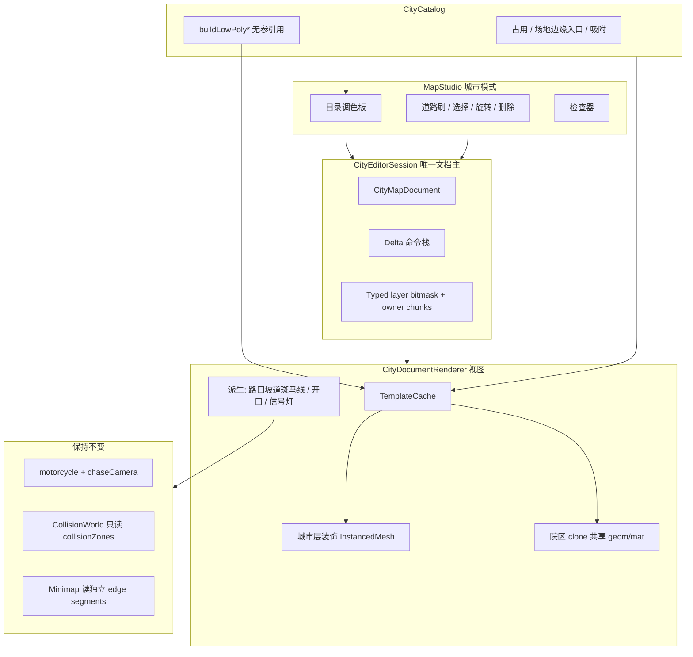
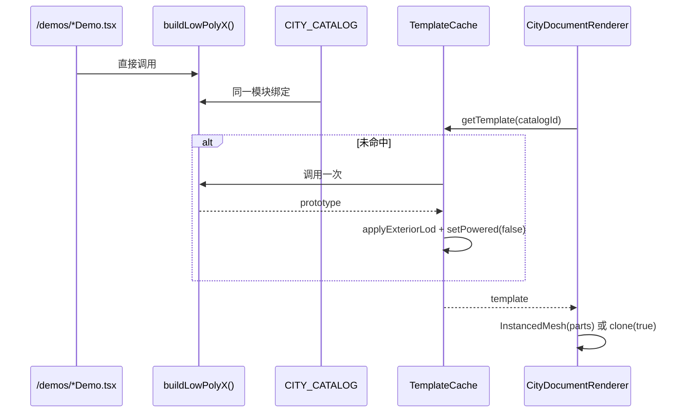
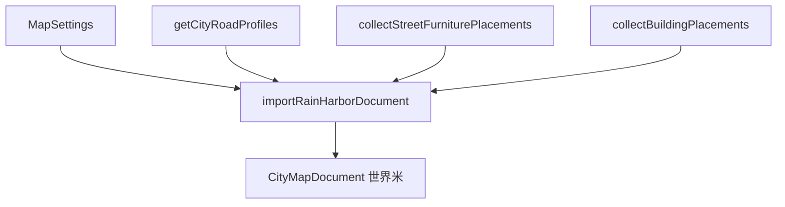

# 雨港新城：从程序化模拟器到格子 3D 城市地图编辑器

| 字段 | 值 |
|---|---|
| 文档标题 | Forest Courier · 雨港新城格子地图编辑器设计稿 |
| 作者 | Forest Courier · Map Workshop |
| 日期 | 2026-08-15 |
| 状态 | Draft — open questions resolved |
| 修订 | 2026-08-16 r7（1 格 = 1 m²；花坛 4×1、兔子电动车 2×1 为游戏标尺；院区保留占地但场地可骑；道路改为预设 + 组合式剖面） |
| 产品 | Forest Courier · Map Workshop (`forest-courier-map-studio`) |
| 范围 | 城市地图（`mapType === "city"`，「雨港新城」/ Rain Harbor） |
| 非范围 | 森林地图程序化生成、展示区 `/demos` 视觉重做、骑行物理重写 |

---

## Overview

当前雨港新城由 `app/lib/map/city.ts` 的 `buildCityWorld()` **一次性程序化生成**：五条南北脊路 `ROAD_X = [-820, -360, 120, 500, 820]`、四条东西脊路 `ROAD_Z = [-640, -180, 280, 700]`，街区里塞的是按城区染色的盒子楼（`addBuildings`），不是展示区院区。工坊侧 `MapStudio.tsx` 只有 `cityDensity` / `roadWidth` / `seed` 滑条，导入导出只序列化 `MapSettings`（`format: "forest-courier-map", version: 2`）。

本设计把城市路径改成 **格子占用 + 世界米路网 + 展示区目录** 的 3D 地图编辑器：用户面对的最小编辑单元是 **1 m × 1 m** 地面方格（路灯 1×1、花坛 **4×1**、兔子电动车 **2×1**；圆形占地收成 n×n 正方形并补四角场地）。花坛和兔子是**游戏标尺**，不是当前 mesh AABB 的直接 `ceil`；地图用 prototype 必须统一缩放或重做视觉包络，使可碰撞本体落在声明格内。现有院区 **不裁 mesh**，编辑保留区按实际 `siteSize`；保留区不可叠放其它建筑，但草地、广场、内路可骑，碰撞只来自楼体、围墙、树干和设施等 `collisionZones`。道路节点与导入物件的位姿存在**世界米**里，再按统一的 world-AABB 半开区间规则栅格化。道路 UI 使用常见预设，文档存左右车道/自行车道/人行道等组合式剖面。渲染必须直接调用 `/demos` 同一套 `buildLowPoly*` 工厂，再派生真正的地图 LOD 或 InstancedMesh/BatchedMesh。森林地图保持程序化；骑行、追逐相机、小地图、破碎（仅森林）保持不变；i18n **只加键、不重写框架**。

城市工坊**默认打开空白镜框**（地面、海、禁区/海堤，无路无楼），并使用固定安全出生点；不能再假定 `roadPoints[0]` 存在。`importRainHarborDocument(settings)` 仍把脊路、`CityRoadProfile` 米制、灯/树/体块的世界坐标原样写入文档，由面板「导入默认雨港」显式调用；该导入结果在 Play 下与现城等价（允许 instance 矩阵浮点差）。`USE_CITY_DOCUMENT` 等价测试用导入器产出作夹具，不用空白默认档。新画道路由预设生成组合式规范剖面（标准机动车道 **3.0 m = 3 格**）；导入边仍冻结现城 2.9–3.8 m 与左右横断面，再按实际世界区间栅格化，禁止把 `ceil(corridorWidth)` 当作完整覆盖规则。森林路径不受影响。

---

## Background & Motivation

### 现状

| 层 | 现状 | 关键文件 |
|---|---|---|
| 工坊 UI | 参数滑条 + Play，不是格子编辑器 | `app/components/MapStudio.tsx` |
| 地图类型 | `MapType = "forest" \| "city"`，城市旋钮 `cityDensity` / `roadWidth` / `seed` / `deliveryStops` | `app/lib/map/types.ts` |
| 城市生成 | `buildCityWorld()` 全图一次建完，不走 `ChunkManager`（森林 `CHUNK_SIZE = 96`） | `app/lib/map/city.ts` |
| 道路 | `getCityRoadProfiles()` 按 seed 赋 1–3 车道/向 + 自行车道 + 隔离带 + 人行道；永远双向机动车。`laneWidth` clamp 2.9–3.8 m，人行道 lerp 6.5–9.2 m | `city.ts` `roadProfile()` |
| 建筑 | 五城区（harbor / waterfront / hills / oldtown / central）程序化盒子 | `city.ts` `addBuildings()` |
| 街道设施 | 已改为展示区源的 InstancedMesh（当前生成器约路灯 306、行道树 270、信号灯 72；测试只断言下界） | `addInstancedShowroomModel()` / `addStreetFurniture()` |
| 场景入口 | `ForestScene.buildCity()` 调 `buildCityWorld()`，骑行 / 碰撞 / 小地图仍工作 | `app/lib/map/ForestScene.ts` |
| 展示区 | 12 个 collection，全部 `buildLowPoly*`，几乎都是 TS 生成的 Three.js Group，不是 GLB | `app/demos/page.tsx` + `app/lib/map/*.ts` |
| 持久化 | `{ format, version: 2, settings }`，没有对象级文档 | `MapStudio.exportMap` / `importMap` |
| 世界尺度 | `CITY_MIN_X/MAX_X = ±1100`，`CITY_MIN_Z = -1080`，`CITY_MAX_Z = 860`（2200 × 1940 m） | `city.ts` |
| 路口骑行 | `addSidewalkNetwork` 铺人行道、转角垫、每活动交叉口 8 条坡道（`RAMP_LENGTH = 4.2`）、斑马线；`sampleCitySurface` 硬编码这些坡 | `city.ts` 219–229、368+ |

### 痛点

1. **不可编辑**：玩家不能把医院、学校、体育中心拖到路上，只能拧密度旋钮重生整座城。
2. **模型两套皮**：展示区有完整院区，城市里仍是盒子楼。路灯/信号灯已复用工厂，建筑没有。
3. **道路类型隐含**：现有剖面永远是「双向 + 非机动车 + 人行道」，没有单行道，也没有「这条路占几格」。
4. **入口与信号灯是写死的**：坡道/斑马线按脊路交点批量铺；信号灯无条件铺满活动交叉口。
5. **JSON 存不住一座城**：version 2 只有旋钮。

### 已有可复用资产（必须直接调用，禁止分叉几何）

展示区工厂是 TypeScript 现场建 Group。地图只要和 demo 引用**同一个函数**，工厂一改，下次 rebuild 就会变。

`city.ts` 已证明这条路：`addInstancedShowroomModel()` 对 `buildLowPolyStreetLight()` / `buildLowPolyTrafficLight()` 的原型 traverse，按 part 做 `InstancedMesh`，`userData.sourceModel` 记录工厂 `group.name`。编辑器要把这套机制推广到**城市层**装饰；院区内部再调一次工厂的嵌套家具**不**并入城市 InstancedMesh（见复用合同）。

---

## Goals & Non-Goals

### Goals

1. 用户最小编辑单元 = 一块 **1 m × 1 m** 地面方格。游戏标尺：路灯 1×1、花坛 4×1、兔子电动车 2×1；其余条目默认按地图 prototype 的地面包络向上取整，允许有审计过的语义 override。**圆形占地在地图上永远是 n×n 正方形**；圆与方之间的空地用场地补白设计。现有展示区建筑/院区 **不裁 mesh、不按入口宽裁内部路**，编辑保留区按实际 `siteSize` / AABB 修正。
2. 单一 `CityCatalog`：catalog id → 展示区工厂 + 占用 + 吸附 + 碰撞 + 分类。加模型 = 加一条注册，绝不复制几何。
3. 道路是轴对齐折线/图（v1 不做自由曲线）。**节点存世界米**；占用栅到格子。UI 提供单行 1 车道、双向 1/2/3 车道/向等预设；文档持久化组合式 `RoadCrossSection`（A→B/B→A 车道数、左右自行车道、人行道、隔离带、停车带）。导入边冻结当时的完整左右米制剖面。
4. 道路可自延伸；碰到院区**场地边缘路缘开口**时自动接路，不把沥青刷进草坪。
5. 红绿灯：用户选择「需要红绿灯」后，在合格交叉口自动放置 `buildLowPolyTrafficLight`，沿用 `getCitySignalCornerOrientation`（现实现恒为 `armSide: -1`）。
6. MapStudio 城市模式变成调色板 + 3D 拖放 + 道路刷 + 选择变换 + 撤销重做。
7. 新 JSON schema（version 3）与 `MapSettings` 分离存储城市文档；Play 骑编辑后的图。
8. 雨港尺度（~2 km）可编辑：院区使用真正的 `map-exterior` LOD（隐藏/合并地图不需要的细节，不把 cutaway 冒充 LOD），装饰 instance；性能验收通过后才开放几十个院区 + 数百装饰。
9. 现有可玩雨港不静默消失：保留 seed → document 导入器（世界米保真），由「导入默认雨港」一键恢复。**默认打开 = 空白镜框**，不是自动导入。
10. 遗留盒子楼只作为导入产物 `legacy-massing-block` 存在；v1 **不做**「一键换成展示区建筑」。

### Non-Goals（v1 明确不做）

- 森林地图格子化 / 森林物体拖放。
- 改写 `/demos` 展示区交互或视觉。
- 改骑行物理（`motorcycle.ts`）、追逐相机、破碎形态。
- 真实 GIS / 经纬度 / 高德路网。
- 信号灯时序驱动（`setPhase` 只摆静态红/绿）。
- 自由角度旋转（新摆物件只 90°；导入树保留自由 yaw）、自由曲线道路、立交/隧道/高架。
- 运行时改工厂源码或把 Group 烘焙成 GLB。
- D1/R2 云端存档。
- v1「一键把遗留体块换成展示区建筑」（2026-08-15 已否决）。
- 城市 chunk 流式加载（后续；v1 全图构建 + 共享几何）。
- 机动车 AI、刚体/布娃娃、建筑破坏；v1 只给现有 `CollisionWorld` 增加静态 circle/OBB collider，不改车辆动力学。
- 把院区内部的灯/坛/餐车提升成城市 InstancedMesh。

---

## Key Decisions

| # | 决策 | 理由 |
|---|---|---|
| D1 | 占用尺 `TILE_SIZE_METERS = 1`；花坛 4×1、兔子电动车 2×1 是游戏标尺 | 1 格 = 1 m 边长、1 m²。标尺优先于当前展示 mesh AABB；地图 prototype 必须缩放/简化到声明包络内，或明确登记不参与碰撞的视觉 overhang。其它条目默认按地图 prototype 地面 AABB `ceil`。新画车道规范 3.0 m = 3 格。 |
| D2 | 方案 A：格子占用 + 目录（不用 B/C） | 满足「最小单元是方格」和「直接复用工厂」。B 留不下道路类型；C 工期不匹配。 |
| D3 | 占用格永远是轴对齐矩形。圆形占地：直径 D → **n×n**，`n = ceil(D / TILE)` | 格子编辑器没有圆形格。外接正方形是唯一占地；四角用 `sitePad` 补成完整方形场地。灯臂等点状家具才用 `footprintOverride`（1×1），**禁止**用 override 缩小院区/楼。 |
| D4 | 单一 `CITY_CATALOG`，工厂字段是无参 `buildLowPoly*` 引用 | 加模型 = 加条目。信号灯**不**走 `factoryArgs`，由 `citySignals.ts` 直接调 `buildLowPolyTrafficLight(-1)` + `setPhase`。 |
| D5 | 模板缓存：每 catalogId 调一次工厂；地图 prototype 有独立资源所有者；invalidate 后强制重建 instance/batch | `prototype.clone(true)` 共享 geometry/material。cache 是共享资源唯一 owner；placement 删除只 detach，不能 dispose 借用资源。HMR 是**新工作**，不是现成钩子。 |
| D6 | 道路节点存世界米；占用再栅到 1 m 格 | TILE=1 时全部脊路相对 origin 落在**格边**（整数米）。新画吸附格心会偏 0.5 m，故仍存世界米：导入无损，延长已有边锁世界轴。`mergeSlop` 默认 0.9 m（> 半格 0.5 m），才能焊上导入脊路。 |
| D7 | UI 用道路预设；文档存组合式 `RoadCrossSection`；导入边持久化冻结的左右米制剖面 | 预设只负责创建剖面，不成为存档真相。导入若只冻道路名称，路缘/灯位/信号会漂数米。`sampleCitySurface`、占用和派生路口读边上的同一剖面。 |
| D8 | 红绿灯默认关；勾选后按交叉口自动摆。三态：`undefined` 继承文档，`true`/`false` 覆盖 | 用户 opt-in。导入城文档旗为 true。 |
| D9 | 入口锚点 = AABB 边路缘切口（城侧接路宽度）。`InternalRoad` = 工厂真实可骑矩形，**只沿 outward 拉到 AABB，禁止按入口宽裁切** | 医院主通道停在 z∈[19,25]，AABB +z=31，必须拉边才能连续采样。学校南环路实际158m宽：可骑面保持158m，不得裁成大门16m。视觉 mesh 不动；围墙/门柱 collisionZones 另行保证入口畅通。 |
| D10 | 导入器保留；**默认打开 = 空白镜框**；「导入默认雨港」是显式命令。盒子楼不自动换 | 用户 2026-08-15 拍板。空白可玩（地面/海/围栏，无路）。导入器仍是恢复今日可骑城的唯一一键路径；`legacy-massing-block` 仅出现在导入结果里，用户用手拖展示区院区替换。 |
| D11 | 森林继续程序化；城市文档与 `MapSettings` 并存 | version 3：`settings` 服务森林与骑行旋钮；`cityDocument` 仅城市。森林写出器**只写 v3 且无 `cityDocument`**（一种写出器）。读端收 v2 与 v3。 |
| D12 | 院区默认真正的 `map-exterior` LOD，烘焙在 **catalogId 模板** 上；v1 不做 per-placement LOD | `setInteriorCutaway(true)` 只隐藏部分外壳并保留大量内部 Mesh，不是 exterior LOD。工厂需标记 map layer，模板构建器隐藏/合并 detail，并以实测 draw calls 作为门槛。以后若要单座开内饰，缓存键改为 `(catalogId,lod)`。 |
| D13 | 占用使用 2200×1940 的 typed-array 位掩码，owner/派生数据按需分块 | 426.8 万格用 `Uint8Array` 存 5–8 个 layer 约 4.1 MiB，比大量字符串键 `Map` 更稳定。选择 owner 可单独用 chunked `Uint32Array`/稀疏表，视觉 GridHelper 与数据存储分离。 |
| D14 | v1 全图构建 + 共享几何；chunk 流式后续 | 今天城市已全图一次建完。 |
| D15 | 位姿使用判别联合：`grid` / `world` / `legacy-massing` 三选一 | 新摆物件用格最小角 + `Yaw90`；导入灯/树用世界米与自由 yaw/scale；体块用唯一 massing pose。禁止同一 placement 同时出现互相矛盾的 `i/j`、`x/z` 与 `massing.x/z`。 |
| D16 | `CityEditorSession` 拥有文档并提供 `subscribe/getSnapshot/revision`；`ForestScene` 只是视图 | 避免 React/editor/scene 三份权威。命令是 `{ apply, revert }` delta；每次 apply/revert 增 revision 并通知 React/renderer。旋转绕 footprint 中心改写 `(i,j)`。 |
| D17 | 院区保留区与骑行碰撞彻底分离；`CollisionWorld` 原生支持静态 circle + OBB | 整个 `siteSize` 只用于编辑 reservation。草地、广场、内路可骑；楼体/围墙/设施由 catalog `collisionZones` 描述并直接注册 circle/OBB。避免圆阵列近似矩形造成穿缝、外溢和大量 collider；不改车辆动力学。 |
| D18 | 导入器在每个 `roadsIntersect` 点插节点并打断两边；刷路撞上异向中心线同样打断 | 「一条脊路一条边」没有共享顶点，度数检测会得到 0 个路口。与 `addSidewalkNetwork` 同一拓扑。 |
| D19 | 现有展示区建筑/院区不裁 mesh；院区 reservation = `ceil(siteSize/TILE)`；语义标尺允许审计过的 `footprintOverride` | 院区保留区禁止缩小。路灯/公园灯/信号 1×1、花坛 4×1、兔子电动车 2×1 是明确的游戏标尺；地图 prototype 必须与 override 视觉包络一致。 |
| D20 | 圆形占地：编辑占用 = 外接正方形；骑行碰撞仍用圆；四角补白可骑、不可再落 solid | 树冠/喷泉/圆塔在格子上是 n×n。补白（铺装/草地/树池）是该条目场地的一部分，不是地图空隙。碰撞：树用树干半径；圆建筑用 `D/2`；补白不加圆。 |
| D21 | 交叉口由图节点派生；只持久化 `intersectionOverrides[nodeId]` | `Intersection{x,z}` 与 `RoadNode{x,z}` 双份坐标会漂。道路拆分/移动后，信号灯覆盖跟随 node id；不再序列化派生交叉口列表。 |
| D22 | 所有占用统一走 world-AABB 半开区间栅格器 | `ceil(width/TILE)` 只算尺寸，不决定格索引。路中心可能在格边或格心，冻结宽度是小数；幽灵、冲突、道路层、碰撞和导入测试必须共享 `rasterizeWorldAabb([min,max))`。 |
| D23 | 默认空白镜框使用固定安全出生点；小地图接收独立线段而非单 polyline | 空文档无 `roadPoints[0]`。Play/相机/配送需有无路回退；小地图不得把不相邻 edges 连成假路。 |
| D24 | 城市静态 collider 使用 uniform spatial hash broadphase | 当前 `CollisionWorld` 每帧线性遍历所有 statics；5000 placements + 院区 zones 不可接受。circle/OBB 按世界 AABB 登记到16m buckets，骑行只查询 bike AABB 相交 buckets；编辑 collision dirty 时增量更新或重建城市索引。 |

---

## Proposed Design

### 系统全景



### 与现有调用链的关系

今天：

```
MapStudio.generate(settings)
  → ForestScene.build(settings)
    → buildCity(settings)
      → buildCityWorld(settings, collision, modelPack)
```

目标：

```
MapStudio 持有 CityEditorSession
  首次进入城市且无已载入文档:
    session.replace(emptyCityDocument())   // 空白镜框，不自动导入
  「导入默认雨港」:
    session.replace(importRainHarborDocument(settings))
  session.document 变更
    → ForestScene.applyCityDocument(doc, dirtyLayers)
  森林路径不变
```

`buildCityWorld()` **不删除**，直到导入器 + 文档渲染覆盖 `city-map.test.mjs`。`ROAD_X` / `ROAD_Z` 从 `city.ts` **导出**（今天是文件私有 `const`，`Minimap.ts` 已复制字面量）供导入器与对照测试使用。

### 格子系统

#### 推导

| 参照物 | 用户标尺 | 当前展示尺寸 | 地图规则 |
|---|---|---|---|
| 路灯 | **1×1** | 基座底半径 0.56 m；悬臂到约 x=2.73 m | 占用/碰撞按杆位；灯臂登记为无碰撞 visual overhang，不得拿来缩小其它 solid |
| 路边花坛 | **4×1** | `roadside-planter-foundation` = 6.35 × 1.75 m | catalog 的地图 prototype 单独等比缩放到 4×1 包络内；测试 `Box3.x≤4 && Box3.z≤1`，禁止只改占用数字 |
| 骑电动车的小兔子 | **2×1** | 当前展示参考长度 2.4 m | 将 `RABBIT_RIDER_REFERENCE_LENGTH_METERS` 与 rider 渲染目标长度改为 2.0 m；它不是 v1 可摆 placement，骑行物理半径仍独立为 0.55 m，不改车辆动力学 |

取 **`TILE_SIZE_METERS = 1`**。一格面积 1 m²。

```
originWorld = { x: CITY_MIN_X, z: CITY_MIN_Z } = { x: -1100, z: -1080 }
tile (i, j) 中心:
  x = origin.x + (i + 0.5) * TILE
  z = origin.z + (j + 0.5) * TILE
bounds（占用栅格，处处用这一对）:
  tilesX = 2200 / 1 = 2200
  tilesZ = 1940 / 1 = 1940
```

栅格与可玩矩形 `[CITY_MIN_X, CITY_MAX_X] × [CITY_MIN_Z, CITY_MAX_Z]` 对齐。海岸 mesh / 护栏仍钉在 `CITY_MAX_Z`。

坐标约定与 `ForestScene.getTextState()` 一致：`+x` 东，`+z` 南。

#### 为什么路网仍存世界米

相对 origin，**全部**现脊路落在格边（`相对 / 1` 都是整数）：

| 坐标 | 相对 origin | `/ 1` | 落点 |
|---|---|---|---|
| `ROAD_X` -820, -360, 120, 500, 820 | 280, 740, 1220, 1600, 1920 | 同左 | **格边** |
| `ROAD_Z` -640, -180, 280, 700 | 440, 900, 1360, 1780 | 同左 | **格边** |

新画吸附格心会偏 **0.5 m**。导入剖面 `laneWidth` 不是整数。因此节点仍存 `(x, z)` 米。占用/幽灵/新画吸附用 1 m 格；延长已有边锁该边世界轴。

#### 占用规则

```ts
export const TILE_SIZE_METERS = 1;
export const OCCUPANCY_TILES_X = 2200;
export const OCCUPANCY_TILES_Z = 1940;

export type Yaw90 = 0 | 90 | 180 | 270;

export function worldSizeToTiles(sizeMeters: number): number {
  return Math.max(1, Math.ceil(sizeMeters / TILE_SIZE_METERS - 1e-6));
}

export function footprintTiles(worldX: number, worldZ: number, yaw: Yaw90): { w: number; d: number } {
  const swap = yaw === 90 || yaw === 270;
  return {
    w: worldSizeToTiles(swap ? worldZ : worldX),
    d: worldSizeToTiles(swap ? worldX : worldZ),
  };
}

/** 唯一 world → tile 覆盖规则。max 是半开边；仅接触格边不算占用。 */
export function rasterizeWorldAabb(min: number, max: number, origin: number): { first: number; lastExclusive: number } {
  const first = Math.floor((min - origin) / TILE_SIZE_METERS + 1e-6);
  const lastExclusive = Math.ceil((max - origin) / TILE_SIZE_METERS - 1e-6);
  return { first, lastExclusive };
}
```

- **新摆锚点**：`(i, j)` = 占用 AABB **最小角**（西、北）。
- **旋转**：`yaw += 90` 后按 footprint 中心回写 `(i, j)`，禁止绕西北角扫过邻格。
- **覆盖**：`footprintOverride` 只用于明确的游戏标尺/点状家具（路灯/公园灯/信号 1×1、花坛 4×1）。override 条目必须有 `mapScale`/地图 prototype 包络测试；院区、楼、遗留体块禁止 override 缩小。
- **导入装饰**：走 `WorldPlacement`，只存 `x,z,yawRadians,scale,heightScale`；占用由旋转后的世界 AABB/override 经过 `rasterizeWorldAabb` 得到。它不再同时携带 `i,j`。
- **道路**：不能用 `ceil(corridorWidth)` 直接猜格数。先求世界走廊 `[center-halfWidth, center+halfWidth)`，再走同一栅格器；格边/格心、小数冻结剖面全部遵守这一规则。
- **占用内存**：每格一个 `Uint8` layer bitmask；reservation owner 另存分块 id 表。禁止以字符串 `"i,j"` 为每个道路格建 `Map`。

#### 圆形占地 → 正方形场地（D3 / D20）

格子上没有圆形格。凡是圆形占地（树冠、圆喷泉、圆塔、以及今天用「一个碰撞圆」表达的点状圆物），**地图占用必须是外接正方形**：

```
n = worldSizeToTiles(diameterMeters)   // ceil(D / 1)，最小 1
occupancy = n × n                      // 永不相等轴
padWorld = n * TILE_SIZE_METERS        // 略大于 D 的方形场地
```

```ts
export function squareTilesFromCircle(diameterMeters: number): { n: number; padMeters: number } {
  const n = worldSizeToTiles(diameterMeters);
  return { n, padMeters: n * TILE_SIZE_METERS };
}
```

| 层 | 圆形本体 | 方 − 圆 的四角/环带 |
|---|---|---|
| 编辑占用 | 计入 n×n | **计入同一 n×n**（整块场地属于该物件） |
| 视觉 | 工厂 mesh **不裁** | `sitePad`：铺装 / 草地 / 方形树池。加在 **TemplateCache** 里，不改 `/demos` 工厂 |
| 骑行碰撞 | 仍用圆：树 = 树干半径；圆建筑 = `D/2` | **不加碰撞圆**（空地可骑） |
| 再放其它 solid | 冲突 | 冲突 |

院区内部的旋转木马、体育场跑道、喷泉 **不** 升为城市层圆形条目：它们已经画在矩形 `siteSize` 里，院区占地仍按矩形 siteSize。

v1 城市层圆形条目：

| id | 直径来源 | n×n | sitePad |
|---|---|---|---|
| `street-tree` | 叶冠 xz AABB；无 GLB 时 fallback `IcosahedronGeometry(2.35)` → D=4.7 m | **5×5**（5 m 场地） | `soil-grate` 方形树池，居中；树干仍在格心 |

导入树带 `scale` 时：直径按 `4.7 * scale` 再 `ceil`，占用可以是 4×4 或 5×5；碰撞仍是 `trunkRadius * scale`。城市行道树 scale≈0.75–0.86 → D≈3.5–4.0 m → **4×4**。

#### 编辑保留区、视觉包络与骑行碰撞分离（D17 / D19）

- **不改** 展示区工厂 mesh、不另写 `buildCityHospital()`、不按格子去切楼板。
- 院区 `reservationFootprint` = `ceil(实际 siteSize / TILE)`，用于防止其它建筑/院区重叠；**它不是碰撞体**。
- 单体建筑 `reservationFootprint` 默认取地图 prototype 地面 AABB；游戏标尺 override 必须同时让地图 prototype 落在声明包络内。
- `visualEnvelope` 用于幽灵预览和开发断言：solid mesh 不得越出 reservation；只有显式 `nonCollidingOverhang`（如灯臂、屋檐）可以越界。
- `collisionZones` 只描述楼体、围墙、柱、树干、花坛等真实实体。院区草地、广场、内部道路和步行路径默认可骑。
- `InternalRoad` 宽度 = 工厂沥青/广场在 siteSize 框里的真实宽度；`stretchInternalRoadToKerb` **只沿 outward 延长到 AABB 边**，垂直方向尺寸不变。
- 城侧自动接路仍用较窄的 `EntranceAnchor.widthMeters`（大门净宽）。内路可骑面 ≠ 大门：学校内路面158m宽，城侧接路16m宽。

遗留盒子楼：reservation 取 `LegacyMassingPlacement.width × depth` 的 ceil 矩形。导入后 Play 碰撞仍用现城那1个圆 `r=min(width,depth)*0.47`，以免默认雨港手感突变；新摆院区则从 catalog 的局部 `collisionZones` 旋转/平移生成碰撞，禁止对整个 siteSize 填圆。

#### 占用层矩阵

层：`road-reservation` | `asphalt` | `bike` | `sidewalk` | `driveway` | `site-reservation` | `solid`。一格可有多层；`reservation` 管编辑冲突，`solid` 仅标实际实体投影。

| 动作 | road-reservation | asphalt / bike | sidewalk | driveway | site-reservation | solid |
|---|---|---|---|---|---|---|
| 装饰 `snap: "cell"` | 冲突 | 冲突 | 否（应改用 road-verge） | 仅入口附属物 | 冲突 | 冲突 |
| 装饰 `snap: "road-verge"` | **必须位于其中** | 冲突 | **必须落在 sidewalk** | 允许 | 允许院区自带家具 | 冲突 |
| 装饰 `snap: "intersection-corner"` | **必须位于其中** | 冲突 | 必须落在交叉口人行垫 | 否 | 否 | 冲突 |
| 建筑 / 院区 | **冲突** | 冲突 | 冲突 | 否 | **冲突** | **冲突** |
| 道路刷 | 同剖面共线段规范化；异剖面拆分/替换 | 按剖面重建 | 按剖面重建 | 清掉再刷 | **拒绝** | **拒绝** |
| 派生 driveway | 只切开所属路缘段 | 覆盖到沥青边 | 换坡道 | 盖上 | 允许穿过所属院区 | **不得穿透 collisionZones** |

幽灵：违反上表 → 红，不可落。

#### 骑行碰撞：只挡真实实体，院区场地可骑

`CollisionWorld.registerStatic({x,z,r})` 当前只有圆，`motorcycle.ts` 的 `BIKE_R = 0.55`。v1 不给整个院区 reservation 填圆，而给碰撞世界增加静态 shape 联合：

```ts
export type CollisionZone =
  | { id: string; kind: "circle"; localX: number; localZ: number; radius: number }
  | { id: string; kind: "rect"; localX: number; localZ: number; width: number; depth: number; yawRadians: number };

export type StaticCollider =
  | { kind: "circle"; x: number; z: number; radius: number }
  | { kind: "obb"; x: number; z: number; halfWidth: number; halfDepth: number; yawRadians: number };
```

- 楼体、围墙、柱、设备、花坛：登记 zone。
- 草地、广场、步行路径、内部道路：不登记 zone，默认可骑。
- 树：碰撞只取树干，不取树冠 reservation。
- 圆形场地条目：只给圆形本体或树干碰撞；`sitePad` 四角可骑。
- `legacy-massing-block`：继续用现城 1 圆 `r=min(width,depth)*0.47`，保证导入手感。

`resolveBike` 对 circle 保持现算法；对 OBB：把 bike 圆心逆旋进 OBB 局部坐标，clamp 到矩形求最近点。圆心在外时按最近点法线推出到 `BIKE_R`；圆心在内时按最近边的最短轴推出 `到边距离 + BIKE_R`。速度损失/切向滑动继续复用现 `collideStatic` 响应，只替换接触法线与穿透深度求法。这样窄墙、长楼和旋转设施都无需数百个近似圆，也不会把碰撞扩进相邻草地。

城市 collider 不直接塞进当前线性 `statics[]`：新增16m uniform spatial hash，shape 按世界 AABB 写入所有相交 bucket；`resolveBike` 用 bike AABB 查询候选并按 collider id 去重。placement 新增/移动/旋转/删除只更新该 placement 的 buckets；导入/清空可整表重建。森林 chunk collider 路径保持不变。

入口和内部道路不靠“挖洞”实现，因为场地本来就没有整块碰撞。只需保证入口线与 catalog 围墙/门柱 zones 不相交；工厂真实 `InternalRoad` 仍服务于入口连通、表面采样与测试。

`tests/city-collision.test.mjs`：

- 医院楼体中心被挡；医院草坪、主广场和 `(0,31)→(0,22)` 内路连续可骑。
- 学校操场/内部道路可骑，教学楼和围墙被挡。
- 公园草坪、广场与步行路径可骑；树干、建筑、花坛被挡。
- OBB 四边、四角、圆心在内、旋转45°的接触解析正确；zone 外 `BIKE_R + 0.01m` 的平行测试线自由。
- placement 旋转 90/180/270 后 collisionZones 与视觉/入口同轴。
- 远处10000个 collider 不进入当前 bike bucket 候选；跨 bucket 的长围墙只解析一次；移动/undo 后旧 bucket 无残留。

### 目录 / Prefab 注册表

新文件：`app/lib/map/cityCatalog.ts`。

**硬约束**：`factory` 必须是展示区正在 import 的那个**无参**函数。禁止在 catalog 里复制几何、把 Group 序列进 JSON、为地图另写 `buildCityHospital()`。

```ts
export type CatalogCategory = "decoration" | "building" | "scene";
export type Cardinal = "+z" | "-z" | "+x" | "-x";

export type EntranceAnchor = {
  id: string;
  /**
   * siteSize 坐标系（工厂 Group 应用根 scale 之后，与 userData.siteSize 同一框架）。
   * 商场必须用 184×138，禁止写预缩放 160×120 或把 69 再乘 1.15。
   * 必须落在 siteSize AABB 边缘（容差 1.0 m）。
   */
  localX: number;
  localZ: number;
  widthMeters: number;
  outward: Cardinal;
  /** 对应 internalRoads[].name；有值则该洞必须与本切口线段相交 */
  connectsInternalRoad?: string;
};

export type InternalRoad = {
  name: string;
  /** 可骑内路/广场中心，siteSize 坐标 */
  localX: number;
  localZ: number;
  width: number;
  depth: number;
};

/** 工厂沥青/广场矩形沿 outward 拉到 AABB 边；垂直方向尺寸不变。禁止按入口宽裁切。只写碰撞，不改 mesh */
export function stretchInternalRoadToKerb(
  factory: { localX: number; localZ: number; width: number; depth: number },
  site: { x: number; z: number },
  outward: Cardinal,
): InternalRoad;

export type FootprintKind = "rect" | "circle";
export type SitePadMaterial = "paving" | "grass" | "soil-grate";
export type MapLodPolicy =
  | { mode: "instanced-parts" }
  | { mode: "tagged-exterior"; hideLayers: Array<"interior" | "micro-detail" | "animated-detail">; mergeStaticByMaterial: true };

export type CatalogEntry = {
  id: string;
  collection: 1 | 2 | 3 | 4 | 5 | 6 | 7 | 8 | 9 | 10 | 11 | 12;
  category: CatalogCategory;
  titleZh: string;
  titleEn: string;
  factory: () => THREE.Group;
  /** 地图 prototype 的根缩放；默认 1。语义 override 必须靠它或专用 map variant 真正落进声明包络 */
  mapScale: number;
  footprintKind: FootprintKind;
  /** factory 源坐标系的 siteSize；先乘 mapScale。rect 取为 reservation，circle 再按直径收成 n×n */
  siteSizeMeters: { x: number; z: number };
  circleDiameterMeters?: number;
  /** 圆形占地的方形补白；加在 TemplateCache，不进工厂源码 */
  sitePad?: { material: SitePadMaterial };
  footprintOverride?: { w: number; d: number };
  /** 允许越出 reservation 但不参与碰撞的视觉件，如路灯灯臂；必须列名，不接受任意 Box3 越界 */
  nonCollidingOverhangNames?: string[];
  collision:
    | { source: "factory-userData" }
    | { source: "catalog"; zones: CollisionZone[] };
  snap: "cell" | "road-verge" | "intersection-corner";
  reservation: "none" | "object" | "site";
  entrances?: EntranceAnchor[];
  internalRoads?: InternalRoad[];
  frontDirection?: Cardinal;
  mapLod: MapLodPolicy;
  maxRecommendedCount: number;
  /** 城市 instance 时乘在 Y；灯 1.32，信号由派生层写 1.25，其余 1 */
  defaultHeightScale: number;
};

export const CITY_CATALOG_SCHEMA_VERSION = 1;
export const CITY_CATALOG: readonly CatalogEntry[];
export function getCatalogEntry(id: string): CatalogEntry | undefined;
```

`getCatalogEntry` **不是**全函数：未知 id 返回 `undefined`，渲染器跳过并记入 `catalogMisses`。

catalog 变换顺序固定：先构建 factory 与读取 `userData.mapCollisionZones`，再把 `mapScale` 同时作用到 mesh、siteSize、入口、InternalRoad、collision zone 坐标/尺寸/半径，最后计算 reservation override 与 yaw。禁止只缩 mesh 不缩碰撞，或只改 footprint 数字。

调色板分组跟随 `app/demos/page.tsx` 的 12 个 collection。**例外**：`buildLowPolyParkStreetLight` 不是 COLLECTION 01 展品（`CityFurnitureDemo.tsx` 是树+路灯+信号+餐车+两亭+电话亭+花坛 = 8，与首页「8 组模型」一致）。公园灯挂在 COLLECTION 09，标「园内共享家具」。

#### v1 目录占用表

**COLLECTION 01 街道装饰** — `cityFurniture.ts`

| id | 工厂 | 世界 xz (m) | 占用 | 备注 |
|---|---|---|---|---|
| `street-light` | `buildLowPolyStreetLight` | 杆位 | **1×1** | `defaultHeightScale: 1.32`（instance 时乘，不进工厂） |
| `traffic-light` | 不经 catalog.factory 实例化 | 杆 + 臂 | **1×1** | 不进调色板。`citySignals.ts` 调 `buildLowPolyTrafficLight(-1)`。现 `getCitySignalCornerOrientation` **恒** `armSide: -1` |
| `roadside-planter` | `buildLowPolyRoadsidePlanter` | 原型 6.35 × 1.75；地图 prototype 缩到 ≤4×1 | **4×1** | 用户标尺；Box3 与 collision zone 都必须落格内 |
| `food-truck` | `buildLowPolyFoodTruck` | 5.85 × 2.28 | **6×3** | `ceil` 实际 |
| `hot-dog-kiosk` | `buildLowPolyHotDogKiosk` | 3.5 × 2.5 | **4×3** | |
| `newsstand` | `buildLowPolyNewsstand` | 3.5 × 2.5 | **4×3** | |
| `phone-booth` | `buildLowPolyPhoneBooth` | 缩放后 1.84 × 1.69 | **2×2** | |
| `street-tree` | `tree_normal_medium_redwood_a` showroom wood | 叶冠 D≈4.7 m | **5×5** | 圆形占地收方；`sitePad: soil-grate`；碰撞仍树干 ~0.7。唯一非 `buildLowPoly*` |

**COLLECTION 09 共享（公园灯）**

| id | 工厂 | 占用 | 备注 |
|---|---|---|---|
| `park-street-light` | `buildLowPolyParkStreetLight` | 1×1 | 公园 demo 使用；调色板放 09，不冒充 COLLECTION 01 |

**COLLECTION 02 居民建筑**

| id | 工厂 | 基础 / siteSize (m) | reservation | mapLod |
|---|---|---|---|---|
| `residential-building` | `buildLowPolyResidentialBuilding` | 7.4 × 5.25 | **8×6** | tagged-exterior |
| `high-rise-residential` | `buildLowPolyHighRiseResidential` | 13 × 9 | **13×9** | tagged-exterior |
| `small-villa` | `buildLowPolySmallVilla` | 8.3 × 6.65 | **9×7** | tagged-exterior |
| `office-campus` | `buildLowPolyOfficeCampus` | **30 × 17** | **30×17** | tagged-exterior |

**COLLECTION 03–12 院区**

所有坐标 = **`userData.siteSize` 框架**（根 `group.scale` 已乘完）。商场 `SHOPPING_MALL_SCALE = 1.15`：siteSize 已是 184 × 138，切口写 `(0, 69)`，**不要**再 `* 1.15`。

`InternalRoad` 是可骑表面/入口连通元数据，不再是从整院区碰撞中挖出的“洞”：工厂真实沥青/广场沿 `outward` 拉到 AABB，垂直方向保持工厂宽度。视觉 mesh 保持工厂原尺寸。`connectsInternalRoad` 有值时，该矩形必须与切口线段相交。**禁止**把 158 m 的路裁成 16 m 大门。

城侧接路宽度仍写在 `EntranceAnchor.widthMeters`（下表「入口」列）。

| id | siteSize | reservation | mapLod | maxN | EntranceAnchor（siteSize 米，城侧接路宽） | InternalRoad 可骑表面 `{name, x, z, w, d}`（工厂真宽 + 只拉边） |
|---|---|---|---|---|---|---|
| `hospital-campus` | 80 × 62 | **80×62** | tagged-exterior | 4 | `main` (0, **31**, w=12, `+z`) → main-access；`emergency` (**40**, 5, w=8, `+x`) → emergency；`ward` (0, **−31**, w=10, `−z`) → ward | `main-access` (0, **25**, 76, **12**) 工厂 (0,22,76,6) 拉到 z=31；`emergency` (**36.5**, 5, **7**, 36) 工厂 (35.5,5,5,36) 拉到 x=40；`ward` (0, **−29.1**, 28, **3.8**) 工厂 (0,−29,28,3.6) 拉到 z=−31 |
| `amusement-park` | 180 × 130 | **180×130** | tagged-exterior | 2 | `gate` (0, **65**, w=16, `+z`) 大门净宽即工厂宽度，不是裁切 | `gate-approach` (0, **60**, 16, **10**) 工厂大门 ~16 m 从 z=55 拉到边 65 |
| `school-campus` | 170 × 130 | **170×130** | tagged-exterior | 2 | `main` (0, **65**, w=16, `+z`) 只决定城侧 driveway | `main-approach` (0, **62.4**, **158**, **5.2**) 工厂 `school-campus-service-road` (0,61.8,158,4) **整宽**拉到 z=65，不裁成 16 |
| `shopping-mall` | **184 × 138** | **184×138** | tagged-exterior | 2 | `south` (0, **69**, w=**62.1**, `+z`) 入口广场 54×1.15 | `south-perimeter` (0, **64.11**, 172.5, **9.78**) 工厂南环路 (0,55,150,7)×1.15 拉到 z=69 |
| `residential-community` | 190 × 145 | **190×145** | tagged-exterior | 2 | `public-south` (0, **72.5**, w=16, `+z`)（临街商铺外路，**不是**内门 (−43, 35)） | `public-road` (0, **69.05**, 181, **6.9**) 工厂 (0,68.7,181,6.2) 拉到 z=72.5 |
| `fire-station` | 155 × 110 | **155×110** | tagged-exterior | 2 | `response` (0, **55**, w=80, `+z`) 六车库净宽；连通面仍用整条出警路 | `public-response` (0, **50.5**, **151**, **9**) 工厂已贴 z=55，无需再拉，**不裁成 80** |
| `city-park` | 185 × 140 | **185×140** | tagged-exterior | 2 | `south` (0, **70**, w=20, **`+z`**)；`north` (0, **−70**, w=18, `−z`)；`west` (**−92.5**, 0, w=18, `−x`)；`east` (**92.5**, 0, w=18, `+x`)。工厂 `inwardDirection` 与 outward 相反，勿抄 | `south-plaza` (0, **58.75**, **48**, **22.5**) 广场 (0,57,48,19) **整宽**拉到 z=70，不裁成 20；北东西口工厂无更宽沥青 → 按入口净宽 18 m 拉边 |
| `sports-center` | 280 × 190 | **280×190** | tagged-exterior | **1** | `public` (0, **95**, w=24, `+z`) | `public-road` (0, **89.75**, 274, **10.5**) 工厂 (0,89,274,9) 拉到 z=95（跑道在矩形场地内，reservation 仍是矩形） |
| `city-center` | 210 × 165 | **210×165** | tagged-exterior | **1** | `map` (0, **82.5**, w=16, `+z`)；`transit-west` (**−105**, −39, w=20, `−x`) | `south-boulevard` (0, **75.25**, **204**, **14.5**) 工厂南大道 (0,74,204,12) **整宽**拉到 z=82.5；`hub-apron-west` 按工厂 apron 真宽拉到 x=−105 |
| `town-center` | 175 × 135 | **175×135** | tagged-exterior | 2 | `south` (0, **67.5**, w=17, `+z`) 人行接口净宽 | `south-street` (0, **61.75**, **169**, **11.5**) 工厂南环 (0,61,169,10) **整宽**拉到 z=67.5 |

`tests/city-catalog.test.mjs`：

- 每条 `entrances[]` 距 `siteSize` AABB 边 ≤ 1 m。
- 每条带 `connectsInternalRoad` 的切口线段与对应 `InternalRoad` 矩形相交。
- `stretchInternalRoadToKerb`：outward 轴变长，垂直轴等于工厂宽度（学校 158、公园南广场 48、市镇南环 169、城市中心南大道 204）。
- 院区占用 `w,d` ≥ `ceil(siteSize / TILE)`，禁止更小裁切框。
- `street-tree`：`footprintKind==="circle"`，占用 n×n 且 n≥5（D=4.7），`sitePad.material==="soil-grate"`。
- `factory ===` 导出函数；`siteSize` 对齐 `userData.siteSize`（商场断言 `x===184`、`z===138`）。
- 商场南切口 `(0, 69)` 在缩放后 AABB 上，**不**在 `69*1.15`。
- 花坛地图 prototype 的 solid `Box3` ≤ 4×1；兔子比例尺长度 === 2 m。
- 每个 `reservation:"site"` 工厂必须在 `userData.mapCollisionZones` 暴露楼体/围墙/设施的语义碰撞；catalog 只声明 `source:"factory-userData"`，避免几何改了而碰撞清单留旧。点状家具/GLB 可用 catalog zones。collisionZones 的 union 不得等于整个 siteSize；草地/广场/内路可骑夹具必须存在。
- traverse 同时记录 `showcaseMeshCount` 与 `mapVisibleMeshCount`；后者在加 `sitePad` 前统计，并受性能门槛约束。

**迁移专用（不进默认调色板）**

| id | 渲染 | 用途 |
|---|---|---|
| `legacy-massing-block` | 与今天相同的 **7** 个 InstancedMesh（bodies, plinths, roofs, trims, doors, awnings, windows） | 导入器写入世界位姿。禁止新图手摆。 |

兔子骑手不是 v1 可摆物件。

### 复用合同与实时同步



#### 规则

1. **模块身份**：`cityCatalog.ts` 与 demo 从同一相对路径 import。
2. **禁止烘焙**：JSON 不存几何。
3. **模板缓存**：

```ts
class CityTemplateCache {
  private generation = 0;
  private map = new Map<string, TemplateRecord>();

  invalidateAll() {
    /* 先让 renderer detach 所有借用 clone/instance，再由 cache 对 ownedResources 各 dispose 一次。 */
    cityDocumentRenderer.detachCatalogBorrowers();
    for (const rec of this.map.values()) rec.owner.dispose();
    this.map.clear();
    this.generation += 1;
  }

  get(entry: CatalogEntry): TemplateRecord {
    /* 键 = catalogId。factory 只调用一次得到 showcasePrototype；再按 entry.mapScale 与
       mapLod 构建 mapPrototype。所有 geometry/material/sitePad 都登记在 record.owner。
       placement 只借用，删除/undo 时只 detach。 */
  }
}

function buildMapPrototype(entry: CatalogEntry, source: THREE.Group): THREE.Group {
  source.userData.setPowered?.(false);
  source.userData.setWaterMotionEnabled?.(false);
  /* 工厂给 Object3D 标 userData.mapLayer = exterior|interior|micro-detail|animated-detail。
     tagged-exterior 隐藏非地图层，并把静态、同材质、同阴影策略的 mesh 合并；
     重复家具提升为 prototype 内的 InstancedMesh/BatchedMesh。绝不调用 cutaway 充当 LOD。 */
}
```

4. **资源所有权是硬规则**：cache 拥有共享 prototype、geometry、material、texture、sitePad；placement/scene 只是 borrower。现有 `ForestScene.disposeWorld()` 的“遍历所有 Mesh 直接 dispose”不能用于城市借用层，必须改成 renderer 显式 `disposeOwnedLayer()` + cache `owner.dispose()`。测试删除两个共享 clone 中的一个，另一个仍可渲染。
5. **失效是硬规则**：`invalidateAll` 之后调用方按新 `record.parts` 重建 InstancedMesh/BatchedMesh；只 bump generation 不会更新已上传缓冲。
6. **HMR 是新工作**：`app/lib/map` 今日无 `import.meta.hot`。PR 2 为 `cityCatalog.ts` 与各工厂加 `import.meta.hot.accept` → `invalidateAll` + `rebuildAllCatalogLayers`。未接 HMR 前靠「刷新模型」按钮或整页 reload。
7. **实例化**
   - 城市层装饰：每 catalogId **一次** `geometry.clone()` + `material.clone()`（与今天 `addInstancedShowroomModel` 相同），再 instance。缓存避免每盏灯再 clone。
   - 院区/建筑：clone 的是已合并/裁掉细节的 `mapPrototype`，共享 geometry/material。禁止直接 clone 数千 Mesh 的展示 prototype。
   - 院区内部重复灯/树/花坛在 `buildMapPrototype` 阶段提升为院区内 batch；仍不并入城市全局 instance，以保持工厂封装。
   - 信号灯不走 catalog.factory。
8. **heightScale / setPhase 在工厂外**：改杆几何 → instance 几何变；改「城灯有多高」必须渲染器继续乘 1.32 / 1.25。
9. **回归**：`invalidateAll` 后 instance 层 `sourceModel` 仍为 `"city-street-light-lowpoly"`；每个重院区记录 `showcaseMeshCount`、`mapVisibleMeshCount`、`mapDrawCalls`，性能门槛用 renderer 实测。
10. **v1 无 per-placement LOD**：placement 不带 `mapLod`。以后若要单座开内饰，缓存键改为 `(catalogId,lod)`，两套 prototype 与资源 owner 隔离。

### 道路工具

#### 数据：世界米图 + 格子占用

```ts
export type RoadPresetId = "one-way-1" | "two-way-1" | "two-way-2" | "two-way-3";

/** left/right 永远以看向 a→b 的方向定义；单位都是世界米。 */
export type RoadSideProfile = {
  bikeLaneWidth: number;
  bikeBufferWidth: number;
  parkingWidth: number;
  sidewalkWidth: number;
  vergeWidth: number;
};

export type RoadCrossSection = {
  lanesAToB: number;
  lanesBToA: number;
  laneWidth: number;
  medianWidth: number;
  left: RoadSideProfile;
  right: RoadSideProfile;
};

export type RoadProfile =
  | { source: "preset"; presetId: RoadPresetId; crossSection: RoadCrossSection }
  | { source: "frozen-import"; crossSection: RoadCrossSection };

export type RoadNode = { id: string; x: number; z: number };

export type RoadEdge = {
  id: string;
  a: string;
  b: string;
  profile: RoadProfile;
};

export type IntersectionOverride = {
  /** key 是派生交叉口对应的 RoadNode.id；undefined 继承文档旗 */
  needTrafficLights?: boolean;
};

export type CityRoadGraph = {
  nodes: RoadNode[];
  edges: RoadEdge[];
  intersectionOverrides: Record<string, IntersectionOverride>;
};
```

边必须轴对齐：`a.x===b.x` 或 `a.z===b.z`（容差 1e-4）。度数 ≥ 3，或两度但转向 → 派生交叉口。文档不再另存 `Intersection{x,z}`。

`a/b` 顺序有交通和左右语义，禁止为排序而静默交换。拆边必须生成 `a→mid`、`mid→b` 并原样复制 profile。若内部确需反转 edge 表示，必须同时交换端点、`lanesAToB/lanesBToA`、`left/right`，从而保持世界中的车流与横断面完全不变；该操作不是用户的“反转车流”。

**新画吸附**：指针落到最近格心，节点写该格心世界坐标。

**延长已有边**：新节点锁在该边的固定轴（南北脊锁 `x`，东西脊锁 `z`），不重新吸附到格心。这样延长 `-820` 脊路不会跳到 -819.2 或 -820.8。
**打断 / 合并（D18）**：刷子或自延伸的新段若在 `mergeSlop`（默认 0.9 m）内碰到**另一条边的中心线**（不只是已有节点），则：

1. 在交点插入或复用一个节点；
2. 把被碰到的边拆成两段（完整继承 `RoadProfile`）；
3. 新段接到该节点。

禁止「焊到 2 km 脊路的端点」这种假合并。交叉口度数检测只认图，几何交叉仅作 debug 断言。

共线重叠不能只说“同向合并”：

- 世界横断面完全相同、交通方向语义相同 → 拆点后规范化为不重叠的最少 edges。
- 剖面不同 → 默认红色拒绝；用户显式选择“替换道路”时，先按刷子边界拆旧 edge，再用新 profile 替换覆盖段。
- 只有端点相接但剖面不同 → 允许，生成 profile-transition node；v1 沥青取两剖面 union、标线在节点截断，禁止在一条 edge 中途无节点突变。

#### 剖面 → 米 → 占用格

**新画规范组件**（1 m 格，默认整数米）：

| 组成 | 规范米 | 格 |
|---|---|---|
| 一条机动车道 | **3.0** | **3** |
| 非机动车道 | **3.0** | **3** |
| 机非隔离 | **1.0** | **1** |
| 单侧人行道 | **8.0** | **8** |
| 停车带 / 中央隔离 / 绿化带 | 预设默认 0；检查器可按 1 m 步进增加 | 同米数 |

UI 预设只负责生成下列 `RoadCrossSection`，落图后检查器可编辑组件；存档真相是组合结果，不是预设名：

| 预设 | A→B / B→A | 左侧 | 机动车+中央 | 右侧 | 总宽 |
|---|---:|---:|---:|---:|---:|
| `one-way-1` | 1 / 0 | 0 | 3 | 自行车3 + 隔离1 + 人行道8 | **15 m** |
| `two-way-1` | 1 / 1 | 12 | 6 | 12 | **30 m** |
| `two-way-2` | 2 / 2 | 12 | 12 | 12 | **36 m** |
| `two-way-3` | 3 / 3 | 12 | 18 | 12 | **42 m** |

其中双向预设的单侧 12 m = 自行车道3 + 隔离1 + 人行道8。单行预设默认设施在行进方向右侧；检查器移动到左侧时直接改 `left/right`，不增加新的道路枚举。未来的单行2/3车道、单侧停车带、中央绿化带都由同一结构表达。

道路刷按“按下点 = a、松开/当前端 = b”确定 a→b；单行幽灵必须显示连续方向箭头。检查器的“反转车流”只交换 `lanesAToB/lanesBToA`，保持道路实体位置和左右设施不动；另提供“镜像左右设施”交换 `left/right`。用户不直接编辑内部 a/b id。

**导入边**写 `source:"frozen-import"`，把现 `CityRoadProfile` 转成对称左右剖面：A→B/B→A 各 `lanesPerDirection`，左右各用真实 `bikeLaneWidth/bufferWidth/sidewalkWidth`。一条双向3车道可到机动车 22.8 m、总走廊约 50 m，不能压成规范42 m。

```ts
function corridorMeters(edge: RoadEdge): number {
  const c = edge.profile.crossSection;
  return sideWidth(c.left)
    + (c.lanesAToB + c.lanesBToA) * c.laneWidth
    + c.medianWidth
    + sideWidth(c.right);
}
```

占用先在世界中求走廊 AABB，再调用 `rasterizeWorldAabb`；禁止用 `ceil(corridorMeters)` 直接指定格数。`sampleCitySurface`、灯位、信号位和标线读同一个 `RoadCrossSection`。

标线：任一方向为0时不画双向中心黄线；双向时按 `medianWidth` 选择双黄/实体隔离，方向内部画 `laneCount-1` 道虚线。停止线、箭头和信号头只在存在的 approach 上生成。

#### 派生路口几何（与信号灯同类）

现城可骑不只是沥青盒子。`addSidewalkNetwork` 还铺：

- 分段人行道（在交叉口走廊处断开）
- 转角垫
- 每个活动交叉口 **8 条** 坡道（`RAMP_LENGTH = 4.2`，`rampCount = ROAD_X.length * ROAD_Z.length * 8`）
- 斑马线与停止线

这些全部是路网的**派生几何**，与信号灯一样不进 JSON。旧算法只用于“默认雨港等价”夹具，不能原样推广到编辑器：T 字、单行、缺一侧人行道和不等宽道路不一定有 8 条坡。新 `rasterJunctionFurniture(graph)` 按每条进入节点的 approach 生成切线/法线、左右路缘、存在的人行道端点、停止线和斑马线，再对路口中心做 union。只有实际存在且能接到另一侧人行道的端点才生成坡道。

`sampleCitySurface` 读同一份派生栅：沥青 0、人行道 `CURB_HEIGHT = 0.24`、坡道按现公式 lerp。回归：默认导入后在旧 `ROAD_X[i] × ROAD_Z[j]` 活动交叉口角上采样，高度仍走坡，不得突变 0.24。

#### 自延伸

1. 端点柄沿固定轴拖；拐 90° 插入节点，完整继承 `RoadProfile`（从导入边拖出的第一段仍是 `frozen-import`；检查器可选择一个预设转换为规范剖面）。
2. `mergeSlop` 内若命中异向中心线：插点并**打断**该边（见上），不是只焊端点。
3. 刷子沿指针走轴对齐折线，同样走打断。

交叉口：图上度数 ≥ 3，或两度但转向 → T/+。导入器必须已经在每个 `roadsIntersect` 处打断，否则默认雨港度数全是 1。

#### 自动入口

锚点是 **site-edge kerb cut**，必须通过 catalog 单测「落在 `siteSize` 边上」。

**两种接法**

1. **沿路（平行）**

   城路走向 ⊥ `outward`（路贴着院墙正面走）。从切口沿 `outward` 向外搜符合方向的第一条沥青中心线；遇到其它 site-reservation、solid、海岸/可玩边界即停止，不得穿过第三方院区。拒绝距离 `> max(40 m, 0.5 * 该边面宽)` 的匹配（避免跨城误接）。
   在路缘与切口之间盖 `driveway`（宽 `ceil(widthMeters/TILE)`，至少 2 格），人行道换 `createCurbRampGeometry`。

2. **尽端路（stub，正撞）**

   城路走向 ∥ `outward`，且中心线到切口横向距离 ≤ `widthMeters/2`。把该边终点焊到切口世界坐标（T 接）。

**进入院区（硬约束）**：`connectsInternalRoad` 有值时：

- 城侧：AABB **外**盖 driveway / 坡（与沿路相同）。
- 院内：不新铺沥青 mesh（工厂路保持原样）。
- 可骑表面：使用 catalog 里已经拉到切口、未裁入口宽的 `InternalRoad`。实现 = `stretchInternalRoadToKerb(factoryRect, siteSize, outward)`；必须与切口线段相交。学校南缘保持 158 m 工厂真宽，不压成 16 m。
- 碰撞：入口线、InternalRoad 和可骑广场不得与围墙/门柱/楼体 `collisionZones` 相交。医院局部 `(0,22)` 与 `(0,31)→(0,25)` 全段自由。

无 `internalRoads` 的切口：只在 AABB 外人行带开口；院内是否可继续骑由实际 `collisionZones` 决定，不再把剩余 siteSize 当 solid。

工厂里没有对应沥青、只有门洞/缺口（公园北东西口）：`InternalRoad` 用 **入口净宽** 生成条带再拉边。这是「按实际开口」，只有在存在更宽工厂路时才禁止裁宽。

不再使用固定 `ENTRANCE_SEARCH_TILES = 8`。

无 `entrances[]` 的单体建筑：用 `frontDirection`（默认 `+z`）在 footprint 正面中点合成宽 2–4 格的隐含切口，规则同上。

派生表不进 undo；路或院区一动整表重算。

placement 旋转时，`EntranceAnchor`、`InternalRoad`、`collisionZones` 与 `frontDirection` 必须使用同一个绕 reservation 中心的局部→世界变换；catalog 测试覆盖 0/90/180/270°，禁止只旋 mesh 不旋入口/碰撞。

#### 红绿灯（opt-in）

| `flags.needTrafficLights` | `intersectionOverrides[nodeId]?.needTrafficLights` | 结果 |
|---|---|---|
| false | `undefined` | 关 |
| false | false | 关 |
| false | true | **开**（交叉口强开） |
| true | `undefined` | 开 |
| true | true | 开 |
| true | false | **关**（交叉口强关） |

- 文档默认 false。导入雨港文档旗 = true。
- 合格：至少 3 个**有驶入车道**的 approaches。只有驶出车道的单行支路不生成面向它的信号头；2 路转角不摆。
- 每个受控 approach 一盏：`buildLowPolyTrafficLight(-1)`；位置从该 approach 的 tangent/normal 与左右剖面求出，朝向采用向量算法。旧 `getCitySignalCornerOrientation` 只作为默认四向路口回归夹具，不作为任意 T 字/单行路口的生成器。相位按驶入车道数与主路优先级，`heightScale:1.25`。
- 关：0 盏。不进调色板。
- 渲染器第一天就读这张表，禁止「先无条件摆灯、PR 8 再改 opt-in」。

### 编辑器 UX 与文档所有权

`CityEditorSession`（`app/lib/map/cityEditor.ts`）是文档唯一主：

```ts
class CityEditorSession {
  readonly document: CityMapDocument;          // 可变，仅 session 写
  private revision: number;
  subscribe(listener: () => void): () => void;
  getSnapshot(): { document: CityMapDocument; revision: number };
  apply(delta: DocumentDelta): void;
  undo(): void;
  redo(): void;
  replace(next: CityMapDocument, name: "import" | "clear"): void; // 整表替换进栈
}

type DocumentDelta = {
  name: string;
  apply(doc: CityMapDocument): void;
  revert(doc: CityMapDocument): void;
};
```

栈深100。导入/清空才整表替换。每次 apply/revert/replace 递增 revision、按 dirty mask 重算派生层并通知订阅者；React 用 `useSyncExternalStore(session.subscribe, session.getSnapshot)`，禁止依赖可变 document 引用自己变化。

`ForestScene` **不拥有**文档：

```ts
applyCityDocument(doc: CityMapDocument, dirty?: LayerMask): void;
```

`getCityDocument()` 若仍暴露，只是调试只读快照，权威在 session。`MapStudio` 持有 session；导出序列化 `session.document`。

`mapType === "city"` 且非 Play：右侧换成编辑器。森林 UI 不动。i18n **只加键**。

| 操作 | 行为 |
|---|---|
| 拖调色板 | 射线 y=0，吸附格；层矩阵绿/红 |
| `R` | 绕 footprint 中心 +90°，回写 `(i,j)` |
| 道路工具 | UI 选预设；新画吸附格心；柄延长继承世界轴与完整组合剖面；检查器可编辑左右组件 |
| 选择/删 | Raycast `instanceId → placementId`；GridPlacement 平移吸附格，WorldPlacement 保持世界相位；删除后维护 instance 映射 |
| 撤销 | session.undo，Ctrl/Cmd+Z |
| Play | 骑当前文档。优先使用 `document.spawn`；若被新 collision zone 挡住，找最近可骑格；空白镜框回退固定安全点，不访问空 `roadPoints` |
| 「导入默认雨港」 | `session.replace(importRainHarborDocument(settings))`，一条 undo（整表替换）。有确认 |
| 「清空为镜框」 | `session.replace(emptyCityDocument())`，回到默认打开态。有确认 |

城市滑条：`cityDensity` / `roadWidth` 退出主路径，只服务于「导入默认雨港」时复现旧生成器。`deliveryStops` 保留，渲染器沿**文档**路网人行道跑从 `addDeliveryStops` 抽出的纯函数（空白图为 0 个灯塔）。

2 km 地图不能只靠单次拖放：v1 同时提供俯视/透视切换、道路连续刷、Esc 取消、复制/粘贴、框选删除、目录搜索、格坐标与 footprint 尺寸提示。多选变换可后置，但不能只实现“从调色板拖一次放一次”。

#### 持久化（version 3）

```ts
type MapFileV3 = {
  format: "forest-courier-map";
  version: 3;
  settings: MapSettings;
  cityDocument?: CityMapDocument;
};

type PlacementBase = {
  id: string;
  catalogId: string;
};

type GridPlacement = PlacementBase & {
  poseKind: "grid";
  i: number;
  j: number;
  yaw: Yaw90;
};

type WorldPlacement = PlacementBase & {
  poseKind: "world";
  x: number;
  z: number;
  yawRadians: number;
  scale: number;
  heightScale?: number;
};

type LegacyMassingPlacement = PlacementBase & {
  poseKind: "legacy-massing";
  x: number;
  z: number;
  yawRadians: 0;
  width: number;
  depth: number;
  height: number;
  color: number;
  district: string;
};

type Placement = GridPlacement | WorldPlacement | LegacyMassingPlacement;

type CityMapDocument = {
  schemaVersion: 1;
  catalogSchemaVersion: 1;
  tileSizeMeters: 1;
  spawn: { x: number; z: number; heading: number };
  graph: CityRoadGraph;
  placements: Placement[];
  flags: { needTrafficLights: boolean; lampHeightScale: number; signalHeightScale: number };
};
```

写出器：

- **一种**：永远 v3。森林：无 `cityDocument`。城市：带文档。
- 读：
  - **首次进入城市工坊 / 无已载入文档** → `emptyCityDocument()`，**不**跑导入器。
  - 用户点「导入默认雨港」或打开一份 v2 城市 JSON → 导入器。
  - v3 带 `cityDocument` → 直接用。
  - v3 城市文件缺 `cityDocument` → 空白镜框（与首次打开相同），不偷偷导入。
  - 未知 `catalogId` 跳过 + `catalogMisses`。
  - `schemaVersion` 走显式 migration；`catalogSchemaVersion` 落后时重算 reservation/碰撞并报告 `placementConflicts`，不静默覆盖旧图。
- 城级常量（可写在文档 `flags` 旁）：`lampHeightScale: 1.32`，`signalHeightScale: 1.25`。导入写入，渲染器读取；新图用同一默认。

`tileSizeMeters` 必须为1，否则 v1 拒读。判别联合之外的混合位姿（例如同时有 `i/j` 与 `x/z`）拒读，不猜优先级。

### 性能

目标：雨港尺度，工坊 60 fps @1080p，阴影盒仍是 `syncShadowRig` 的 ±70 m。

2026-08-16 基线审计：直接构建现工厂并调用 cutaway 后，有效可见 Mesh 仍为医院393、商场1117、学校1390、公园2169、游乐园2829、居民社区5218。故“共享 geometry/material + cutaway”不构成性能方案；它只减少内存或隐藏少量外壳。

| 类别 | 策略 | 预算 |
|---|---|---|
| 格子 | 相机周围 ~80×80 `GridHelper`（80 m），不建 426.8 万 mesh | 1 |
| 地面 / 海 / 禁区 | 与现城相同的常量层 | 现有 |
| 道路 + 派生路口 | instance 条带 / 坡 / 斑马线 | 与现 `addSidewalkNetwork` 同量级 |
| 城市层装饰 | 每 id 一套 part InstancedMesh | 300 灯 ≈ 十余 dc |
| 行道树 | wood+leaves instance | 2 |
| 院区 | tagged map layers + 隐藏 interior/micro detail + 静态同材质合并 + 重复家具 batch | 单院区 `mapVisibleMeshCount ≤ 150` 且增量 draw calls ≤ 80；超标不得进入调色板 |
| 遗留体块 | **7** 个 InstancedMesh | 7 |
| 点光 | `setPowered(false)` | 0 盏城市点光 |

硬约束（在用户能拖院区的 PR 之前落地）：

1. 先做“居民社区 + 游乐园 + 公园”最坏三类的 map LOD 技术验证；`setInteriorCutaway`/`setServiceCutaway` 不计为通过。
2. catalog 测试快照 `showcaseMeshCount/mapVisibleMeshCount`；浏览器基准夹具记录 `renderer.info.render.calls` 与 frame time。默认雨港 + 10 个重院区在约定基准机 1080p 达不到 60 fps，则院区拖放功能不解锁。
3. `sports-center` / `city-center` 已有1座时再落确认；其它重院区遵守 `maxRecommendedCount`。
4. 增量：落一座院区只加一个 mapPrototype clone；改路只重建路网 + derived；删除 placement 不 dispose cache 共享资源。

后续（非 v1）：视距外 `siteSize` 盒子；城市 chunk。

### 迁移

选 **(a) seed → document 导入器**，但是 **opt-in**。默认打开的是 `emptyCityDocument()`（同一套 `CITY_*` 镜框：地面、海、海堤、禁区围栏；`nodes/edges/placements` 为空；`needTrafficLights: false`）。

「导入默认雨港」才生成今日可骑城。盒子楼以 `legacy-massing-block` 写入导入结果；v1 不提供一键替换。用户用手拖展示区模型覆盖。



| 源 | 目标 |
|---|---|
| 每条 `CityRoadProfile` | 不是“两端 + 一条边”。在 start/end 与每个 `roadsIntersect` 点建节点并逐段连边；每段写同一 `RoadProfile{source:"frozen-import",crossSection}`。默认 seed 的派生交叉口数等于 live `roadsIntersect` 计数 |
| 活动交叉口 | 不写派生 `intersections[]`；需要特例时写 `intersectionOverrides[nodeId]`。文档全局 `needTrafficLights:true` |
| `collectStreetFurniturePlacements(profiles)` | 灯/树写 `WorldPlacement`；函数从 `addStreetFurniture` 抽出并与生成器共用，禁止复制灯位循环 |
| 信号 | 不写 placement，派生 |
| `collectBuildingPlacements` | 写 `LegacyMassingPlacement`，世界坐标只有一份，不再嵌套重复 massing pose |
| 海堤 / 禁区 | 渲染器常量层 |
| 配送 | `settings.deliveryStops` + 文档路网，抽出 `collectDeliveryStops` |

等价声明（**仅导入器产出**，不是空白默认档）：脊路坐标误差 0、剖面米误差 0、灯/树/体块位姿误差 0、活动交叉口仍有坡。`USE_CITY_DOCUMENT` / `city-map.test.mjs` 夹具调用 `importRainHarborDocument`，不断言空白图像现城。不声称「用户新画的规范路与旧生成器难辨」。

`buildCityWorld` 改为调用上述 collect* 再建 mesh，直到退役。

---

## API / Interface Changes

### `MapSettings`

不删字段。城市编辑器不再把 `cityDensity` / `roadWidth` 当活参数。

### 新模块

| 文件 | 职责 |
|---|---|
| `app/lib/map/cityTiles.ts` | TILE=1、2200×1940、半开 world-AABB 栅格、typed-array layer/owner |
| `app/lib/map/cityCatalog.ts` | 目录、reservation、collisionZones、地图缩放、场地边缘锚、schema version |
| `app/lib/map/cityTemplateCache.ts` | 真正 map LOD、资源 owner、dispose-invalidate、batch/merge |
| `app/lib/map/cityDocument.ts` | 判别位姿联合、schema migration、spawn、校验、`emptyCityDocument()` |
| `app/lib/map/cityRoadGraph.ts` | 世界米图、组合剖面/预设、合并、走廊栅格、approach 式路口派生 |
| `app/lib/map/cityEntrances.ts` | 沿路 / stub 开口 |
| `app/lib/map/citySignals.ts` | 三态旗 → `buildLowPolyTrafficLight(-1)` |
| `app/lib/map/cityCollision.ts` | collisionZones 局部→世界、circle/OBB、16m spatial hash broadphase、自由区 QA |
| `app/lib/map/cityPlacements.ts` | `collectStreetFurniturePlacements` / `collectBuildingPlacements` / `collectDeliveryStops` |
| `app/lib/map/cityImporter.ts` | `importRainHarborDocument` |
| `app/lib/map/cityDocumentRenderer.ts` | 文档 → owned/borrowed layers + collision + 独立 road segments |
| `app/lib/map/cityEditor.ts` | `CityEditorSession`、revision/subscribe、delta 栈 |
| `app/components/CityEditorPanel.tsx` | 调色板 + 检查器 |
| `app/lib/map/cityEditorViewport.ts` | 射线、幽灵、格子 |

`city.ts` 导出 `ROAD_X`、`ROAD_Z`。

### `ForestScene`

```ts
applyCityDocument(doc: CityMapDocument, dirty?: LayerMask): void;
```

冷启动（城市、无已载入文档）由 `MapStudio` / session 喂 `emptyCityDocument()`，**不要**在 `ForestScene.buildCity` 里偷偷 `importRainHarborDocument`。

Play：`sampleCitySurface` 改为读文档路网 + 派生坡栅，签名不变。空白档无边时高度恒0；出生使用 `document.spawn`，若阻塞则找最近可骑格，最终回退镜框固定点。`ForestScene` 城市层销毁走 renderer owner，禁止沿用对所有 Mesh 无差别 dispose 的路径。

### `Minimap.ts`

API 改为 `setCityWorld(segments, stops)`；每条 edge 是独立 `{a,b}` 线段，逐段 `moveTo/lineTo`，禁止把扁平点数组画成一条连续 polyline。删除复制的 `[-820,…]` 字面量；海面仍用 `CITY_MAX_Z`。

### `MapStudio.tsx`

持有 `CityEditorSession`。城市工坊冷启动 `emptyCityDocument()`。面板有「导入默认雨港」与「清空为镜框」。导出 v3。视口 pointer 在工坊给 editor。

### 测试

- `tests/city-tiles.test.mjs` — 花坛4×1、兔子2×1、路灯1×1、树冠4.7→5×5、旋转中心、typed bitmask；格边/格心中心与30.2 m 小数宽度均按半开 AABB 得到确定覆盖
- `tests/city-catalog.test.mjs` — factory 身份、siteSize、4×1 花坛 map Box3、入口/内路、collisionZones 不填满院区、0/90/180/270 局部变换、mapVisibleMeshCount 性能门槛
- `tests/city-document.test.mjs` — 位姿判别联合、混合位姿拒读、schema/catalog migration、v3 round-trip、intersectionOverrides node key、empty spawn 与空 graph
- `tests/city-roads.test.mjs` — 预设生成组合剖面、左右编辑、显式反转、拆边保方向、格边/格心栅格、单行/不对称 T 路口、默认雨港坡回归
- `tests/city-importer.test.mjs` — 脊路坐标全等、灯/树计数与 collect* 一致、`needTrafficLights===true`、体块 ≥ 70、**活动交叉口数 = live `roadsIntersect` 计数**
- `tests/city-entrances.test.mjs` — 公园南 outward；医院内路/草地可骑；入口线不撞 collisionZones；四个 yaw 全覆盖
- `tests/city-collision.test.mjs` — 楼体/围墙挡，医院/学校/公园开放场地可骑；circle/OBB 边角/内点/旋转解析、zone 外不外溢、spatial hash 去重/增删/远处候选上限
- `tests/city-signals.test.mjs` — 文档×node override 真值表；单行无驶入 approach 不摆灯；T 字向量朝向
- `tests/city-resources.test.mjs` — 两个共享 clone 删除一个不损坏另一个；invalidate detach→dispose→rebuild 次序；无双重 dispose
- `tests/city-performance.test.mjs` — 三个最重院区 map LOD 的 mesh/draw-call 结构门槛；浏览器 fixture 另记 frame time
- `city-map.test.mjs` — 空 graph 不崩、spawn 回退、小地图不连假线、导入夹具 `sourceModel` 与资源 invalidate
- 展示区测试不动

---

## Data Model Changes

无服务端。本地 JSON：

| 版本 | 内容 | 读策略 |
|---|---|---|
| v2 | `{ format, version:2, settings }` | **打开该文件**时城市走导入器（用户显式载入旧档）。不是工坊冷启动 |
| v3 | `{ format, version:3, settings, cityDocument? }` | 有文档用文档；城市缺文档或冷启动 → 空白镜框 |

写出器只有 v3。不提供 v3→v2。

---

## Alternatives Considered

### A. 格子占用 + 世界米路网 + 目录（采用）

占用与用户 1 m² / 花坛4×1 / 兔子2×1语言一致；导入无损。比“纯整数格路网”多一个坐标空间，换来现城可骑。

### A′. 用更小的 TILE 让车道 3.2 m 整除

否决。用户已定为1 m；新画车道3.0 m=3格。导入2.9–3.8 m 保留世界米，并用统一 world-AABB 栅格器覆盖。

### A″. 导入时把脊路吸附到最近格心（0.5 m）

灯位、路缘、`sampleCitySurface` 全漂。否决作为默认导入。延长已有边锁世界轴。

### B. 保留程序化城市，只叠手摆物体

道路类型不可编。仅作迁移步骤（导入器），不是运行时架构。

### C. 完整 GIS / 矢量城市场引擎

工期与「方格」需求都不匹配。

---

## Security & Privacy Considerations

- 本地 JSON，不上传。
- `JSON.parse` 后做判别联合与有限数校验；id 唯一、edge 引用现存 node、坐标/尺寸在世界边界与合理上限内。`catalogId` 未命中则跳过并报告。
- 软上限：placements 5000、edges 2000、nodes 2500、每 catalog collisionZones 2000；超限拒读，不部分加载成未知状态。
- 无 D1/R2。

---

## Observability

```ts
cityEditor: {
  tileSize: 1,
  tilesX: 2200,
  tilesZ: 1940,
  placements: number,
  edges: number,
  intersections: number,
  catalogMisses: string[],
  placementConflicts: string[],
  templateGeneration: number,
  mapVisibleMeshes: number,
  drawCalls: number,
  ownedResources: number,
  borrowedPlacements: number,
  occupancyBytes: number,
  staticColliders: number,
  collisionCandidatesLastFrame: number,
  needTrafficLights: boolean,
  derivedSignals: number,
  derivedEntrances: number,
  spawnFallbackUsed: boolean,
}
```

保留现有 `cityFacilities`。

---

## Rollout Plan

1. `USE_CITY_DOCUMENT`（或 `?cityDoc=1`）在导入器、渲染器、真实 map LOD、空 graph spawn、小地图 segments、基础编辑 UI 与“导入默认雨港”按钮全部绿之前保持 false。
2. 开关关闭阶段只用 `importRainHarborDocument` 做等价夹具，不改变用户冷启动；禁止出现“默认空城但还不能编辑/导入”的中间版本。
3. 内部 beta 一次性打开：城市工坊冷启动空白镜框；调色板、道路刷、撤销、导入默认雨港、清空与 Play 同时可用。
4. 稳定后再删运行时 `buildCityWorld`；回滚仍可关 flag，v3 文件继续可读。
5. 展示区只增加 mapLayer/collision 元数据，不改展示交互和外观。森林不受影响。

---

## Open Questions

**已解决（2026-08-15 / 16，用户拍板，不再讨论）。**

| 问题 | 决议 | 日期 |
|---|---|---|
| 遗留盒子楼要不要 v1「一键换成展示区建筑」？ | **不要。** 导入结果保留 `legacy-massing-block`；用户用手拖展示区院区/建筑替换。 | 2026-08-15 |
| 启动默认是导入雨港还是空白画布？ | **空白镜框。** 地面 + 海 + 边界可骑，无路无楼。「导入默认雨港」为显式动作；「清空为镜框」仍保留，回到同一空档。 | 2026-08-15 |
| 圆形建筑在格子上怎么占？ | **外接正方形 n×n** + 四角 `sitePad` 补白。碰撞仍用圆；补白可骑、占用算在该物件上。院区内的圆设施不单独占城市格。 | 2026-08-15 |
| 现有院区要不要按入口裁占地/内部路？ | **不要。** mesh 不裁；占地按实际 siteSize ceil；内部路只拉边，宽度保持工厂原值。城侧 driveway 仍用大门净宽。 | 2026-08-15 |
| 一格等于多少米？花坛/电动车占几格？ | **1 格 = 1 m × 1 m。** 花坛 **4×1**、兔子电动车 **2×1**、路灯1×1；它们是游戏标尺，地图 prototype 必须适配标尺。 | 2026-08-16 |
| 院区是否可骑？ | **可骑。** 整个 siteSize 只做编辑 reservation；草地、广场、内路、步行路径默认可骑，只有 collisionZones 阻挡。 | 2026-08-16 |
| 道路存固定类型还是可组合剖面？ | **UI 用预设，文档存组合式剖面。** 初始预设为单行1与双向1/2/3；左右设施、方向车道数、隔离/停车可扩展。 | 2026-08-16 |

---

## Risks

| 风险 | 严重度 | 缓解 |
|---|---|---|
| 大型院区 + 嵌套灯拖垮 GPU | 高 | 先做最坏三类 map LOD spike；tag/hide/merge/batch；单院区 mesh/draw-call 门槛与真实浏览器 fixture，不用 cutaway 代替 |
| 导入 0 路口 | 高 | D18：每个 `roadsIntersect` 插点拆边；导入测试对 live 剖面计数 |
| 格边/格心 + 小数宽导致占用差一格 | 高 | D22：统一半开 world-AABB 栅格器；幽灵/道路/碰撞/导入共享；30.2m 格边夹具 |
| 矩形障碍用近似圆导致穿缝或侵占草地 | 高 | D17：原生 circle/OBB；局部 clamp 接触解析；四边/四角/内点/旋转与 zone 外双向测试 |
| 数千 static collider 每帧线性扫描 | 高 | D24：16m uniform spatial hash；bike AABB 局部查询、id 去重；10000远处 collider 候选数夹具 |
| 院区 reservation 被误当成碰撞 | 高 | Catalog 强制 collisionZones；医院/学校/公园草地、广场、内路可骑回归 |
| 圆形占地四角未定义 | 中 | D20：TemplateCache 加 sitePad；占用 n×n；测试树 5×5 |
| 按入口裁内部路导致假连接 | 高 | D9/D19：stretch 禁止裁宽；catalog 单测工厂宽度与入口连通 |
| T 字/单行/不对称路口沿用固定8坡 | 高 | approach 式路口生成；只有真实人行道端点生坡；默认四向仅作迁移回归 |
| 共享 clone 被 scene teardown dispose | 高 | cache 资源 owner + borrower detach；资源生命周期专项测试；城市不走通用深遍历 dispose |
| invalidate 不 rebuild instance/batch | 中 | detach→owner dispose→rebuild 硬顺序 + 测试 |
| 空文档访问 `roadPoints[0]` | 高 | 文档 spawn、最近自由格与固定镜框回退；empty graph Play 测试 |
| 模型更新让旧存档占地静默变化 | 中 | document/catalog schemaVersion、迁移、placementConflicts 报告 |
| HMR 被当成已有 | 低 | 明文「新工作」 |
| 撤销整表拷贝 | 中 | delta apply/revert |
| 绕 NW 角旋转扫格 | 中 | 绕中心回写 `(i,j)` |

---

## References

- `app/demos/page.tsx`、`app/demos/city-street-furniture/CityFurnitureDemo.tsx`
- `app/lib/map/city.ts`（`buildCityWorld`、`getCityRoadProfiles`、`getCitySignalCornerOrientation` 713–720、`addInstancedShowroomModel`、`addSidewalkNetwork`）
- `app/lib/map/types.ts`、`MapStudio.tsx`、`ForestScene.ts`、`collision.ts`、`Minimap.ts`
- `rabbitRiderReference.ts`、`world.ts` `CHUNK_SIZE = 96`
- 各国工厂与 `hospitalCampus.ts` 内部路 `[0,22]` 等
- `tests/city-map.test.mjs`、`tests/city-furniture.test.mjs`、`tests/amusement-park.test.mjs`
- `docs/superpowers/specs/2026-07-25-shatter-morph-design.md`

---

## PR Plan

每 PR 带 `tests/*.mjs`，`npm test` 可过。不顺手改展示区外观。`USE_CITY_DOCUMENT` 在 PR 1–10 全部完成前保持关闭；真实 map LOD 与资源所有权在用户能拖院区之前通过性能门槛。

### PR 1 — 格子数学与占用

- **标题**：`Add city tile math and occupancy helpers`
- **影响**：`app/lib/map/cityTiles.ts`、`rabbitRiderReference.ts`、rider 渲染标尺、`tests/city-tiles.test.mjs`、`tests/rabbit-scale-reference.test.mjs`
- **依赖**：无
- **内容**：TILE=1、2200×1940 typed layer bitmask、world-AABB 半开栅格器、reservation owner 分块、旋转中心；兔子渲染参考长度从2.4m改为2.0m但不改0.55m物理半径。断言花坛4×1、兔子2×1、树5×5；格边/格心中心和30.2m小数宽度得到确定覆盖。

### PR 2 — 目录、真实 map LOD 与资源所有权技术门槛

- **标题**：`Add city catalog bound to showcase buildLowPoly factories`
- **影响**：`cityCatalog.ts`、各工厂 mapLayer/collision 元数据、`cityTemplateCache.ts`、`tests/city-catalog.test.mjs`、`tests/city-resources.test.mjs`、性能 fixture
- **依赖**：PR 1
- **内容**：先完成居民社区/游乐园/公园最坏三类 map LOD：tag/hide/merge/batch，禁止 cutaway 冒充；通过 `mapVisibleMeshCount≤150`、增量 draw calls≤80 结构门槛。再补全 catalog：花坛4×1 mapScale/Box3、reservation、collisionZones、入口/InternalRoad、schema version。cache 是共享资源唯一 owner；placement detach 不 dispose。无 UI。

### PR 3 — CityMapDocument 与 v3 写出器

- **标题**：`Add CityMapDocument schema and map file v3`
- **影响**：`cityDocument.ts`、`cityEditor.ts` session骨架、`MapStudio.tsx` import/export、`tests/city-document.test.mjs`
- **依赖**：PR 1–2
- **内容**：`schemaVersion/catalogSchemaVersion`、Grid/World/LegacyMassing 判别联合、spawn、`intersectionOverrides[nodeId]`、迁移与冲突报告、软上限、`emptyCityDocument()`；`CityEditorSession.subscribe/getSnapshot/revision` 骨架。森林写v3无文档。城市 Play 暂走旧生成器。

### PR 4 — 组合式道路图、走廊栅格与 approach 路口

- **标题**：`Add world-metre road graph with corridor raster and junction ramps`
- **影响**：`cityRoadGraph.ts`、从 `city.ts` 导出 `ROAD_X`/`ROAD_Z`、抽出坡道/斑马线纯函数、`tests/city-roads.test.mjs`
- **依赖**：PR 3
- **内容**：四个 UI preset → `RoadCrossSection`，左右/方向车道/隔离/停车组件；区分内部 edge 表示反转、用户车流反转和左右镜像。轴对齐世界米边、锁轴、自交拆边；走廊统一用 PR1 栅格器。`rasterJunctionFurniture` 按 approach 生成 T/+、单行和不对称坡道/标线。无 UI、不切换 Play。

### PR 5 — 抽出 collect* 并做导入器

- **标题**：`Import Rain Harbor via shared placement collectors`
- **影响**：`cityPlacements.ts`（`collectStreetFurniturePlacements` / `collectBuildingPlacements` / `collectDeliveryStops`）、`city.ts` 改为调用 collect*、`cityImporter.ts`、`tests/city-importer.test.mjs`
- **依赖**：PR 4
- **内容**：每条脊路在全部 `roadsIntersect` 处打断；写 `frozen-import` 完整左右剖面；灯/树为 WorldPlacement，体块为 LegacyMassingPlacement；交叉口只由 node 派生。collect* 与旧生成器共用。本 PR 不改用户冷启动，导入器只作命令与测试夹具。

### PR 6a — 文档渲染器：环境、道路、物件与资源层

- **标题**：`Render city document layers with owned map prototypes`
- **影响**：`cityDocumentRenderer.ts`、`cityTemplateCache` 接线、`tests/city-resources.test.mjs`、部分 `city-map` 结构断言
- **依赖**：PR 2、PR 5
- **内容**：地面/海/禁区；按组合/冻结剖面挤路和路口；7件套体块；装饰 instance；院区只 clone PR2 的 mapPrototype。接线 owned/borrowed layer 生命周期与 `instanceId→placementId`。尚不翻开关。

### PR 6b — collisionZones、可骑院区与表面采样

- **标题**：`Drive city collision and surface from catalog zones`
- **影响**：`collision.ts` 静态 shape 联合、`cityCollision.ts`、`sampleCitySurface`、`ForestScene.applyCityDocument`、`tests/city-collision.test.mjs`、`tests/motorcycle.test.mjs`、`city-map.test.mjs`
- **依赖**：PR 6a
- **内容**：扩展 `CollisionWorld` 静态 circle/OBB，矩形 zone 直接注册 OBB；复用现有速度响应并新增接触法线/穿透求解。新增16m spatial hash broadphase与 placement 增量更新。医院/学校/公园开放场地可骑。表面采样读文档路网+派生坡。资源 invalidate 回归。仍不打开用户开关。

### PR 7 — 自动入口

- **标题**：`Auto-connect site-edge kerb cuts to city roads`
- **影响**：`cityEntrances.ts`、入口/内路可骑面、`tests/city-entrances.test.mjs`
- **依赖**：PR 4、PR 6b
- **内容**：沿路 driveway + stub T 接；InternalRoad 按工厂真宽拉边用于表面/连通；入口线不得撞围墙/门柱 zones。医院 `(0,22)` 与 `(0,31)→(0,25)` 自由；placement 四个 yaw 的入口/内路/碰撞同轴；院内不新铺 mesh、不裁工厂。

### PR 8 — 红绿灯三态（检查器与测试补全）

- **标题**：`Honor per-intersection traffic-light overrides`
- **影响**：`citySignals.ts`、检查器文案、`tests/city-signals.test.mjs`
- **依赖**：PR 4、PR 6a（渲染器已读旗）
- **内容**：全局旗×node override 真值表；按有驶入车道的 approach 生成，向量定位置/朝向；单行/T字测试。不进调色板。

### PR 9 — 编辑器视口：调色板拖放

- **标题**：`Add city editor palette drag-and-drop onto the 3D grid`
- **影响**：`CityEditorSession` 骨架、`CityEditorPanel.tsx`、`cityEditorViewport.ts`、`MapStudio.tsx`、i18n **只加键**
- **依赖**：PR 6a–8、PR 2 性能门槛已过
- **内容**：12（+公园灯）分组、搜索、俯视/透视、typed layer 幽灵、绕中心R、选择/删、复制/粘贴、instance映射。第二座体育/城市中心确认。

### PR 10 — 道路刷 UI、选择、delta 撤销

- **标题**：`Add road paint, selection, and delta undo`
- **影响**：`cityEditor.ts` 全套、视口工具、检查器（类型、冻结→规范、交叉口三态）
- **依赖**：PR 4、PR 8、PR 9
- **内容**：预设按钮创建组合剖面；连续刷、柄延长锁轴、左右剖面检查器、冻结→预设；revision+delta栈100；导入/清空整表替换；v3写出。

### PR 11 — 小地图、spawn、整体验收与切换

- **标题**：`Switch city play path fully to the document renderer`
- **影响**：`Minimap.ts` segments、spawn回退、开关、全流程浏览器测试；稳定后标记旧生成器 deprecated
- **依赖**：PR 1–10 全绿，默认雨港 + 10重院区性能 fixture 达标
- **内容**：小地图独立 edge segments、不画假连线；empty graph 固定 spawn、阻塞后最近自由格；导入默认雨港 Play 等价。内部 beta 一次性打开完整编辑器和空白冷启动；稳定后移除 flag，并标记 `buildCityWorld` deprecated。保留导入/清空。不改森林。

后续不排期：城市 chunk、斜路、一键替换遗留体块、信号灯动画、动态刚体/建筑破坏、把嵌套院区家具提升为城市全局 instance。
